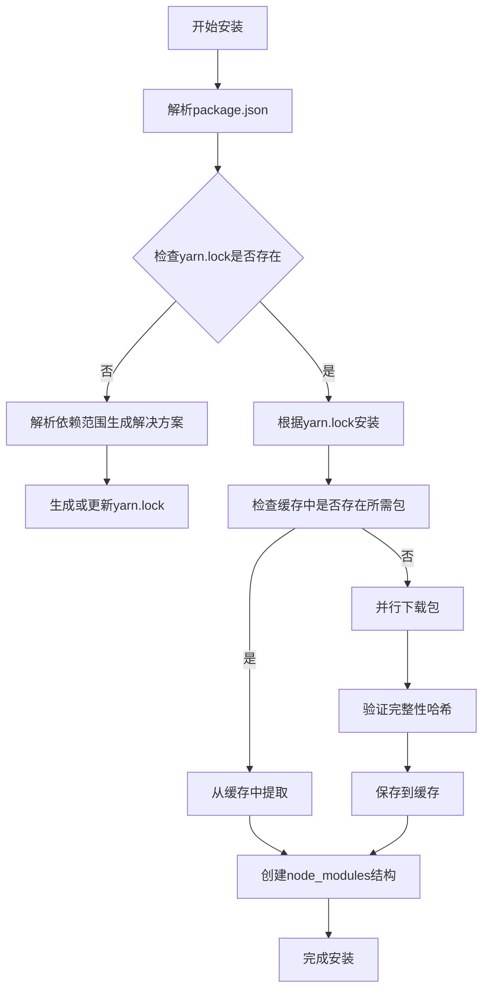

# Yarn 详解与最佳实践：现代前端依赖管理的完整指南

Yarn 官方文档：<https://yarnpkg.com/>

## 1. Yarn简介与背景

Yarn（Yet Another Resource Negotiator）是由 Facebook、Google、Exponent 和 Tilde 共同开发的 JavaScript **包管理工具**，于2016年发布。它的诞生主要是为了解决当时 npm 在**性能**、**安全性**和**一致性**方面的诸多痛点。作为 npm 的直接替代品，Yarn 引入了创新的依赖管理方法，显著提升了 JavaScript 开发者的工作效率和项目可靠性。

Yarn 与 npm 的核心差异体现在以下几个方面：Yarn 采用**并行安装**策略，通过同时下载多个依赖包来极大提升安装速度；它使用 **yarn.lock** 文件锁定依赖版本，确保在不同环境中安装完全相同的依赖结构；Yarn 还实现了**离线模式**，允许开发者在没有网络连接的情况下安装依赖；此外，Yarn 采用**扁平化依赖树**结构，减少重复安装并优化依赖关系。

_表：Yarn 与 npm 核心特性对比_

| **特性**         | **Yarn**           | **npm**                   |
| ---------------- | ------------------ | ------------------------- |
| **安装速度**     | 快（并行下载）     | 较慢（串行下载为主）      |
| **版本锁定**     | 强制使用 yarn.lock | 可选（package-lock.json） |
| **离线支持**     | 完全支持           | 部分支持                  |
| **命令行简洁性** | 更简洁             | 更冗长                    |

经过多年发展，Yarn 已经演进到第二个大版本（Yarn Berry），引入了 **Plug'n'Play**（PnP）**零安装**等创新特性。不过在实际项目中，Yarn 1.x 仍然广泛应用，本文内容将同时覆盖 Yarn 1.x 和 Yarn 2+ 的最佳实践。

## 2. 安装与配置

### 2.1 多平台安装方法

Yarn 支持多种安装方式，适用于不同的操作系统环境。在安装 Yarn 之前，需要确保系统已安装 **Node.js**（包含 npm），因为 Yarn 本身是基于 Node.js 运行的。

**通过 npm 安装**（跨平台）：

```bash
npm install -g yarn
```

**平台特定安装方法**：

- **macOS**：使用 Homebrew 包管理器安装

  ```bash
  brew install yarn
  ```

- **Windows**：使用 Chocolatey 包管理器安装

  ```bash
  choco install yarn
  ```

- **Ubuntu/Debian**：使用 apt 包管理器安装

  ```bash
  curl -sS https://dl.yarnpkg.com/debian/pubkey.gpg | sudo apt-key add -
  echo "deb https://dl.yarnpkg.com/debian/ stable main" | sudo tee /etc/apt/sources.list.d/yarn.list
  sudo apt-get update && sudo apt-get install yarn
  ```

- **CentOS/Fedora**：使用 yum 或 dnf 包管理器安装

  ```bash
  sudo rpm --import https://dl.yarnpkg.com/rpm/yarn-offline-mirror.asc
  sudo yum install yarn
  # 或
  sudo dnf install yarn
  ```

安装完成后，可以通过以下命令验证安装是否成功：

```bash
yarn --version
```

### 2.2 镜像源配置

为了提高依赖下载速度，特别是在中国大陆地区，建议配置国内镜像源。**淘宝 npm 镜像**是目前国内最流行的选择之一。

```bash
# 设置淘宝镜像源
yarn config set registry https://registry.npmmirror.com

# 查看当前配置的镜像源
yarn config get registry
```

此外，Yarn 还允许配置其他选项来优化体验：

```bash
# 设置全局安装目录
yarn config set global-folder ~/.yarn-global

# 设置缓存目录
yarn config set cache-folder ~/.yarn-cache

# 设置离线模式（启用后优先使用缓存）
yarn config set yarn-offline true
```

所有配置信息默认保存在用户目录下的 `.yarnrc` 文件中，也可以创建项目特定的配置文件，只需在项目根目录创建 `.yarnrc` 文件并添加相应配置选项。

## 3. 核心概念与工作原理

### 3.1 yarn.lock 机制

Yarn 的核心创新之一是引入了 **yarn.lock** 文件，该文件记录了项目依赖树中每个包的确切版本和完整性校验值。这与 npm 的 package-lock.json 类似，但 Yarn 强制使用锁定文件，确保了依赖安装的一致性。

当执行 `yarn install` 时，Yarn 会遵循以下优先级解析依赖：

1. 首先检查 `yarn.lock` 文件，如果存在则使用其中记录的精确版本
2. 如果没有 `yarn.lock`，则根据 `package.json` 中的版本范围解析并生成新的 `yarn.lock` 文件
3. 如果存在 `yarn.lock` 但与 `package.json` 冲突，Yarn 会根据 `package.json` 更新 `yarn.lock` 文件

**锁定文件示例**：

```bash
# THIS IS AN AUTOGENERATED FILE. DO NOT EDIT THIS FILE DIRECTLY.
# yarn lockfile v1
lodash@^4.17.0:
  version "4.17.21"
  resolved "https://registry.npmjs.org/lodash/-/lodash-4.17.21.tgz#679591c564c3bffaae8454cf0b3df370c3d6911c"
  integrity sha512-v2kDEe57lecTulaDIuNTPy3Ry4gLGJ6Z1O3vE1krgXZNrsQ+LFTGHVxVjcXPs17LhbZVGedAJv8XZ1tvj5FvSg==
```

### 3.2 依赖解析与安装流程

Yarn 的依赖解析过程可以分为以下几个阶段：

1. **依赖收集**：解析 `package.json` 中的 dependencies、devDependencies 等字段，收集所有需要的依赖包
2. **依赖解析**：向注册表查询满足版本范围的包信息，递归处理所有传递依赖
3. **依赖确定**：根据解析结果生成或更新 `yarn.lock` 文件，确保依赖树确定性
4. **包下载**：并行下载所有需要的包到缓存目录，并验证完整性哈希
5. **依赖链接**：将缓存中的包复制到项目的 `node_modules` 目录中，创建适当的符号链接

_Yarn 依赖安装流程示意图_



### 3.3 缓存策略

Yarn 使用**磁盘缓存**来存储已下载的包，这使其能够在后续安装中极大提升速度，特别是在大型项目中。默认情况下，Yarn 会缓存每个下载的包，下次请求相同包时，优先使用缓存版本。

可以使用以下命令管理缓存：

```bash
# 列出已缓存的包
yarn cache list

# 查看缓存目录位置
yarn config get cache-folder

# 清理缓存
yarn cache clean
```

在 Yarn 2+ 中，缓存策略进一步优化，引入了 **零安装**（Zero-Installs）概念，将缓存纳入版本控制系统，使得项目克隆后无需运行 `yarn install` 即可立即开始开发。

## 4. 基础命令使用

### 4.1 项目初始化与依赖管理

**初始化新项目**：

```bash
# 交互式创建 package.json
yarn init

# 快速初始化（使用默认值）
yarn init -y
```

**依赖管理命令**：

```bash
# 添加生产依赖
yarn add package-name
yarn add package-name@version
yarn add package-name@tag

# 添加开发依赖
yarn add package-name --dev
yarn add package-name -D

# 添加可选依赖
yarn add package-name --optional

# 移除依赖
yarn remove package-name

# 更新依赖
yarn upgrade package-name
yarn upgrade  # 更新所有依赖

# 交互式更新依赖（Yarn 2+）
yarn upgrade-interactive
```

### 4.2 脚本执行与工作流

Yarn 可以执行 `package.json` 中定义的脚本，语法比 npm 更简洁：

```bash
# 执行脚本
yrun start
yarn run build
yarn test

# 查看已安装的包列表
yarn list

# 检查依赖关系
yarn why package-name  # 解释为什么安装了某个包

# 检查过时的包
yarn outdated
```

**package.json 脚本示例**：

```json
{
  "scripts": {
    "start": "webpack serve --mode development",
    "build": "webpack --mode production",
    "test": "jest",
    "lint": "eslint src/",
    "predeploy": "yarn build",
    "deploy": "gh-pages -d dist"
  }
}
```

## 5. 高级特性与应用

### 5.1 Workspaces 工作区

Yarn Workspaces 是用于**单体仓库**（Monorepo）的强大功能，允许在单个代码库中管理多个相互关联的包。这对于大型项目和组件库开发特别有用。

**启用 Workspaces**：
在项目根目录的 `package.json` 中添加：

```json
{
  "private": true,
  "workspaces": ["packages/*", "shared/*"]
}
```

**Workspaces 常用命令**：

```bash
# 为所有工作区安装依赖
yarn install

# 为特定工作区添加依赖
yarn workspace my-package add lodash

# 在特定工作区运行脚本
yarn workspace my-package run build

# 在所有工作区运行脚本
yarn workspaces run test
```

**Workspaces 优势**：

- **依赖提升**：将重复依赖提升到根 node_modules，减少磁盘空间占用
- **跨包链接**：工作区之间的依赖通过符号链接连接，支持实时开发测试
- **统一构建**：可以一次性构建所有包或按需构建相关包

### 5.2 选择性版本覆盖

在某些情况下，可能需要强制项目使用特定版本的依赖，即使其他依赖要求不同版本。Yarn 提供了**选择性版本覆盖**功能来解决这个问题。

在 `package.json` 中使用 `resolutions` 字段覆盖依赖版本：

```json
{
  "resolutions": {
    "**/package-a/**/lodash": "4.17.21",
    "**/package-b/**/lodash": "4.17.20",
    "left-pad": "1.3.0"
  }
}
```

执行以下命令使版本覆盖生效：

```bash
yarn install
```

这个特性特别适用于解决**安全漏洞**，可以强制将所有位置的某个易受攻击的依赖升级到安全版本，而无需等待上游依赖更新。

### 5.3 离线模式与网络优化

Yarn 的**离线模式**允许在没有网络连接的情况下安装依赖，极大提升了开发者在飞机、高铁等网络不稳定环境下的工作效率。

**启用离线模式**：

```bash
# 通过配置启用离线模式
yarn config set yarn-offline true

# 或通过命令行标志
yarn install --offline
```

Yarn 还提供了多种网络优化策略：

1. **并行请求**：同时发送多个包请求，最大化利用网络带宽
2. **请求队列优化**：优先处理关键路径上的包请求
3. **失败重试**：自动重试失败的下载请求，提高网络弹性
4. **超时优化**：根据网络状况动态调整超时时间

## 6. 性能优化与配置

### 6.1 网络性能优化

对于国内开发者，配置合适的**镜像源**是提升 Yarn 性能的最有效方法之一。以下是一些常用的镜像源配置：

```bash
# 淘宝 NPM 镜像
yarn config set registry https://registry.npmmirror.com

# 腾讯云 NPM 镜像
yarn config set registry https://mirrors.cloud.tencent.com/npm/

# 华为云 NPM 镜像
yarn config set registry https://mirrors.huaweicloud.com/repository/npm/
```

此外，还可以通过配置**并发连接数**来优化网络性能：

```bash
# 设置网络并发数（默认值为8）
yarn config set network-concurrency 12
```

### 6.2 缓存策略优化

合理配置缓存可以显著提升 Yarn 的性能，特别是在大型项目中。

**缓存优化配置**：

```bash
# 设置缓存目录（优先使用SSD磁盘）
yarn config set cache-folder ~/.yarn-cache

# 设置硬链接模式（减少磁盘空间使用，仅限Unix系统）
yarn config set enableHardlinks true

# 设置缓存过期时间（默认值为1天）
yarn config set cache-expiry 48h
```

**清理缓存策略**：
定期清理缓存可以回收磁盘空间，但会导致下一次安装需要重新下载所有包：

```bash
# 清理缓存但保留最近常用包
yarn cache clean --mirror

# 完全清理缓存
yarn cache clean --all
```

### 6.3 并行处理与内存优化

Yarn 默认使用并行处理来加速依赖安装，但需要合理配置以避免资源过度消耗。

```bash
# 设置并行工作线程数（默认值为CPU核心数）
yarn config set child-concurrency 4

# 设置内存限制（防止内存溢出）
yarn config set global-folder ~/.yarn-global
yarn config set memory-limit 2048MB
```

在 `.yarnrc` 文件中保存这些配置，可以获得更稳定的性能表现：

```bash
# .yarnrc 配置文件示例
network-concurrency 12
child-concurrency 4
cache-folder "/path/to/ssd/.yarn-cache"
enableHardlinks true
memory-limit 2048MB
```

## 7. 安全最佳实践

### 7.1 依赖安全审计

Yarn 提供了内置的**安全审计**功能，可以检查项目依赖中的已知漏洞。

```bash
# 检查安全漏洞
yarn audit

# 自动修复可更新的漏洞
yarn audit fix

# 仅打印摘要信息
yarn audit --json

# 忽略特定漏洞（谨慎使用）
yarn audit --exclude 12345,67890
```

**集成安全审计到CI/CD**：
可以将安全审计集成到持续集成流程中，自动阻断存在高风险漏洞的提交：

```bash
# 仅检查高风险漏洞
yarn audit --level high

# 如果有漏洞则返回非零退出码，适合CI环境
yarn audit --level moderate --json | grep -q '"type": "audit_summary"'
if [ $? -eq 0 ]; then
  echo "发现安全漏洞，构建失败"
  exit 1
fi
```

### 7.2 依赖来源验证

Yarn 使用**完整性哈希**验证下载的包是否被篡改，这是其安全模型的核心组成部分。

**完整性校验机制**：

1. 首次下载包时，Yarn 计算其 SHA-512 哈希值并保存在 `yarn.lock` 中
2. 后续安装时，重新计算哈希并与存储值比较
3. 如果不匹配，安装将终止并报错

**允许列表策略**：
对于企业环境，可以配置只允许从特定注册表下载依赖：

```bash
# 设置允许的注册表范围
yarn config set allowed-registries "https://registry.npmjs.org,https://npm.pkg.github.com"

# 设置Scope对应的注册表
yarn config set --scope=@mycompany registry https://npm.pkg.github.com
```

### 7.3 漏洞修复与预防

当发现安全漏洞时，Yarn 提供了多种修复方式：

1. **自动升级**：使用 `yarn upgrade` 升级到安全版本
2. **选择性覆盖**：使用 `resolutions` 字段强制使用安全版本
3. **补丁应用**：使用 Yarn 2+ 的补丁功能修复当前版本

**补丁功能示例**（Yarn 2+）：

```bash
# 生成补丁文件
yarn patch package-name@version

# 应用补丁
yarn patch-commit -s patch-folder
```

**预防策略**：

- 定期运行 `yarn audit` 检查漏洞
- 使用依赖锁定文件（yarn.lock）
- 启用自动化依赖更新（如Dependabot）
- 定期更新依赖到最新稳定版本

## 8. 故障排除与常见问题

### 8.1 常见问题解决方案

**依赖冲突问题**：
当出现依赖版本冲突时，可以使用以下命令分析问题：

```bash
# 解释为什么安装了某个包
yarn why package-name

# 显示依赖树
yarn list --pattern package-name
yarn list --depth=2
```

**锁定文件不一致**：
当团队中有人使用 npm 有人使用 Yarn 时，可能会出现锁定文件不一致：

```bash
# 删除node_modules和现有锁定文件
rm -rf node_modules
rm -f yarn.lock package-lock.json

# 重新生成yarn.lock
yarn install
```

**内存不足问题**：
大型项目可能会遇到内存不足错误：

```bash
# 增加内存限制
yarn config set memory-limit 4096MB

# 或使用Node.js选项
NODE_OPTIONS="--max-old-space-size=4096" yarn install
```

### 8.2 调试技巧

Yarn 提供了丰富的调试选项来帮助诊断问题：

```bash
# 启用详细日志输出
yarn install --verbose

# 启用调试日志
yarn install --debug

# 分析安装时间
yarn install --profile
yarn install --profile --json > profile.json

# 生成构建分析报告
yarn install --skip-integrity-check
```

**读取日志**：
Yarn 的日志输出包含有用信息：

- **颜色编码**：红色表示错误，黄色表示警告
- **错误代码**：每个错误都有唯一代码，便于搜索解决方案
- **时间戳**：长时间操作会显示执行时间，帮助性能分析

## 9. 迁移与集成

### 9.1 从 npm 迁移到 Yarn

将现有项目从 npm 迁移到 Yarn 是一个 straightforward 的过程：

**迁移步骤**：

1. 删除现有的 `node_modules` 目录和锁定文件

   ```bash
   rm -rf node_modules
   rm -f package-lock.json npm-shrinkwrap.json
   ```

2. 保留现有 `package.json`（无需修改）
3. 运行 Yarn 安装依赖

   ```bash
   yarn install
   ```

4. 验证项目正常运行

   ```bash
   yarn test
   yarn start
   ```

5. 更新 CI/CD 和文档中的命令
   - 将 `npm install` 替换为 `yarn install`
   - 将 `npm run` 替换为 `yarn run`
   - 将 `npm test` 替换为 `yarn test`

**注意事项**：

- 确保团队所有成员同时切换到 Yarn，避免混合使用
- 更新 Dockerfile 和持续集成配置中的包管理器命令
- 通知所有开发者并提供简单的迁移指南

### 9.2 与 CI/CD 集成

Yarn 可以无缝集成到各种持续集成/持续部署环境中。

**基础 CI 配置示例**（GitHub Actions）：

```yaml
name: Node.js CI
on: [push, pull_request]
jobs:
  build:
    runs-on: ubuntu-latest
    steps:
      - uses: actions/checkout@v3
      - name: Setup Yarn
        uses: actions/setup-node@v3
        with:
          node-version: '18'
          cache: 'yarn'
      - run: yarn install --frozen-lockfile
      - run: yarn build
      - run: yarn test
```

**优化策略**：

1. **利用缓存**：缓存 Yarn 缓存目录和 node_modules
2. **使用冻结锁定文件**：`--frozen-lockfile` 确保 CI 环境与开发环境一致
3. **并行任务**：利用 Yarn Workspaces 并行执行测试和构建
4. **离线模式**：在 CI 环境中使用离线模式提高可靠性

**依赖缓存配置**（GitHub Actions）：

```yaml
- name: Get Yarn cache directory path
  id: yarn-cache-dir-path
  run: echo "dir=$(yarn config get cache-folder)" >> $GITHUB_OUTPUT

- uses: actions/cache@v3
  with:
    path: ${{ steps.yarn-cache-dir-path.outputs.dir }}
    key: ${{ runner.os }}-yarn-${{ hashFiles('**/yarn.lock') }}
    restore-keys: |
      ${{ runner.os }}-yarn-
```

## 10. 总结与未来展望

Yarn 作为现代 JavaScript 开发中不可或缺的工具，通过其**卓越的性能**、**确定性安装**和**丰富的功能集**显著改善了开发体验。从基本的依赖管理到高级的 Monorepo 支持，Yarn 提供了一整套解决方案，使团队能够更高效地协作和维护大型项目。

**关键优势总结**：

- 🚀 **性能优异**：并行下载、离线模式和智能缓存策略大幅提升安装速度
- 🔒 **一致性保证**：yarn.lock 文件确保跨环境的一致性安装结果
- 🏗 **Monorepo 支持**：Workspaces 功能使多包管理变得简单高效
- 🛡 **安全增强**：完整性校验和安全审计帮助预防和发现漏洞
- ⚙ **可配置性强**：丰富的配置选项适应各种复杂场景需求

**未来发展趋势**：
随着 Yarn 2+（Berry）的不断发展，JavaScript 包管理正在向**零安装**（Zero-Installs）、**Plug'n'Play** 和**更严格的安全模型**方向演进。这些创新将进一步优化开发体验，减少环境配置问题，并提供更强大的依赖管理能力。

对于开发者来说，掌握 Yarn 不仅意味着学会使用一个工具，更是理解现代前端工程化的重要组成部分。通过遵循本文中的最佳实践，你可以构建更**可靠**、**可维护**且**安全**的 JavaScript 应用程序。
