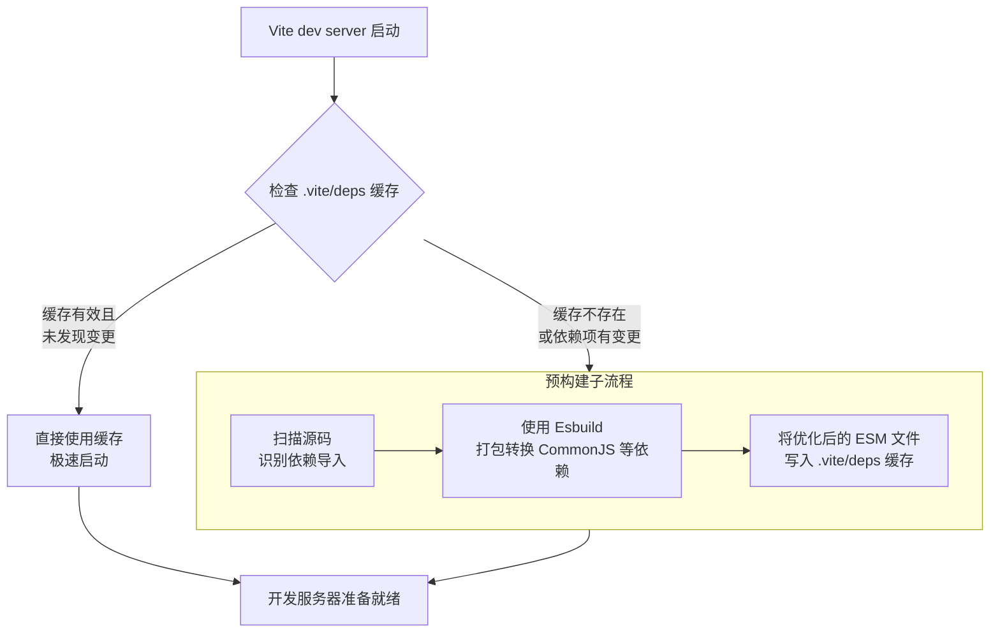

好的，收到您的需求。作为一名 Vite 专家和技术文档工程师，我将为您生成一篇详尽、准确且实用的关于 Vite 依赖预构建的技术文档。

本文在撰写前，我已综合分析并总结了来自 Vite 官方文档、`vite-plugin-optimize-persist` 插件说明、多位社区专家（如 Anthony Fu、Matias Capeletto）的深度文章，以及 Stack Overflow 和 GitHub Discussions 上的相关讨论，旨在为您提供经过实践验证的最佳方案。

---

# Vite 依赖预构建详解与最佳实践

## 1. 引言：为什么需要依赖预构建？

Vite 在开发环境下基于浏览器原生 ES 模块 (ESM) 提供服务。这带来了无与伦快的启动速度，但同时也面临一个挑战：**尽管现代浏览器已经支持 ESM，但大多数现有的 npm 包仍然是以 CommonJS (CJS) 格式发布的**。

直接导入 CJS 模块会导致浏览器报错，并引发一连串的的问题：

1. **格式兼容性问题**：浏览器无法直接解析 `require` 或 `module.exports`。
2. **性能问题**：某些包可能由数百个小文件组成。直接使用会引发浏览器大量的 HTTP 请求，导致页面加载缓慢，这与 Vite 的“快”的初衷背道而驰。
3. **导入路径问题**：一些包可能使用非相对路径的裸模块导入（如 `import { cloneDeep } from 'lodash-es'`），这同样需要被解析和转换。

**依赖预构建（Dependency Pre-Bundling）** 正是 Vite 用来解决上述问题的核心技术。它是指在开发服务器启动前，Vite 会先将你的依赖项（`node_modules` 中的内容）提前编译和打包成单个 ESM 模块。

简单来说，Vite 开发服务器启动时在终端看到的 `Pre-bundling dependencies:` 和 `Built in 500ms` 等日志信息，就是指这个过程。

```bash
$ vite
  VITE v6.0.0  ready in 500 ms
  ➜  Local:   http://localhost:5173/
  ➜  Network: use --host to display
  ➜  press h + enter to show help
# 在这背后，Vite 已经默默地完成了依赖预构建
```

## 2. 依赖预构建的核心机制

### 2.1 预构建的过程

Vite 的预构建过程主要做了三件事：

1. **格式转换**：将非 ESM 格式（主要是 CommonJS）的依赖项转换为标准的 ESM。这是通过 ESBuild 完成的，其速度极快。
2. **模块合并**：将某个包内部大量的内部模块（例如 `lodash-es` 有 600+ 个模块）预先打包成一个单独的模块。这样将数百个 HTTP 请求减少为一个，极大地提升了开发时的页面加载性能。
3. **路径解析**：将裸模块导入（如 `import { createApp } from 'vue'`）转换为相对路径（如 `import { createApp } from '/node_modules/.vite/deps/vue.js'`），以便浏览器能够正确解析。

预构建后的文件默认存储在 `node_modules/.vite/deps` 目录下。Vite 开发服务器会优先从此目录提供依赖文件。

### 2.2 流程图解

以下是依赖预构建的决策与执行流程：



## 3. 配置与使用

### 3.1 核心配置选项

在 `vite.config.ts` 中，你可以通过 `optimizeDeps` 选项对预构建行为进行精细控制。

```typescript
import { defineConfig } from 'vite';
import react from '@vitejs/plugin-react';

export default defineConfig({
  plugins: [react()],
  optimizeDeps: {
    // 1. 控制包含的依赖：默认情况下，不在 `node_modules` 中的链接包不会被预构建。使用此选项可强制预构建它们。
    include: [
      'linked-package-name',
      'lodash-es', // 明确包含一个包
      'some-component-library/*.ts', // 你也可以使用 glob 模式
    ],

    // 2. 控制排除的依赖：排除不需要预构建的依赖。
    exclude: ['some-optional-dep'], // 例如，一个纯 ESM 且文件很少的包，可以排除以避免不必要的构建

    // 3. 强制重新构建：设置为 true 时，会忽略缓存，强制在每次启动时进行预构建。
    force: true, // 常用于调试或解决依赖缓存问题

    // 4. 禁用预构建（不推荐）：完全禁用依赖优化。
    // disabled: true,

    // 5. 自定义 Esbuild 选项：用于控制依赖扫描和转换的过程。
    esbuildOptions: {
      plugins: [
        // 可以添加 Esbuild 插件来处理特殊文件
      ],
      jsx: 'automatic', // 例如，为依赖项设置 JSX 处理方式
      target: 'es2020', // 设置构建目标
    },
  },
});
```

### 3.2 常见场景与最佳实践配置示例

#### 场景 1：处理具有特殊入口的依赖

有些依赖在 `package.json` 中指定的入口不是标准的 ESM，这可能导致预构建或浏览器运行时出错。你可以使用 `include` 强制 Vite 预构建它，并配合 `esbuildOptions` 进行解析。

```typescript
// vite.config.ts
export default defineConfig({
  optimizeDeps: {
    include: ['my-dep-with-bad-entry'],
    esbuildOptions: {
      // 如果这个依赖有特殊的加载方式，可以在这里指定
      mainFields: ['module', 'main', 'browser'],
    },
  },
});
```

#### 场景 2：优化大型 UI 库（如 Ant Design, Element Plus）

这些库通常由大量小文件组成，预构建可以极大提升性能。但它们的按需引入有时会和预构建产生微妙的交互。

```typescript
// vite.config.ts
export default defineConfig({
  optimizeDeps: {
    // 明确包含 UI 库的 ES 模块版本，确保它们被正确预构建
    include: ['antd', 'antd/es/button/style', 'element-plus'],
    // 或者，如果你使用 unplugin-vue-components 等自动导入插件，
    // 可能需要排除它们，让插件来处理，但这通常不是必须的。
    // exclude: ['antd']
  },
  // 搭配构建优化选项
  build: {
    rollupOptions: {
      // 构建时的优化选项...
    },
  },
});
```

#### 场景 3：解决缓存失效问题

有时依赖更新后，预构建缓存可能没有及时更新，导致运行时错误。你有几种选择：

1. **重启服务器**：最直接的方法，重启 Dev Server 会触发重新预构建。
2. **使用 `--force` 标志**：通过命令行强制 Vite 重新构建。

   ```bash
   vite --force
   ```

3. **使用 `vite-plugin-optimize-persist`**：这是一个社区插件，它可以解决在包管理器（如 pnpm）安装后缓存失效的问题。它会将 Vite 的预构建信息持久化到 `package.json` 中，确保所有开发者和环境的一致性。

   ```bash
   npm i -D vite-plugin-optimize-persist
   ```

   ```typescript
   // vite.config.ts
   import { defineConfig } from 'vite';
   import OptimizationPersist from 'vite-plugin-optimize-persist';

   export default defineConfig({
     plugins: [OptimizationPersist()],
   });
   ```

## 4. 最佳实践总结

1. **信任默认行为**：对于绝大多数项目，Vite 的自动依赖发现和预构建是完全无需配置的。不要过度工程化。

2. **优先使用 `include`**：当你遇到问题（如浏览器报错 `XXX is not a constructor`）或明确知道某个依赖需要被预构建时，优先使用 `optimizeDeps.include`。

3. **谨慎使用 `exclude`**：排除依赖可能会导致性能下降和运行时问题。只有在你知道该依赖是纯 ESM 且文件数量很少，或者排除它是为了解决特定问题时才这样做。

4. **善用 `force` 和重启**：遇到诡异的依赖问题时，尝试使用 `vite --force` 或重启服务器，这能解决 90% 的缓存相关问题。

5. **考虑团队协作**：如果你的团队使用 pnpm 或者存在 Monorepo 链接依赖，考虑使用 `vite-plugin-optimize-persist` 来保持预构建缓存的一致性。

6. **监控构建信息**：留意服务器启动时的日志，了解哪些依赖正在被预构建，这有助于你定位和配置问题。

## 5. 总结

Vite 的依赖预构建是其实现“飞速”开发体验的基石魔法。它巧妙地弥补了 ESM 原生特性和现有 npm 生态之间的鸿沟。

| 特性/方面    | 说明                                                                 |
| :----------- | :------------------------------------------------------------------- |
| **目的**     | 转换 CJS/UMD 模块为 ESM、合并请求以优化性能、解析裸模块导入          |
| **关键工具** | ESBuild（极速打包）                                                  |
| **缓存位置** | `node_modules/.vite/deps`                                            |
| **核心配置** | `optimizeDeps.include`, `optimizeDeps.exclude`, `optimizeDeps.force` |
| **核心原则** | **约定大于配置**，大多数项目无需任何配置即可完美运行                 |

理解其工作原理和配置方法，将帮助你在遇到棘手的依赖问题时能够从容应对，并最终充分发挥 Vite 的强大能力。
