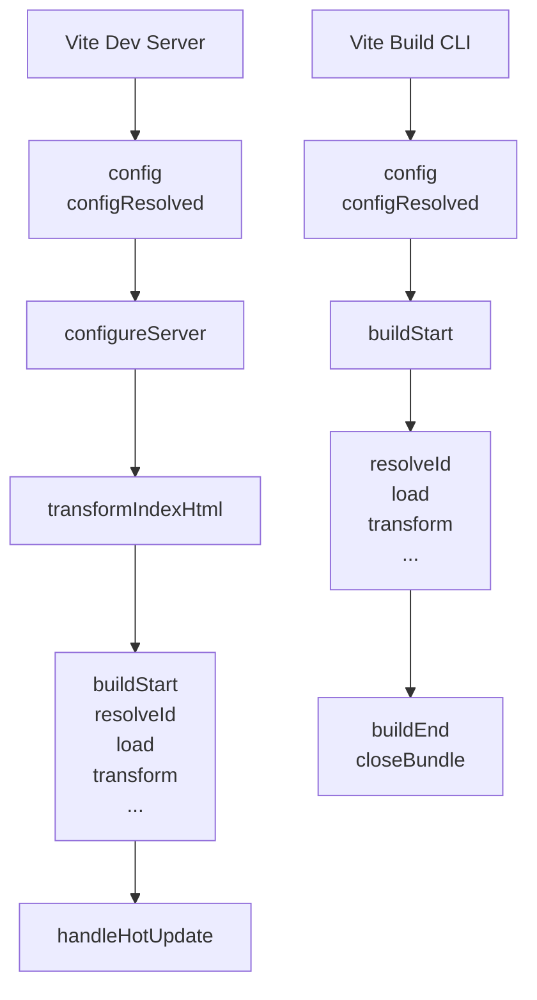

好的，请查阅以下为您生成的关于 Vite 插件 API 的详细技术文档。本文档综合参考了 Vite 官方文档、多个知名开源 Vite 插件源码以及社区最佳实践文章，旨在提供一份详尽、准确且实用的指南。

---

# Vite 插件 API 详解与最佳实践

## 1. 引言

Vite 的核心优势之一是其强大而灵活的插件系统。该插件系统基于 Rollup 的插件接口构建，并在此基础上增加了一些 Vite 特有的钩子和配置项。这意味着绝大多数 Rollup 插件在 Vite 中可以直接使用，同时你也能利用 Vite 特有的能力（如开发服务器、HMR、SSR 等）来扩展构建工具的行为。

本文将深入剖析 Vite 插件 API，并通过清晰的代码示例和最佳实践，帮助你掌握编写高质量 Vite 插件的技能。

## 2. 插件的基本结构

一个 Vite 插件本质上是一个对象，该对象包含一系列有特定意义的属性（如 `name`）和生命周期钩子函数。插件也可以是一个返回此对象的工厂函数，以便接收插件选项。

```javascript
// my-vite-plugin.js

/**
 * @type {import('vite').PluginOption}
 */
export default function myPlugin(options = {}) {
  // 插件逻辑，可以根据 options 进行配置

  return {
    // 必需的：插件名称，用于错误信息和警告
    name: 'vite-plugin-my-plugin',

    // Vite 特有的钩子：用于修改 Vite 配置
    config(config, env) {
      // ...
    },

    // Rollup 钩子：转换单个模块
    transform(code, id) {
      // ...
    },

    // 其他钩子...
  };
}
```

在 `vite.config.js` 中使用插件：

```javascript
// vite.config.js
import { defineConfig } from 'vite';
import myPlugin from './my-vite-plugin.js';

export default defineConfig({
  plugins: [
    myPlugin({ /* 插件选项 */ }),
  ],
});
```

## 3. 核心概念与生命周期

Vite 插件的生命周期由两部分组成：

1. **Rollup 构建钩子**：主要用于生产构建阶段（如 `buildStart`, `transform`, `buildEnd`）。
2. **Vite 特有钩子**：主要用于开发服务器阶段（如 `config`, `configureServer`, `configurePreviewServer`）。

下图简要说明了插件钩子在开发和生产环境下的执行顺序：



### 3.1 通用钩子 (Universal Hooks)

这些钩子在开发（`serve`）和构建（`build`）模式下都会运行。

#### `config` & `configResolved`

- **`config(config, env)`**: 在解析 Vite 配置前调用。你可以在这里修改初始的配置对象。它接收原始用户配置和当前环境（`mode`, `command`, `ssrBuild`）。**注意**：这里的修改是深度合并的。
- **`configResolved(resolvedConfig)`**: 在 Vite 配置解析后调用。它接收最终解析后的配置对象。这是读取和存储最终配置值的理想位置。

```javascript
export default function myPlugin() {
  return {
    name: 'vite-plugin-config-example',
    config(config, env) {
      // 开发模式下，修改 root 选项
      if (env.command === 'serve') {
        return {
          root: './dev-src',
        };
      }
    },
    configResolved(resolvedConfig) {
      // 存储最终解析的配置
      this.config = resolvedConfig;
      console.log(`Running in mode: ${resolvedConfig.mode}`);
    },
  };
}
```

#### `configureServer`

- **`configureServer(server)`**: 一个 Vite 特有的钩子，用于配置开发服务器。你可以在这里添加自定义中间件或监听服务器事件。

```javascript
export default function myPlugin() {
  return {
    name: 'vite-plugin-server-middleware',
    configureServer(server) {
      // 返回一个在内部中间件安装后调用的后置钩子
      return () => {
        server.middlewares.use('/api', (req, res, next) => {
          // 自定义请求处理逻辑
          res.end('Hello from custom middleware!');
        });
      };
    },
  };
}
```

#### `transformIndexHtml`

- **`transformIndexHtml(html, ctx)`**: 一个 Vite 特有的钩子，专门用于转换项目的 `index.html` 文件。它可以在开发期间和构建期间被调用。

```javascript
export default function myPlugin() {
  return {
    name: 'vite-plugin-html-inject',
    transformIndexHtml(html, ctx) {
      const { path, filename, server } = ctx;
      return html.replace(
        '</head>',
        `  <script type="module" src="/src/my-inject.js"></script>\n</head>`
      );
    },
  };
}
```

### 3.2 开发阶段钩子 (Serve Hooks)

#### `handleHotUpdate`

- **`handleHotUpdate(ctx)`**: 执行自定义 HMR（热更新）处理。它可以用于过滤模块、执行自定义更新或添加要额外更新的模块。`ctx` 对象包含 `file`, `timestamp`, `modules`, `read`, `server` 等信息。

```javascript
export default function myPlugin() {
  return {
    name: 'vite-plugin-hmr-handler',
    handleHotUpdate({ file, server, read }) {
      if (file.endsWith('.custom')) {
        // 读取文件内容并广播自定义事件
        const content = read();
        server.ws.send({
          type: 'custom',
          event: 'special-file-update',
          data: { file, content }
        });
        // 返回一个空数组以防止该模块的默认 HMR 行为
        return [];
      }
    },
  };
}
```

在客户端代码中，你需要监听这个自定义事件：

```javascript
// client code
if (import.meta.hot) {
  import.meta.hot.on('special-file-update', (data) => {
    console.log(`File ${data.file} was updated!`);
    // 执行自定义更新逻辑
  });
}
```

### 3.3 构建阶段钩子 (Build Hooks)

这些钩子主要来自于 Rollup，在 `vite build` 或 `vite build --watch` 时执行。

#### `resolveId`, `load`, `transform`

这是 Rollup 插件中最强大的三个钩子，用于处理模块解析和转换。

- **`resolveId(source, importer, options)`**: 解析模块导入路径。可以用于创建虚拟模块或重定向导入。
- **`load(id)`**: 根据模块 ID 加载原始内容。
- **`transform(code, id)`**: 转换已加载的模块内容。

**示例：创建一个虚拟模块**

```javascript
// vite-plugin-virtual-module.js
const virtualModuleId = 'virtual:my-module';
const resolvedVirtualModuleId = '\0' + virtualModuleId; // Rollup 约定

export default function virtualModulePlugin() {
  return {
    name: 'vite-plugin-virtual-module',
    // 1. 解析虚拟模块 ID
    resolveId(id) {
      if (id === virtualModuleId) {
        return resolvedVirtualModuleId;
      }
    },
    // 2. 为虚拟模块加载内容
    load(id) {
      if (id === resolvedVirtualModuleId) {
        return `export const message = "Hello from virtual module!";
                export const count = 42;`;
      }
    },
  };
}
```

在 `vite.config.js` 中注册后，你可以在代码中这样导入：

```javascript
// In your app code
import { message, count } from 'virtual:my-module';
console.log(message, count);
```

## 4. 最佳实践与高级技巧

### 4.1 使用 TypeScript 增强健壮性

为你的插件提供类型定义可以极大地改善开发体验。

```typescript
// my-plugin.ts
import type { PluginOption } from 'vite';

export interface MyPluginOptions {
  enabled?: boolean;
  outputPath?: string;
}

export default function myPlugin(options: MyPluginOptions = {}): PluginOption {
  const { enabled = true, outputPath = 'dist' } = options;
  return {
    name: 'vite-plugin-typed',
    configResolved(config) {
      if (enabled) {
        // 类型安全的配置操作
      }
    },
  };
}
```

### 4.2 合理使用钩子顺序和 `enforce`

Vite 插件可以指定 `enforce: 'pre' | 'post'` 来控制执行顺序。

- `pre`: 在核心 Vite 插件之前运行
- 默认：在核心 Vite 插件之后运行
- `post`: 在构建后置处理插件之后运行

这对于确保你的插件在其他插件之前或之后运行至关重要。例如，一个转换 TSX 的插件应该在其它插件处理之前运行。

```javascript
export default function myPrePlugin() {
  return {
    name: 'vite-plugin-pre',
    enforce: 'pre', // 提前执行
    transform(code, id) {
      // 会先于大多数插件执行
    },
  };
}
```

### 4.3 高效的模块处理与缓存

在 `transform` 或 `load` 钩子中，对于计算密集型的操作，请考虑使用缓存以避免重复工作。

```javascript
import fs from 'node:fs';
import path from 'node:path';
import { createRequire } from 'node:module';

const require = createRequire(import.meta.url);

export default function myCachingPlugin() {
  // 简单的内存缓存
  const cache = new Map();
  return {
    name: 'vite-plugin-with-cache',
    transform(code, id) {
      if (!id.endsWith('.expensive')) return;

      // 检查缓存
      const cached = cache.get(id);
      if (cached && cached.originalCode === code) {
        return cached.result; // 返回缓存的结果
      }

      // 昂贵的转换操作
      const result = doExpensiveTransform(code, id);

      // 存入缓存
      cache.set(id, { originalCode: code, result });
      return result;
    },
  };
}
```

### 4.4 输出有用的错误信息和警告

使用 Vite 的 `logger` 工具来输出格式化的信息，而不是直接使用 `console.log`。

```javascript
export default function myHelpfulPlugin() {
  return {
    name: 'vite-plugin-helpful-errors',
    transform(code, id) {
      try {
        // ... some transformation
      } catch (err) {
        // 使用 this.error 会终止构建并输出错误
        this.error({
          message: `Failed to transform ${id}: ${err.message}`,
          stack: err.stack,
          id, // 提供发生错误的模块 ID
        });
      }

      // 使用 this.warn 输出警告，不会终止构建
      if (code.includes('deprecatedFunction')) {
        this.warn({
          message: `'deprecatedFunction' found in ${id}. It will be removed in a future version.`,
          id,
        });
      }
    },
  };
}
```

## 5. 实战示例：SVG 转换插件

让我们将所学知识整合，编写一个实用的插件：将 SVG 文件转换为 Vue 或 React 组件。

```javascript
// vite-plugin-svg-component.js
import { readFileSync } from 'node:fs';
import { compileTemplate, parse } from '@vue/compiler-sfc';

export default function svgComponentPlugin({ defaultExport = 'component' } = {}) {
  return {
    name: 'vite-plugin-svg-component',
    enforce: 'pre',

    async transform(code, id) {
      // 1. 识别 SVG 文件
      if (!id.endsWith('.svg')) return;

      // 2. 读取 SVG 内容并清理
      const svgContent = readFileSync(id, 'utf-8').trim();

      // 3. 根据请求的格式生成组件代码
      if (id.includes('?vue')) {
        // 转换为 Vue 组件
        const { descriptor } = parse({
          source: `
            <template>
              <div v-html="svgString" />
            </template>
            <script>
            export default {
              name: 'SvgComponent',
              data() {
                return {
                  svgString: \`${svgContent}\`
                }
              }
            }
            </script>
          `
        });
        const { code: vueCode } = compileTemplate({
          source: descriptor.template.content,
          id: id,
        });
        return vueCode;
      } else {
        // 转换为 React 组件 (默认)
        return `
          import React from 'react';
          export default function SvgComponent(props) {
            return React.createElement('div', {
              dangerouslySetInnerHTML: { __html: \`${svgContent}\` },
              ...props
            });
          }
        `;
      }
    },
  };
}
```

在 `vite.config.js` 中使用：

```javascript
// vite.config.js
import { defineConfig } from 'vite';
import svgComponentPlugin from './vite-plugin-svg-component.js';

export default defineConfig({
  plugins: [
    svgComponentPlugin(),
  ],
});
```

在代码中引入：

```javascript
// React 项目
import Logo from './logo.svg'; // 默认导出 React 组件

// Vue 项目
import Logo from './logo.svg?vue'; // 通过 query 指定导出 Vue 组件
```

## 6. 调试与测试

### 6.1 调试插件

在插件代码中使用 `debugger` 语句，然后通过以下命令启动调试：

```bash
node --inspect-brk ./node_modules/vite/bin/vite.js
```

然后在 Chrome DevTools 中打开 `chrome://inspect` 进行调试。

### 6.2 测试插件

使用 `vite-plugin-test-utils` 或 `playwright`/`vitest` 等工具进行集成测试。

```javascript
// test/my-plugin.test.js
import { describe, it, expect } from 'vitest';
import { buildVite, createViteServer } from 'vite-plugin-test-utils';
import myPlugin from '../my-vite-plugin.js';

describe('my vite plugin', () => {
  it('injects script tag', async () => {
    const result = await buildVite({
      plugins: [myPlugin()],
    });
    const indexHtml = result.output.find(f => f.name === 'index.html');
    expect(indexHtml.source).toContain('my-inject.js');
  });
});
```

## 7. 总结

Vite 插件 API 提供了极其强大的扩展能力，允许你深度定制开发服务器和构建过程。掌握其核心概念和生命周期钩子是编写高效、可靠插件的关键。

1. **明确需求**：首先确定你的插件需要在哪个阶段介入（开发、构建、SSR）。
2. **选择合适的钩子**：参考生命周期图，选择最能满足你需求的钩子。
3. **遵循约定**：妥善处理虚拟模块（`\0` 前缀）、合理使用 `enforce` 并输出清晰的错误信息。
4. **性能优先**：对昂贵操作进行缓存，避免阻塞构建流水线。
5. **全面测试**：确保你的插件在各种场景下都能稳定工作。

通过遵循这些最佳实践，你将能够创建出功能强大、稳定可靠且深受社区欢迎的 Vite 插件。

---

**参考资料：**

1. <https://vitejs.dev/guide/api-plugin.html>
2. <https://vitejs.dev/guide/api-plugin.html>
3. <https://rollupjs.org/plugin-development/#hooks>
4. <https://github.com/vitejs/awesome-vite#plugins>
5. <https://dev.to/zaiste/an-introduction-to-vite-plugin-development-3cg7>
6. <https://vitejs.dev/guide/debugging.html>
7. <https://lihautan.com/demystifying-vite-plugin/>
