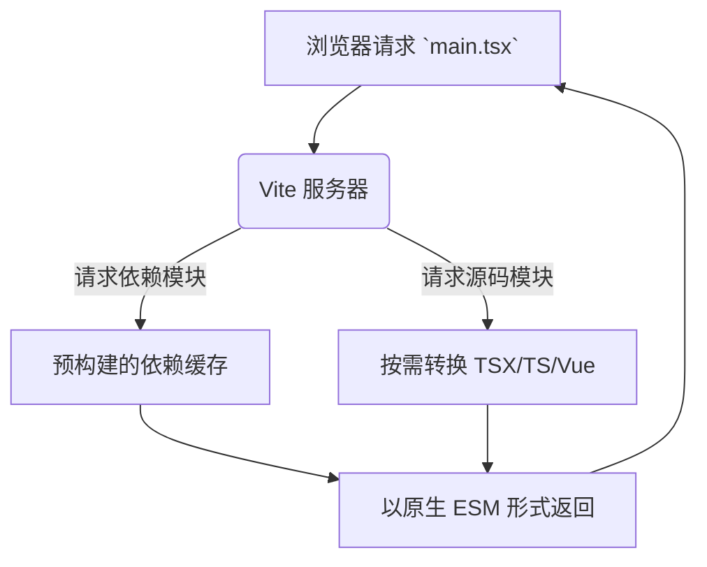

好的，请看下面为您生成的关于 Vite 与传统构建工具对比的完整技术文档。

---

# Vite 与传统构建工具的深度对比与最佳实践

## 1. 引言：前端构建工具的演进

在前端开发领域，构建工具扮演着至关重要的角色。它们负责将开发者编写的现代、模块化代码（如 TypeScript, JSX, Vue SFCs）转换为浏览器能够高效理解和运行的 JavaScript、CSS 和 HTML。传统的构建工具，如 Webpack、Parcel 和 Rollup，极大地推动了前端工程化的发展，但它们也面临着随着项目规模增长而日益显著的性能瓶颈。

Vite（法语意为 "快速"，发音 `/viːt/`）由 Vue.js 作者尤雨溪开发，旨在提供一种全新的开发体验。它并非简单地替代 Webpack，而是重新思考了开发服务器和构建打包的概念。本文将深入对比 Vite 与传统构建工具，并阐述其最佳实践。

## 2. 核心架构差异

### 2.1 传统工具：打包优先 (Bundler-First)

以 **Webpack** 为代表的传统工具采用「打包优先」的策略。在开发服务器启动时，它需要先递归地构建整个应用的依赖图，将所有模块打包成一个或多个巨大的 bundle（通常存储在内存中），然后服务器才能准备就绪。

```javascript
// 一个简化的 Webpack 开发服务器启动过程
1. 读取入口文件 (e.g., `src/main.js`)
2. 构建依赖图：解析 `import` 和 `require` 语句，找到所有依赖模块
3. 转换模块：对每个模块应用对应的 loader (e.g., babel-loader, css-loader)
4. 打包：将所有模块组合成一个或多个 bundle
5. 服务就绪：将 bundle 提供给浏览器
```

*启动时间与项目大小成正比，大型项目可能需要 10 分钟甚至更久。*

### 2.2 Vite：原生 ESM 优先 (Native ESM-First)

Vite 利用了现代浏览器原生支持 **ES 模块 (ESM)** 的特性，采取了截然不同的策略。

1. **开发服务器**：Vite 将代码分为**依赖**和**源码**。
    * **依赖**：大多为纯 JavaScript，无需频繁变动。Vite 使用 **esbuild**（用 Go 编写，极快）进行预构建，将其转换为 ESM 并缓存。Esbuild 的速度比基于 JavaScript 的打包器快 10-100 倍。
    * **源码**：通常是需要转换的代码（如 JSX, TS, Vue）。Vite 按需提供这些源码。当浏览器请求某个模块时，Vite 才会即时转换该模块并提供给它。



*服务器启动时间与项目大小无关，几乎是即时的。*

## 3. 关键特性对比

| 特性 | Vite | Webpack (传统代表) |
| :--- | :--- | :--- |
| **开发服务器启动** | **极快**（<1s），与项目规模无关 | **慢**，随项目规模线性增长 |
| **热更新 (HMR)** | **极快**，仅更新变化的模块 | **较慢**，需要重建部分 bundle |
| **构建工具** | Rollup（生产环境） | Webpack 自身 |
| **开发环境构建** | **无需打包**，使用原生 ESM | 需要打包 |
| **语言支持** | 原生支持 .ts, .jsx, .css 等，依赖 esbuild 转换 | 依赖相应 loader (e.g., `ts-loader`, `css-loader`) |
| **插件生态** | 兼容多数 Rollup 插件，并有自己的 Vite 插件体系 | 庞大成熟的 Webpack 插件生态 |

### 3.1 热更新 (HMR) 性能

这是体验差异最大的地方。

* **Webpack**: HMR 时需要更新变化的模块及其依赖的模块，并重新打包所在的 chunk。虽然比完全刷新快，但在大型应用中仍然能感受到明显的延迟。
* **Vite**: HMR 是在原生 ESM 基础上进行的。当一个模块更新时，Vite 只需要精确地使该模块及其直系导入者的链失效。这意味着 HMR 更新通常**在 50ms 内**完成，无论应用大小，几乎感觉不到延迟。

## 4. 为何选择 Vite？优势场景

1. **追求极致的开发体验**：启动快，热更新快，让开发者心流不中断。
2. **开发大型项目**：性能优势随项目复杂度提升而愈发明显。
3. **使用现代框架**：与 Vue、React、Svelte、Lit 等框架完美契合，是许多新框架官方工具链的基石（如 Nuxt 3, SvelteKit, SolidStart）。
4. **构建库或 Web 组件**：使用 `library` 模式和 Rollup 干净的构建输出，非常合适。

## 5. 潜在考量与迁移挑战

1. **浏览器兼容性**：开发环境依赖浏览器原生 ESM。这意味着不支持原生 ESM 的旧浏览器（如 IE11）无法直接运行开发版本。**生产构建**由 Rollup 处理，仍然可以生成兼容旧浏览器的代码（通过 `@vitejs/plugin-legacy`）。
2. **生态成熟度**：虽然插件生态增长迅速，但一些非常小众或古老的 Webpack 插件可能找不到完全对等的 Vite 替代品。
3. **不同的概念**：需要理解 Vite 的「依赖预构建」和「按需编译」模型，这与 Webpack 的打包思维不同。

## 6. 从 Webpack 迁移到 Vite：最佳实践

### 6.1 步骤概览

1. **安装 Vite 和插件**：

    ```bash
    npm install vite @vitejs/plugin-react --save-dev
    # 或用于 Vue
    # npm install vite @vitejs/plugin-vue --save-dev
    ```

    移除 `webpack`、`webpack-dev-server` 及相关插件和 loader。

2. **创建 Vite 配置文件** (`vite.config.js` 或 `vite.config.ts`)：

    ```javascript
    // vite.config.js
    import { defineConfig } from 'vite'
    import react from '@vitejs/plugin-react'

    export default defineConfig({
      plugins: [react()],
    })
    ```

3. **调整 `index.html`**：
    Vite 将 `index.html` 视为入口点，而非 JS。确保在 `<body>` 中引入你的主 JS 文件。

    ```html
    <!-- 将 -->
    <script src="./dist/bundle.js"></script>
    <!-- 改为 -->
    <script type="module" src="/src/main.jsx"></script>
    ```

    注意：`src="/src/..."` 是绝对路径，这是 Vite 开发服务器的约定。

4. **迁移构建脚本** (`package.json`)：

    ```json
    {
      "scripts": {
        "dev": "vite", // 启动开发服务器
        "build": "vite build", // 为生产环境构建
        "preview": "vite preview" // 本地预览生产构建
      }
    }
    ```

5. **替换环境变量**：
    Vite 使用 `import.meta.env` 而非 `process.env`。
    * `process.env.NODE_ENV` -> `import.meta.env.MODE`
    * `process.env.REACT_APP_API_URL` -> `import.meta.env.VITE_API_URL`
    **注意**：只有以 `VITE_` 为前缀的变量才会被暴露给客户端。

6. **处理静态资源**：
    Vite 使用 `import` 语句或绝对路径引用资源，而非 `file-loader` 或 `url-loader`。

    ```javascript
    // Vite 方式
    import logoUrl from './logo.png'
    const imgUrl = new URL('./logo.png', import.meta.url).href

    function Header() {
      return 
    }
    ```

7. **逐步解决兼容问题**：逐一解决因插件、loader 或特定配置差异导致的问题。

### 6.2 示例：一个简单的 React 项目迁移

**Webpack 配置片段 (`webpack.config.js`)：**

```javascript
module.exports = {
  entry: './src/index.js',
  module: {
    rules: [
      {
        test: /\.(js|jsx)$/,
        exclude: /node_modules/,
        use: ['babel-loader']
      },
      {
        test: /\.css$/i,
        use: ["style-loader", "css-loader"]
      }
    ]
  }
};
```

**对应的 Vite 配置 (`vite.config.js`)：**

```javascript
import { defineConfig } from 'vite'
import react from '@vitejs/plugin-react'

// @vitejs/plugin-react 自动处理了 JSX 和 Babel 转换，并集成了热更新。
// 对于 CSS，Vite 原生支持，无需额外配置即可直接导入。
export default defineConfig({
  plugins: [react()],
})
```

## 7. Vite 生产构建最佳实践

虽然开发环境无需打包，但生产环境仍需打包以优化性能（HTTP/2 虽好，但大量小文件请求仍有开销）和兼容旧浏览器。

1. **使用 Rollup 进行构建**：Vite 使用 Rollup 进行生产构建，输出高度优化的静态资产。
2. **代码分割**：自动动态导入 (`import()`) 进行代码分割。
3. **兼容旧浏览器**：使用官方 `@vitejs/plugin-legacy`。

    ```javascript
    // vite.config.js
    import legacy from '@vitejs/plugin-legacy'

    export default defineConfig({
      plugins: [
        react(),
        legacy({
          targets: ['defaults', 'not IE 11']
        })
      ]
    })
    ```

4. **优化静态资源**：内置支持小图片的 Base64 内联，大图片压缩等。

## 8. 结论

Vite 并非要完全取代 Webpack。Webpack 因其高度的可配置性和庞大的生态，在极其复杂和特定的场景下仍有其价值。

然而，对于绝大多数现代前端项目而言，**Vite 代表着一种范式转变和显著的体验提升**。它通过利用浏览器原生功能和更快的工具链（esbuild、Rollup），成功地「重新诠释了开发者体验」，将开发效率提升到了一个的新高度。

**迁移建议**：

* **新项目**：强烈推荐直接使用 Vite。
* **现有大型 Webpack 项目**：评估迁移成本。如果开发服务器速度已成为团队痛点，那么迁移是值得的。可以逐步迁移，或为新功能创建独立的 Vite 项目。
* **库开发者**：Vite 的库模式是一个优秀的选择。

Vite 的迅猛发展证明了市场对更好开发工具的渴望，它已经成为现代前端开发工具链中不可或缺的核心组成部分。

---

**参考资料：**

1. <https://vitejs.dev/guide/why.html>
2. <https://webpack.js.org/>
3. <https://www.smashingmagazine.com/2021/09/journey-webpack-vite/>
4. <https://blog.logrocket.com/migrating-from-webpack-to-vite/>
5. <https://www.telerik.com/blogs/vite-vs-webpack-which-build-tool-should-you-choose>
6. <https://www.honeybadger.io/blog/future-of-frontend/>
7. <https://pnpm.io/blog/vite-production-build>
8. <https://www.youtube.com/watch?v=KCrXbyQfOlc>
9. <https://dev.to/yyx990803/state-of-vite-2023-2o4n>
10. <https://github.com/yyx990803/vite-vs-webpack-benchmark>
