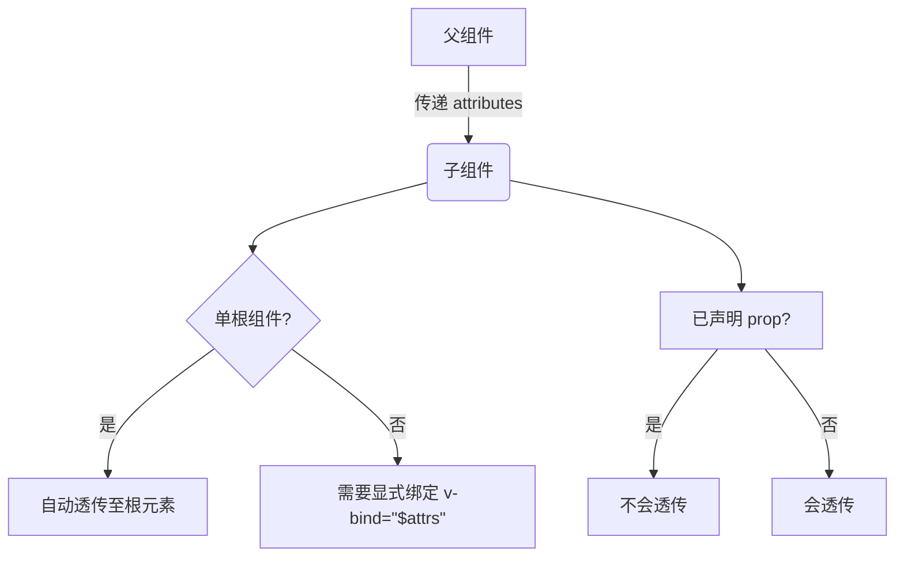

# Vue3 组件透传 Attributes 详解与最佳实践

> 本文基于 Vue 3.4+ 版本编写，深入探讨组件 Attributes 透传机制及其应用场景

## 什么是 Attributes 透传？

在 Vue 组件开发中，**Attributes 透传**是指父组件向子组件传递的 attributes（普通 HTML 属性）和事件监听器（`v-on` 事件）**自动传递**到子组件的根元素上的机制。当子组件没有显式声明这些 props 或事件时，Vue 会自动将这些属性应用到子组件的根元素上。

### 透传机制的核心特点

- 自动应用于**单根节点组件**的根元素
- 包含普通 HTML 属性（如 `class`, `style`, `id` 等）
- 包含原生 DOM 事件监听器（如 `@click`）
- 不包含组件已声明的 props 或自定义事件
- 支持通过 `v-bind="$attrs"` 手动控制透传位置

## 基础透传示例

### 单根节点组件自动透传

```vue
<!-- ParentComponent.vue -->
<template>
  <ChildComponent class="parent-class" style="color: red" data-custom="test" @click="handleClick" />
</template>

<script setup>
import ChildComponent from './ChildComponent.vue';

const handleClick = () => {
  console.log('Click event propagated to parent!');
};
</script>
```

```vue
<!-- ChildComponent.vue -->
<template>
  <!-- 所有未声明的 attributes 将自动传递到根元素 -->
  <div>Click me!</div>
</template>
```

渲染结果：

```html
<div class="parent-class" style="color: red" data-custom="test">Click me!</div>
```

### 多根节点组件透传处理

多根节点组件需要显式指定透传位置：

```vue
<!-- MultiRootComponent.vue -->
<template>
  <header>Header</header>
  <main v-bind="$attrs">Main Content</main>
  <!-- 透传到此处 -->
  <footer>Footer</footer>
</template>

<script setup>
import { useAttrs } from 'vue';

// 访问透传的 attributes
const attrs = useAttrs();
console.log(attrs); // { class: 'parent-class', ... }
</script>
```

## Attributes 透传规则详解

### 1. 合并策略

| 属性类型   | 合并规则         | 示例                                                                     |
| ---------- | ---------------- | ------------------------------------------------------------------------ |
| `class`    | 自动合并         | `<Child class="a"/>` + 子组件 `class="b"` → `class="a b"`                |
| `style`    | 自动合并         | 父: `style="{color: red}"` + 子: `style="{fontSize: '16px'}"` → 合并样式 |
| 其他属性   | 父组件覆盖子组件 | 父: `id="parent"` + 子: `id="child"` → `id="parent"`                     |
| 事件监听器 | 同时触发父子事件 | 父 `@click` 和 子 `@click` 都会触发                                      |

### 2. 透传范围



## 最佳实践与应用场景

### 1. 封装第三方组件

```vue
<!-- CustomButton.vue -->
<template>
  <button v-bind="filteredAttrs">
    <slot></slot>
  </button>
</template>

<script setup>
import { computed, useAttrs } from 'vue';

const attrs = useAttrs();

// 过滤掉不需要透传的属性
const filteredAttrs = computed(() => {
  const { class: className, style, ...rest } = attrs;
  return { class: `custom-btn ${className || ''}`, style, ...rest };
});
</script>
```

### 2. 高级组件透传控制

```vue
<!-- SmartInput.vue -->
<template>
  <div class="input-wrapper">
    <label v-if="label">{{ label }}</label>
    <input v-bind="inputAttrs" :value="modelValue" @input="$emit('update:modelValue', $event.target.value)" />
  </div>
</template>

<script setup>
import { computed, useAttrs } from 'vue';

const props = defineProps({
  modelValue: [String, Number],
  label: String,
});

const emit = defineEmits(['update:modelValue']);

const attrs = useAttrs();

// 分离 input 特定属性
const inputAttrs = computed(() => {
  const { class: _, style, ...rest } = attrs;
  return {
    class: 'form-input',
    ...rest,
  };
});
</script>
```

### 3. 事件监听器透传

```vue
<!-- ClickableCard.vue -->
<template>
  <div class="card" v-bind="cardAttrs" @click="handleClick">
    <slot></slot>
  </div>
</template>

<script setup>
import { useAttrs } from 'vue';

const attrs = useAttrs();

// 处理点击事件（同时支持父组件监听）
const handleClick = (e) => {
  // 执行内部逻辑
  console.log('Card clicked');

  // 触发父组件监听的事件（如果存在）
  if (attrs.onClick) {
    attrs.onClick(e);
  }
};
</script>
```

## 禁用 Attributes 透传

```vue
<script setup>
defineOptions({
  inheritAttrs: false, // 禁用自动透传
});

// 手动处理部分属性
const { class: className, style, ...restAttrs } = useAttrs();
</script>
```

## 注意事项与常见问题

1. **事件监听器命名**：

   ```vue
   <!-- 父组件 -->
   <ChildComponent @custom-event="handler" />

   <!-- 子组件 -->
   <template>
     <div @click="$emit('custom-event')"></div>
   </template>
   ```

2. **特殊属性处理**：

   ```vue
   <script setup>
   import { useAttrs } from 'vue';

   const attrs = useAttrs();

   // 安全访问属性
   const customAttribute = attrs['data-custom'] || '';
   </script>
   ```

3. **性能优化**：

   ```vue
   <script setup>
   import { useAttrs, ref, onMounted } from 'vue';

   const attrs = useAttrs();
   const root = ref(null);

   onMounted(() => {
     // 直接操作DOM处理大量属性
     Object.entries(attrs).forEach(([key, value]) => {
       if () {
         root.value.setAttribute(key, value);
       }
     });
   });
   </script>
   ```

4. **TypeScript 类型支持**：

   ```ts
   import type { HTMLAttributes } from 'vue';

   // 声明透传属性类型
   interface ExtraAttrs extends HTMLAttributes {
     'data-custom'?: string;
     'aria-role'?: string;
   }

   const attrs = useAttrs() as ExtraAttrs;
   ```

## 总结

Vue3 的 Attributes 透传机制提供了强大的组件封装能力，合理运用透传可以：

✅ 创建更灵活的可复用组件  
✅ 减少不必要的 prop 声明  
✅ 保持组件接口简洁  
✅ 实现高阶组件封装模式  
✅ 更好地与原生 HTML 元素集成

在实际开发中，建议：

1. 单根组件优先使用自动透传
2. 复杂组件使用 `useAttrs()` 精细控制
3. 封装第三方组件时合理过滤属性
4. TypeScript 项目添加类型声明
5. 多根组件始终显式绑定 `$attrs`

通过掌握透传机制，可以显著提升 Vue 组件的可重用性和灵活性，创建更优雅的组件 API 设计。

> 本文内容参考：Vue 官方文档、Vue Mastery 教程、Vue School 课程及社区最佳实践
