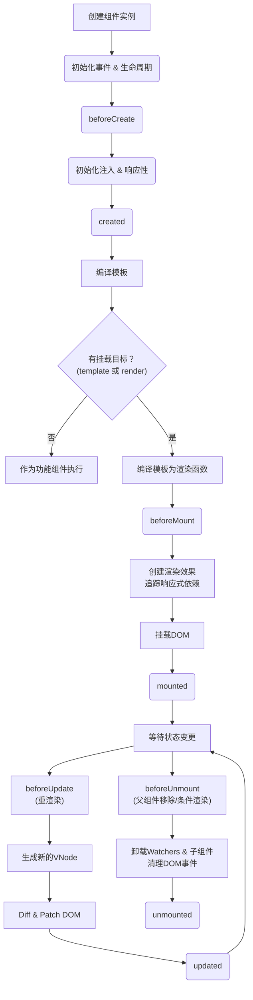

好的，请看下方为您生成的关于 Vue 3 生命周期详解与最佳实践的完整技术文档。

---

# Vue 3 生命周期详解与最佳实践

## 1. 引言

在 Vue 应用开发中，理解和正确使用生命周期钩子是构建健壮、可维护应用的基础。每个 Vue 组件实例在被创建、挂载、更新和销毁时都会经历一系列初始化的步骤，在这些步骤中会运行被称为**生命周期钩子**的函数。

Vue 3 在兼容 Vue 2 选项式 API (Options API) 生命周期的基础上，为其组合式 API (Composition API) 引入了一套新的、功能对等的钩子函数。本文将深入探讨 Vue 3 中的生命周期，并提供基于最佳实践的代码示例。

### 生命周期图示

以下是 Vue 3 官方提供的组件生命周期图谱，它清晰地描绘了一个组件从初始化到销毁的完整过程。



## 2. Vue 3 生命周期概览

Vue 3 的生命周期可以分为四个主要阶段：**创建（Creation）**、**挂载（Mounting）**、**更新（Updating）** 和**卸载（Unmounted）**。此外，还有用于调试和 `<KeepAlive>` 组件的特殊钩子。

### 选项式 API 与 组合式 API 生命周期钩子对照表

| 选项式 API Hook        | 组合式 API Hook         | 触发时机与用途                                                                 |
| :--------------------- | :---------------------- | :----------------------------------------------------------------------------- |
| `beforeCreate`         | `setup()` 内部          | 在实例初始化之后、响应式数据和事件配置之前调用。                               |
| `created`              | `setup()` 内部          | 在实例处理完所有状态相关的选项（响应式数据、计算属性、方法等）后调用。           |
| `beforeMount`          | `onBeforeMount`         | 在组件被挂载到 DOM 之前调用。                                                  |
| `mounted`              | `onMounted`             | 在组件被挂载到 DOM 之后调用。                                                  |
| `beforeUpdate`         | `onBeforeUpdate`        | 在组件即将因响应式状态变更而更新其 DOM 树之前调用。                            |
| `updated`              | `onUpdated`             | 在组件因响应式状态变更而更新其 DOM 树之后调用。                                |
| `beforeUnmount`        | `onBeforeUnmount`       | 在组件实例被卸载之前调用。                                                     |
| `unmounted`            | `onUnmounted`           | 在组件实例被卸载之后调用。                                                     |
| `errorCaptured`        | `onErrorCaptured`       | 在捕获了后代组件传递的错误时调用。                                             |
| `renderTracked` (Dev)  | `onRenderTracked` (Dev) | 在组件渲染过程中追踪到响应式依赖时调用（仅用于开发模式）。                       |
| `renderTriggered` (Dev)| `onRenderTriggered` (Dev)| 在响应式依赖触发组件重新渲染时调用（仅用于开发模式）。                           |
| `activated`            | `onActivated`           | 被 `<KeepAlive>` 缓存的组件激活时调用。                                        |
| `deactivated`          | `onDeactivated`         | 被 `<KeepAlive>` 缓存的组件失活时调用。                                        |

## 3. 生命周期钩子详解与代码示例

### 3.1 Creation (创建阶段)

这个阶段在组件实例被创建时执行，主要处理响应式数据的初始化。

#### `setup()`

**说明**：`setup()` 是组合式 API 的入口点。它在 `beforeCreate` 之前调用，此时组件的 `props` 和 `attrs` 已解析，但其他选项尚未处理。你在此函数中定义的所有响应式状态和函数都需要显式返回，才能在模板中使用。

**选项式 API 等价物**：`beforeCreate` 和 `created`。在 `setup()` 中，你无需定义这两个钩子，因为它们的逻辑可以直接写在 `setup()` 函数体内。

**代码示例**：

```vue
<script>
import { ref, reactive } from 'vue';

export default {
  props: {
    title: String
  },
  setup(props, context) {
    // 此时相当于 beforeCreate 和 created 阶段
    console.log('props:', props.title); // props 已可访问
    console.log('attrs:', context.attrs); // attrs 也可访问

    // 定义响应式数据
    const count = ref(0);
    const user = reactive({ name: 'Alice', age: 30 });

    // 定义方法
    function increment() {
      count.value++;
    }

    // 返回所有需要在模板中使用的数据和方法
    return {
      count,
      user,
      increment
    };
  }
  // beforeCreate 和 created 钩子在此选项式 API 中不再需要定义
}
</script>
```

### 3.2 Mounting (挂载阶段)

这个阶段与将组件挂载到真实 DOM 节点相关。

#### `onBeforeMount` / `beforeMount`

**说明**：在组件被挂载到 DOM 之前调用。此时，渲染函数已被调用，但尚未创建真实的 DOM 节点。**很少使用**，因为在 `setup()` 或 `created` 中能完成大多数初始化工作。

**代码示例**：

```vue
<script>
// 组合式 API
import { onBeforeMount } from 'vue';

export default {
  setup() {
    onBeforeMount(() => {
      console.log('DOM 即将被挂载。');
      // 无法在此访问到 this.$el 或 DOM 元素
    });
  }
}

// 选项式 API
export default {
  beforeMount() {
    console.log('DOM 即将被挂载。');
    console.log(this.$el); // undefined
  }
}
</script>
```

#### `onMounted` / `mounted`

**说明**：在组件被挂载到 DOM 之后调用。此时可以安全地访问组件模板中的 DOM 元素。这是**最常用**的钩子之一，常用于执行 DOM 操作、初始化第三方库（如图表、地图）或发起网络请求。

**代码示例**：

```vue
<template>
  <div ref="root">Hello Vue 3!</div>
</template>

<script>
// 组合式 API
import { ref, onMounted } from 'vue';

export default {
  setup() {
    const root = ref(null); // 创建一个模板引用

    onMounted(() => {
      console.log('DOM 已挂载。');
      console.log(root.value); // 输出: <div>Hello Vue 3!</div>
      // 可以在此初始化依赖 DOM 的库，例如：
      // const chart = echarts.init(root.value);
    });

    return {
      root
    };
  }
}

// 选项式 API
export default {
  mounted() {
    console.log('DOM 已挂载。');
    console.log(this.$el); // 输出: <div>Hello Vue 3!</div>
  }
}
</script>
```

### 3.3 Updating (更新阶段)

这个阶段在组件的响应式状态发生变化导致重新渲染时执行。

#### `onBeforeUpdate` / `beforeUpdate`

**说明**：在组件因响应式状态变更而即将更新其 DOM 树**之前**调用。此时，Vue 已经生成了新的虚拟 DOM，但尚未将其 patch 到真实 DOM 上。可以用于在 DOM 更新前获取状态信息（如当前的滚动位置）。

**代码示例**：

```vue
<template>
  <p>{{ count }}</p>
</template>

<script>
// 组合式 API
import { ref, onBeforeUpdate } from 'vue';

export default {
  setup() {
    const count = ref(0);

    onBeforeUpdate(() => {
      console.log('数据已变化，DOM 即将更新。当前值是:', count.value);
    });

    return { count };
  }
}

// 选项式 API
export default {
  data() {
    return { count: 0 };
  },
  beforeUpdate() {
    console.log('数据已变化，DOM 即将更新。当前值是:', this.count);
  }
}
</script>
```

#### `onUpdated` / `updated`

**说明**：在组件因响应式状态变更而更新其 DOM 树**之后**调用。**谨慎使用**！如果你在此钩子中修改状态，很可能导致无限更新循环。它通常用于执行依赖于组件更新后 DOM 结构的操作。

**最佳实践**：尽量避免使用。如果必须使用，通常是为了集成非 Vue 的第三方库，并且需要确保操作是幂等的（即多次执行结果相同）。

**代码示例**：

```vue
<template>
  <p ref="textElement">{{ message }}</p>
</template>

<script>
// 组合式 API
import { ref, onUpdated } from 'vue';

export default {
  setup() {
    const message = ref('Hello');
    const textElement = ref(null);

    function changeMessage() {
      message.value = 'Updated';
    }

    onUpdated(() => {
      // 这是一个潜在的危险操作，仅作示例。
      console.log('DOM 已更新。当前文本内容:', textElement.value?.textContent);
    });

    return { message, textElement, changeMessage };
  }
}
</script>
```

### 3.4 Unmounting (卸载阶段)

这个阶段在组件实例被销毁和从 DOM 中移除时执行。

#### `onBeforeUnmount` / `beforeUnmount`

**说明**：在组件实例被卸载**之前**调用。此时，组件实例仍然完全可用。这是**清理操作的最佳时机**，例如清除定时器、取消未完成的网络请求、取消订阅的事件监听器或清理第三方库的实例，以防止内存泄漏。

**代码示例**：

```vue
<script>
// 组合式 API
import { onMounted, onBeforeUnmount } from 'vue';

export default {
  setup() {
    let intervalId = null;

    onMounted(() => {
      intervalId = setInterval(() => {
        console.log('Interval tick');
      }, 1000);
    });

    onBeforeUnmount(() => {
      if (intervalId) {
        clearInterval(intervalId);
        intervalId = null;
        console.log('定时器已清理，避免内存泄漏。');
      }
    });
  }
}

// 选项式 API
export default {
  data() {
    return {
      intervalId: null
    };
  },
  mounted() {
    this.intervalId = setInterval(() => {
      console.log('Interval tick');
    }, 1000);
  },
  beforeUnmount() {
    if (this.intervalId) {
      clearInterval(this.intervalId);
      this.intervalId = null;
    }
  }
}
</script>
```

#### `onUnmounted` / `unmounted`

**说明**：在组件实例被卸载**之后**调用。此时，所有指令都已解除绑定，所有事件监听器都已移除，所有子组件实例也都被卸载。可以执行一些最终的清理工作，但大多数清理应在 `onBeforeUnmount` 中完成。

**代码示例**：

```vue
<script>
// 组合式 API
import { onUnmounted } from 'vue';

export default {
  setup() {
    onUnmounted(() => {
      console.log('组件已被卸载。');
    });
  }
}
</script>
```

### 3.5 其他特殊钩子

#### `onErrorCaptured` / `errorCaptured`

**说明**：当捕获了来自后代组件的错误时被调用。它可以返回 `false` 来阻止错误继续向上传播。常用于编写错误边界组件。

#### `onActivated` / `activated` 与 `onDeactivated` / `deactivated`

**说明**：被 `<KeepAlive>` 缓存的组件在激活和失活时调用，而不是创建和卸载。

## 4. 最佳实践与常见陷阱

1. **数据获取在哪进行？**
    * **`created` / `setup()`**：如果数据获取不需要依赖 DOM，应优先在此阶段进行，可以更早地发起请求。
    * **`mounted`**：如果操作必须依赖 DOM，则在此进行。

2. **避免在 `updated` 中改变状态**：
    这很容易导致无限更新循环。如果必须，请添加条件判断来阻止循环。

3. **务必清理副作用**：
    在 `onBeforeUnmount` (或选项式 API 的 `beforeUnmount`) 中清理定时器 (`setInterval`, `setTimeout`)、事件监听器 (如 `window.addEventListener`)、第三方库实例等。这是防止内存泄漏的关键。

4. **模板引用 (`ref`) 的访问时机**：
    在 `setup()` 中，模板引用 (`ref`) 的初始值是 `null`。只有在 `onMounted` 及之后的生命周期钩子中才能访问到对应的 DOM 元素或组件实例。

5. **组合式 API 的优势**：
    组合式 API 的钩子 (`onXxx`) 可以多次调用，并且逻辑相关的代码（数据、方法、生命周期）可以组织在一起，大大提高了代码的可读性和可维护性。对于新项目，强烈推荐使用组合式 API。

## 5. 总结

Vue 3 的生命周期钩子为你提供了在组件不同阶段执行代码的能力。理解每个钩子的触发时机和适用场景是编写高效、无内存泄漏 Vue 应用的关键。

* **创建阶段 (`setup`)**: 初始化响应式状态和事件。
* **挂载阶段 (`onMounted`)**: 访问 DOM，集成第三方库。
* **更新阶段 (谨慎使用 `onUpdated`)**: 响应状态变化后的 DOM 操作。
* **卸载阶段 (`onBeforeUnmount`)**: **清理副作用，防止内存泄漏**。

根据你的逻辑需求，选择正确的钩子函数，并遵循本文提到的最佳实践，将帮助你构建出更加稳健的 Vue 应用程序。

---
**版权声明**：本文内容部分参考并总结了 <https://vuejs.org/guide/essentials/lifecycle.html> 及社区最佳实践，旨在提供清晰的学习指南。
