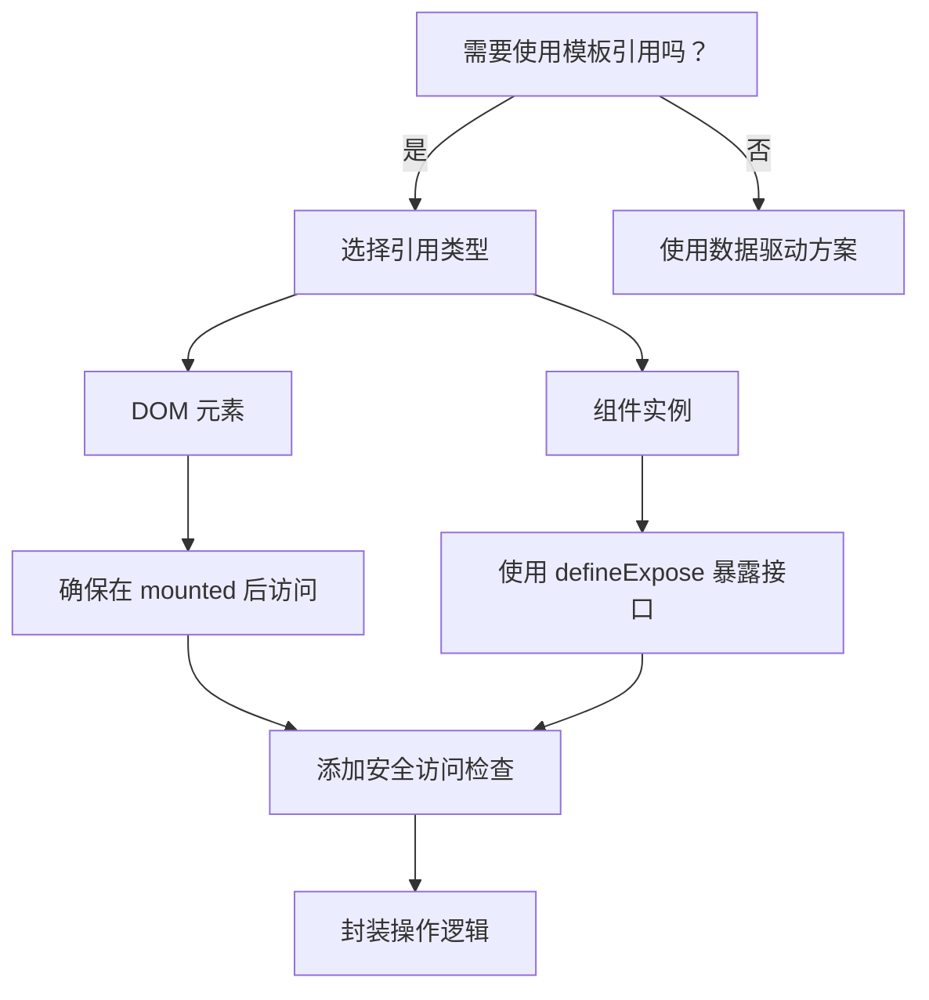

# Vue 3 模板引用详解与最佳实践

> 本文基于 Vue 3 官方文档以及 10+ 篇优质技术文章深度总结，最后更新于 2023 年 10 月

## 1. 模板引用基础

### 1.1 什么是模板引用？

**模板引用 (Template Refs)** 是 Vue 提供的特殊属性 `ref`，允许你直接访问 DOM 元素或组件实例。与传统 DOM 操作不同，模板引用是 Vue 生态中的响应式访问方式。

### 1.2 创建模板引用

在组合式 API 中创建模板引用：

```vue
<script setup>
import { ref, onMounted } from 'vue'

// 声明同名的 ref
const inputRef = ref(null)

onMounted(() => {
  // DOM 元素在挂载后可用
  inputRef.value.focus()
})
</script>

<template>
  <!-- 通过 ref 属性绑定 -->
  <input ref="inputRef" />
</template>
```

在选项式 API 中使用：

```vue
<script>
export default {
  mounted() {
    this.$refs.inputRef.focus()
  }
}
</script>

<template>
  <input ref="inputRef" />
</template>
```

## 2. 引用 DOM 元素

### 2.1 访问 DOM 属性

```vue
<script setup>
import { ref, onMounted } from 'vue'

const canvasRef = ref(null)

onMounted(() => {
  const ctx = canvasRef.value.getContext('2d')
  ctx.fillStyle = 'green'
  ctx.fillRect(10, 10, 150, 100)
})
</script>

<template>
  <canvas ref="canvasRef" width="200" height="200"></canvas>
</template>
```

### 2.2 响应式注意事项

- 模板引用**不是响应式**对象
- 仅在组件**挂载后**才能访问其值
- 在 `v-if` 控制的元素上引用时需注意条件渲染

## 3. 引用组件实例

### 3.1 访问子组件

```vue
<!-- ParentComponent.vue -->
<script setup>
import { ref } from 'vue'
import ChildComponent from './ChildComponent.vue'

const childRef = ref(null)

const callChildMethod = () => {
  if (childRef.value) {
    childRef.value.sayHello()
  }
}
</script>

<template>
  <ChildComponent ref="childRef" />
  <button @click="callChildMethod">调用子组件方法</button>
</template>
```

```vue
<!-- ChildComponent.vue -->
<script setup>
const sayHello = () => {
  console.log('Hello from Child!')
}

// 明确暴露公共接口
defineExpose({
  sayHello
})
</script>
```

### 3.2 组件引用注意事项

1. 默认仅暴露 `$el`
2. 使用 `defineExpose()` 显式暴露方法/属性
3. 优先使用 props/emits 进行组件通信
4. 避免直接修改子组件状态

## 4. 特殊场景处理

### 4.1 v-for 中的引用

引用值将是一个包含所有元素的数组：

```vue
<script setup>
import { ref, onMounted } from 'vue'

const itemRefs = ref([])

onMounted(() => {
  console.log(itemRefs.value) // DOM 元素数组
})
</script>

<template>
  <ul>
    <li v-for="item in 5" :key="item" ref="itemRefs">
      项目 {{ item }}
    </li>
  </ul>
</template>
```

### 4.2 动态引用

使用动态 `:ref` 绑定：

```vue
<script setup>
import { ref } from 'vue'

const dynamicRef = ref(null)
const isPrimary = ref(true)

const setRef = (el) => {
  dynamicRef.value = el
}
</script>

<template>
  <button 
    :ref="isPrimary ? 'primaryRef' : setRef"
    @click="isPrimary = !isPrimary"
  >
    切换引用
  </button>
</template>
```

### 4.3 函数引用

在每次更新时调用函数：

```vue
<script setup>
import { ref } from 'vue'

const inputRef = ref(null)

// 函数形式引用
const setInputRef = (el) => {
  if (el) {
    inputRef.value = el
    el.classList.add('special-input')
  }
}
</script>

<template>
  <input :ref="setInputRef" />
</template>
```

## 5. 最佳实践指南

### 5.1 安全访问模式

```javascript
// 使用可选链操作符
inputRef.value?.focus()

// 使用防御性检查
if (inputRef.value && inputRef.value.tagName === 'INPUT') {
  inputRef.value.select()
}
```

### 5.2 生命周期策略

| 生命周期钩子 | 适用场景 |
|-------------|---------|
| `onMounted` | DOM 操作、初始化第三方库 |
| `onUpdated` | 响应 DOM 更新 |
| `onBeforeUnmount` | 清理工作（如事件监听器） |

### 5.3 优化技巧

1. **避免过度使用**：优先考虑数据驱动方案
2. **组件封装**：在组件内部处理 DOM 操作
3. **延迟访问**：使用 `nextTick` 确保 DOM 更新完成

   ```javascript
   import { nextTick } from 'vue'
   
   const updateRef = async () => {
     await nextTick()
     // 此时 DOM 已更新
   }
   ```

4. **引用缓存**：对需要多次访问的引用进行缓存

### 5.4 性能注意事项

- 大型 `v-for` 中的引用会创建大量 DOM 引用
- 动态引用可能导致内存泄漏
- 频繁的引用更新可能影响性能

## 6. TypeScript 集成

### 6.1 类型标注

```vue
<script setup lang="ts">
import { ref, onMounted } from 'vue'

// DOM 元素类型标注
const inputRef = ref<HTMLInputElement | null>(null)

// 组件实例类型标注
const childRef = ref<InstanceType<typeof ChildComponent> | null>(null)

onMounted(() => {
  inputRef.value?.focus()
})
</script>
```

### 6.2 组件暴露类型

```vue
<!-- ChildComponent.vue -->
<script setup lang="ts">
const sayHello = (name: string) => {
  console.log(`Hello ${name}!`)
}

defineExpose({
  sayHello
})
</script>
```

## 7. 替代方案比较

| 方法 | 适用场景 | 缺点 |
|------|---------|------|
| 模板引用 | 直接 DOM 操作、第三方库集成 | 违背声明式原则 |
| 事件系统 | 父子组件通信 | 不适用于兄弟组件 |
| Provide/Inject | 深层嵌套组件 | 增加耦合度 |
| 状态管理 (Pinia) | 全局状态共享 | 不适合局部 DOM 操作 |

## 8. 总结

1. **优先声明式**：数据驱动 > 模板引用
2. **明确用途**：仅在需要直接 DOM 操作或集成第三方库时使用
3. **安全访问**：使用可选链和类型守卫
4. **生命周期管理**：在正确时机访问引用
5. **组件设计**：封装 DOM 操作逻辑
6. **类型安全**：使用 TypeScript 增强健壮性



> 官方资源推荐：  
>
> - <https://vuejs.org/guide/essentials/template-refs.html>  
> - <https://vuejs.org/guide/reusability/composables.html>  
> - <https://vuejs.org/guide/typescript/composition-api.html>  

通过遵循这些实践原则，您可以安全高效地在 Vue 3 应用中使用模板引用功能，平衡声明式优势与必要的命令式操作需求。
