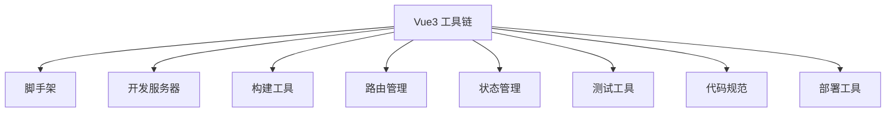
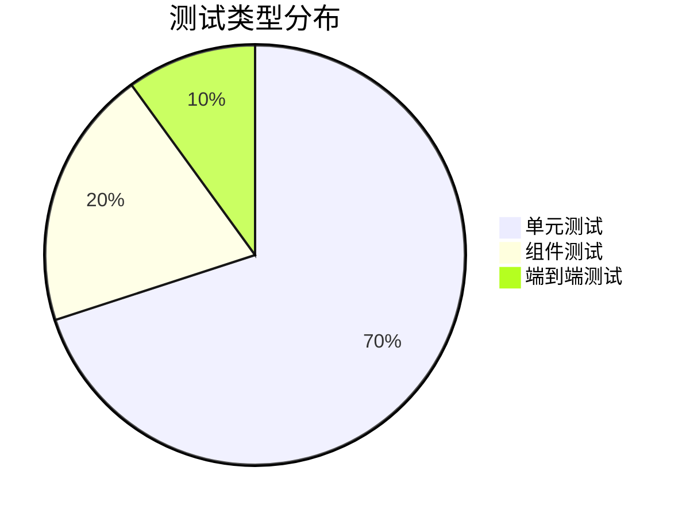
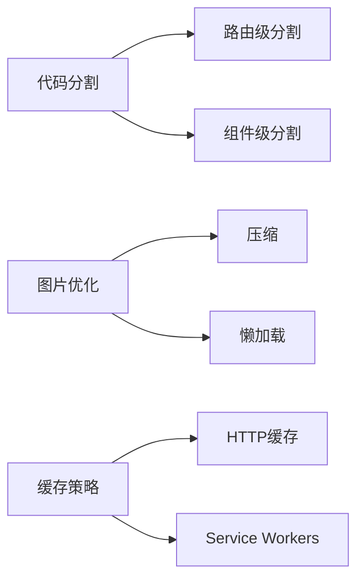

# Vue3 工具链详解与最佳实践

> 本文基于 Vue.js 官方文档、社区最佳实践以及工具链生态系统的深入分析编写而成

## 目录

1. #vue3-工具链概述
2. #核心工具详解
3. #路由管理最佳实践
4. #状态管理方案
5. #测试策略与工具
6. #代码质量与规范
7. #性能优化技巧
8. #部署与持续集成
9. #项目结构与组织
10. #社区资源与学习路径

## Vue3 工具链概述

<a id="vue3-工具链概述"></a>

Vue3 工具链是构建现代 Vue 应用程序的基础设施，提供从开发到部署的全套解决方案：



### 核心优势

- **开发体验**：快速热重载（HMR）、即时服务器启动
- **生产优化**：代码分割、Tree-shaking、预渲染
- **生态系统**：丰富的官方和社区插件支持
- **渐进式采用**：可按需选择工具组合

### 现代工具链演进

1. **Vue CLI**：传统的 Webpack 基础工作流
2. **Vite**：下一代前端工具，基于原生 ES 模块
3. **Vitesse**：社区驱动的 Vite 优化模板

> 根据 Vue 官方调查，2023 年 Vite 采用率已达 78%，成为 Vue3 项目首选工具

## 核心工具详解

<a id="核心工具详解"></a>

### Vite - 下一代前端工具

**安装与初始化**：

```bash
npm create vite@latest my-vue-app -- --template vue
cd my-vue-app
npm install
npm run dev
```

**vite.config.js 最佳实践**：

```javascript
import { defineConfig } from 'vite'
import vue from '@vitejs/plugin-vue'

export default defineConfig({
  plugins: [vue()],
  resolve: {
    alias: {
      '@': path.resolve(__dirname, './src')
    }
  },
  build: {
    rollupOptions: {
      output: {
        manualChunks: {
          vendor: ['vue', 'vue-router', 'pinia']
        }
      }
    }
  },
  server: {
    proxy: {
      '/api': {
        target: 'http://localhost:3000',
        changeOrigin: true,
        rewrite: (path) => path.replace(/^\/api/, '')
      }
    }
  }
})
```

### 插件生态系统

| 插件名称 | 功能 | 安装命令 |
|----------|------|----------|
| @vitejs/plugin-vue | Vue3 单文件组件支持 | `npm i -D @vitejs/plugin-vue` |
| unplugin-vue-components | 自动导入组件 | `npm i -D unplugin-vue-components` |
| vite-plugin-pwa | PWA 支持 | `npm i -D vite-plugin-pwa` |
| vite-plugin-svg-icons | SVG 图标处理 | `npm i -D vite-plugin-svg-icons` |
| vite-plugin-compression | 资源压缩 | `npm i -D vite-plugin-compression` |

### 性能优化技巧

```javascript
// 自动导入组件配置
import Components from 'unplugin-vue-components/vite'
import { ElementPlusResolver } from 'unplugin-vue-components/resolvers'

export default defineConfig({
  plugins: [
    Components({
      resolvers: [ElementPlusResolver()],
      dts: true // 生成类型声明文件
    })
  ]
})
```

## 路由管理最佳实践

<a id="路由管理最佳实践"></a>

### Vue Router 4 进阶用法

**路由模块化**：

```javascript
// src/router/index.js
import { createRouter, createWebHistory } from 'vue-router'

const routes = [
  {
    path: '/',
    component: () => import('@/layouts/MainLayout.vue'),
    children: [
      {
        path: '',
        name: 'Home',
        component: () => import('@/views/HomeView.vue'),
        meta: { requiresAuth: true }
      },
      // 其他子路由...
    ]
  }
]

const router = createRouter({
  history: createWebHistory(import.meta.env.BASE_URL),
  routes,
  scrollBehavior(to, from, savedPosition) {
    return savedPosition || { top: 0 }
  }
})
```

**路由守卫最佳实践**：

```javascript
router.beforeEach((to, from) => {
  const authStore = useAuthStore()
  
  // 身份验证检查
  if (to.meta.requiresAuth && !authStore.isAuthenticated) {
    return { name: 'Login', query: { redirect: to.fullPath } }
  }
  
  // 页面访问分析
  if (import.meta.env.PROD) {
    analytics.trackPageView(to.name)
  }
  
  // 页面标题设置
  document.title = to.meta.title ? `${to.meta.title} | My App` : 'My App'
})
```

### 动态路由加载策略

```javascript
// 按用户权限加载路由
export function setupDynamicRoutes(userRoles) {
  const routes = []
  
  if (userRoles.includes('admin')) {
    routes.push({
      path: '/admin',
      component: () => import('@/views/admin/Dashboard.vue'),
      meta: { requiresAdmin: true }
    })
  }
  
  routes.forEach(route => router.addRoute(route))
}
```

## 状态管理方案

<a id="状态管理方案"></a>

### Pinia - Vuex 的现代替代品

**核心优势**：

- 完整的 TypeScript 支持
- 去除 mutations 的简化 API
- 模块化设计无需嵌套
- 更友好的开发工具集成

**基本用法**：

```javascript
// stores/counter.js
import { defineStore } from 'pinia'

export const useCounterStore = defineStore('counter', {
  state: () => ({ count: 0 }),
  getters: {
    doubleCount: (state) => state.count * 2
  },
  actions: {
    increment() {
      this.count++
    },
    async fetchInitialCount() {
      const res = await api.getCount()
      this.count = res.data.count
    }
  }
})
```

**组件中使用**：

```vue
<script setup>
import { useCounterStore } from '@/stores/counter'

const counter = useCounterStore()
</script>

<template>
  <div>Count: {{ counter.count }}</div>
  <div>Double: {{ counter.doubleCount }}</div>
  <button @click="counter.increment">Increment</button>
</template>
```

### 状态持久化策略

```javascript
import { defineStore } from 'pinia'
import { useStorage } from '@vueuse/core'

export const useUserStore = defineStore('user', {
  state: () => ({
    token: useStorage('token', null),
    preferences: useStorage('preferences', {
      theme: 'light',
      locale: 'en-US'
    })
  })
})
```

## 测试策略与工具

<a id="测试策略与工具"></a>

### 三层测试金字塔



### Vitest - 高性能测试框架

**安装与配置**：

```bash
npm install -D vitest happy-dom @testing-library/vue
```

**vite.config.js 添加测试配置**：

```javascript
/// <reference types="vitest" />
export default defineConfig({
  test: {
    globals: true,
    environment: 'happy-dom',
    coverage: {
      reporter: ['text', 'json', 'html']
    }
  }
})
```

**组件测试示例**：

```javascript
import { render } from '@testing-library/vue'
import Counter from '@/components/Counter.vue'

test('increments value on click', async () => {
  const { getByText } = render(Counter)
  
  getByText('Count: 0')
  
  const button = getByText('Increment')
  await button.click()
  
  getByText('Count: 1')
})
```

### 端到端测试方案

```javascript
// Cypress 组件测试
describe('Login', () => {
  it('successfully logs in', () => {
    cy.visit('/login')
    cy.get('[data-testid="email"]').type('user@example.com')
    cy.get('[data-testid="password"]').type('password123')
    cy.get('[data-testid="submit"]').click()
    cy.url().should('include', '/dashboard')
  })
})
```

## 代码质量与规范

<a id="代码质量与规范"></a>

### ESLint + Prettier 配置

**.eslintrc.cjs**：

```javascript
module.exports = {
  root: true,
  env: {
    node: true,
  },
  extends: [
    'eslint:recommended',
    'plugin:vue/vue3-recommended',
    '@vue/typescript/recommended',
    '@vue/prettier'
  ],
  rules: {
    'vue/multi-word-component-names': 'off',
    'vue/component-api-style': ['error', ['script-setup']],
    'vue/require-default-prop': 'off',
    '@typescript-eslint/no-explicit-any': 'off'
  }
}
```

**.prettierrc**：

```json
{
  "semi": false,
  "singleQuote": true,
  "printWidth": 100,
  "tabWidth": 2,
  "trailingComma": "none",
  "arrowParens": "avoid",
  "vueIndentScriptAndStyle": true
}
```

### Git Hooks 自动化

```json
// package.json
{
  "scripts": {
    "lint": "eslint . --ext .vue,.js,.jsx,.cjs,.mjs,.ts,.tsx,.cts,.mts --fix",
    "format": "prettier --write ."
  },
  "lint-staged": {
    "*.{js,jsx,ts,tsx,vue}": [
      "eslint --fix",
      "prettier --write"
    ]
  }
}
```

```bash
# 安装 Husky
npx husky-init && npm install
npx husky add .husky/pre-commit "npx lint-staged"
```

## 性能优化技巧

<a id="性能优化技巧"></a>

### 关键优化策略



### 实际优化示例

```vue
<script setup>
import { defineAsyncComponent } from 'vue'

// 异步组件加载
const HeavyComponent = defineAsyncComponent(() =>
  import('@/components/HeavyComponent.vue')
)

// 图片懒加载
const imageRef = ref(null)
onMounted(() => {
  const observer = new IntersectionObserver((entries) => {
    if (entries[0].isIntersecting) {
      entries[0].target.src = entries[0].target.dataset.src
      observer.unobserve(entries[0].target)
    }
  })
  
  observer.observe(imageRef.value)
})
</script>

<template>
  
  <HeavyComponent v-if="showHeavyComponent" />
</template>
```

## 部署与持续集成

<a id="部署与持续集成"></a>

### Vite 生产构建

```bash
# 创建生产构建
npm run build

# 预览生产版本
npm run preview
```

**Docker 部署示例**：

```Dockerfile
# 使用 Node LTS
FROM node:18-alpine AS builder
WORKDIR /app
COPY package*.json ./
RUN npm ci
COPY . .
RUN npm run build

# 使用 Nginx 服务器
FROM nginx:alpine
COPY --from=builder /app/dist /usr/share/nginx/html
COPY nginx.conf /etc/nginx/conf.d/default.conf
EXPOSE 80
CMD ["nginx", "-g", "daemon off;"]
```

### CI/CD 配置示例

```yaml
# GitHub Actions 配置
name: Deploy

on:
  push:
    branches: [main]

jobs:
  build:
    runs-on: ubuntu-latest
    steps:
      - uses: actions/checkout@v3
      - uses: actions/setup-node@v3
        with:
          node-version: 18
      - run: npm ci
      - run: npm run build
      - run: npm run test:unit
      - name: Deploy to Production
        uses: peaceiris/actions-gh-pages@v3
        with:
          github_token: ${{ secrets.GITHUB_TOKEN }}
          publish_dir: ./dist
```

## 项目结构与组织

<a id="项目结构与组织"></a>

### 推荐项目结构

```
my-vue-app/
├── public/               # 静态资源
├── src/
│   ├── assets/           # 模块资源
│   ├── components/       # 通用组件
│   ├── composables/      # 组合式函数
│   ├── layouts/          # 布局组件
│   ├── router/           # 路由配置
│   ├── stores/           # 状态管理
│   ├── styles/           # 全局样式
│   ├── utils/            # 工具函数
│   ├── views/            # 路由视图
│   ├── App.vue           # 根组件
│   └── main.js           # 应用入口
├── tests/
│   ├── e2e/              # 端到端测试
│   └── unit/             # 单元测试
├── .env                  # 环境变量
├── .eslintrc.js          # ESLint 配置
├── .prettierrc           # Prettier 配置
├── vite.config.js        # Vite 配置
└── package.json
```

## 社区资源与学习路径

<a id="社区资源与学习路径"></a>

### 推荐学习资源

1. <https://vuejs.org/>
2. <https://vitejs.dev/>
3. <https://www.vuemastery.com/> - 优质视频教程
4. <https://vueschool.io/> - 专业课程
5. <https://vuedose.tips/> - 简短实用的技巧

### 进阶学习路径

1. TypeScript 深度集成
2. Vue3 响应式原理剖析
3. 自定义 Vite 插件开发
4. 微前端架构实践
5. 服务端渲染（SSR）与静态站点生成（SSG）

> 最佳实践总结：Vue3 工具链的核心在于选择合适的工具组合，保持开发体验与性能的平衡。Vite + Pinia + Vue Router 已成为现代 Vue 应用的黄金组合，配合 TypeScript 和测试工具可构建出健壮的企业级应用。
