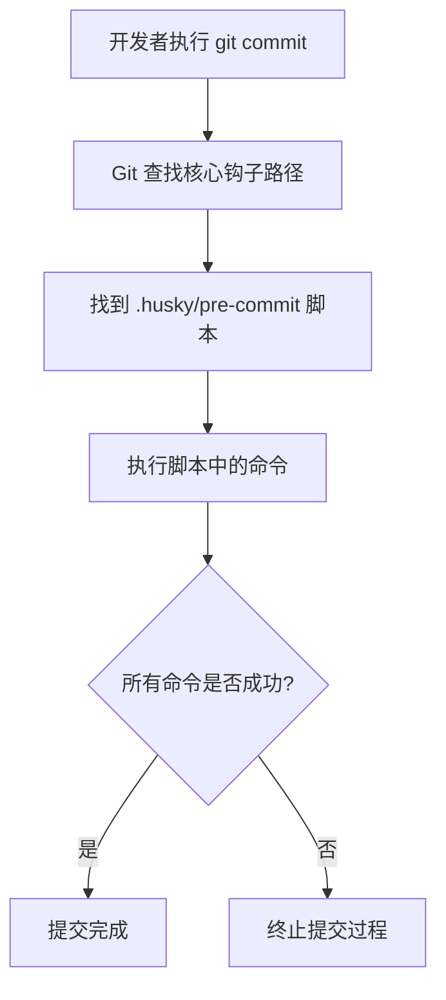

# Husky 详解与最佳实践：现代化前端项目的 Git 钩子管理

- GitHub 仓库：[https://github.com/typicode/husky](https://github.com/typicode/husky)
- 文档：[https://typicode.github.io/husky/zh/](https://typicode.github.io/husky/zh/)

## 1 Husky 简介

Husky 是一个**现代化 Git 钩子管理工具**，它允许开发者轻松地在 Git 操作的特定阶段（如提交代码、推送代码前）自动触发自定义脚本。通过 Husky，团队可以实现在代码提交或推送前执行代码规范检查、测试运行、提交信息验证等任务，从而显著提升代码质量和开发协作效率。

### 1.1 什么是 Git Hooks

Git Hooks 是 Git 版本控制系统提供的**原生机制**，允许用户在 Git 操作的关键节点执行自定义脚本。这些钩子位于每个 Git 仓库的 `.git/hooks` 目录中，涵盖了版本控制的完整生命周期，包括提交前（pre-commit）、提交信息处理（commit-msg）、推送前（pre-push）等关键阶段。

### 1.2 Husky 的核心价值

Husky 的出现解决了原生 Git Hooks 的几个痛点：**跨项目共享困难**（因为 `.git/hooks` 不被纳入版本控制）、**配置管理复杂**和**团队协作一致性**问题。Husky 通过以下方式提升了开发体验：

- **自动化管理**：简化了 Git Hooks 的创建、维护和共享过程
- **团队协作**：确保所有团队成员使用相同的代码质量关卡
- **灵活配置**：支持多种钩子类型和自定义脚本执行
- **跨平台支持**：在 Windows、macOS 和 Linux 上提供一致体验

### 1.3 在现代前端工程化中的作用

在现代前端开发中，Husky 已成为**代码质量保障体系**的关键组成部分。它与 ESLint、Prettier、Commitlint 等工具结合，形成了强大的自动化工作流：

- **代码质量保障**：在提交前自动进行代码检查和格式化
- **规范执行**：确保团队遵守代码规范和提交约定
- **流程自动化**：减少手动检查工作，提高开发效率
- **错误提前发现**：在本地阶段拦截问题，降低 CI 失败率

## 2 安装与配置

### 2.1 环境要求与前置条件

在安装 Husky 前，请确保您的开发环境满足以下基本要求：

- **Node.js** 版本 12.0.0 或更高（推荐 18+ 以获得最佳体验）
- **Git** 版本 2.9.0 或更高（支持 `core.hooksPath` 配置）
- 一个已初始化的 Git 仓库（通过 `git init` 创建）

### 2.2 安装步骤

Husky 支持所有主流 Node.js 包管理器，您可以根据项目使用的工具选择相应的安装命令：

| 包管理器 | 安装命令 | 初始化命令 |
|---------|---------|------------|
| npm | `npm install husky --save-dev` | `npx husky init` |
| pnpm | `pnpm add husky --save-dev` | `pnpm exec husky init` |
| yarn | `yarn add husky --dev` | Yarn 不支持 prepare 脚本，需要手动初始化 |
| bun | `bun add husky --dev` | `bunx husky init` |

### 2.3 初始化配置

安装完成后，需要初始化 Husky 以创建必要的目录结构和配置：

```bash
# 使用 npx (npm)
npx husky init

# 使用 pnpm
pnpm exec husky init

# 使用 yarn
yarn husky init

# 使用 bun
bunx husky init
```

此命令会创建 `.husky` 目录，并设置 Git 使用该目录作为 hooks 路径（通过 `git config core.hooksPath .husky`）。

### 2.4 自动化安装脚本

为了确保新克隆项目的团队成员也能自动配置 Husky，需要在 `package.json` 中添加 **prepare** 脚本：

```json
{
  "scripts": {
    "prepare": "husky install"
  }
}
```

这样，当其他开发者运行 `npm install`（或类似命令）时，Husky 会自动进行初始化配置。

### 2.5 目录结构说明

初始化完成后，项目中将出现以下结构：

```bash
项目根目录/
├── .husky/
│   ├── _/
│   │   ├── husky.sh    # Husky 核心脚本
│   │   └── .gitignore  # 忽略不必要的文件
│   └── pre-commit      # 预提交钩子示例
├── .git/
└── package.json
```

## 3 核心概念与工作原理

### 3.1 Git Hooks 机制深度解析

Git Hooks 是 Git 版本控制系统的**核心功能之一**，它允许在特定 Git 操作的关键节点执行自定义脚本。这些钩子脚本可以是任何可执行程序，通常用于实施项目策略、执行验证任务或自动化工作流。

Git 提供了多种钩子类型，覆盖了版本控制的完整生命周期：

- **客户端钩子**：由本地操作触发，如提交、合并、推送等
- **服务器端钩子**：在推送到服务器时执行，用于实施项目策略

Husky 主要专注于**客户端钩子**的管理和增强，特别是与代码提交和推送相关的关键钩子。

### 3.2 Husky 的实现原理

新版本 Husky（v7+）利用了 Git 2.9 引入的 **`core.hooksPath`** 配置项，这是其工作原理的核心：

1. **重定向钩子路径**：通过 `git config core.hooksPath .husky` 命令，将 Git 的钩子查找目录从默认的 `.git/hooks` 改为项目中的 `.husky` 目录
2. **持久化钩子脚本**：由于 `.husky` 目录可以纳入版本控制，确保了钩子配置在团队成员间共享
3. **自动化管理**：通过 npm 的 prepare 脚本机制，确保每次安装依赖后自动设置 hooks 路径

这种设计解决了原生 Git Hooks 的**最大痛点** - 无法共享配置，使团队协作变得更加顺畅。

### 3.3 核心工作流程

当开发者执行 Git 操作时，Husky 的工作流程如下：



### 3.4 常见钩子类型及用途

Husky 支持所有 Git 钩子，下表列出了最常用的几种：

| 钩子名称 | 触发时机 | 典型用途 | 重要性 |
|---------|---------|---------|--------|
| **pre-commit** | 在提交消息输入后，提交完成前 | 代码检查、格式化、测试 | ⭐⭐⭐⭐⭐ |
| **commit-msg** | 在提交消息保存后，提交完成前 | 提交消息格式验证 | ⭐⭐⭐⭐ |
| **pre-push** | 在推送到远程仓库前 | 运行完整测试套件、构建检查 | ⭐⭐⭐⭐ |
| **pre-rebase** | 在变基操作前 | 检查是否允许变基 | ⭐⭐ |
| **post-merge** | 在合并操作完成后 | 更新依赖、生成文档 | ⭐⭐ |

## 4 常用钩子详解

### 4.1 pre-commit 钩子

**pre-commit** 是使用最广泛的 Git 钩子，它在提交消息输入后但提交完成前执行，适合用于代码质量保障任务。

#### 4.1.1 基本配置

创建基本的 pre-commit 钩子：

```bash
npx husky add .husky/pre-commit "npm run lint"
```

生成的脚本内容如下：

```bash
#!/usr/bin/env sh
. "$(dirname "$0")/_/husky.sh"

npm run lint
```

#### 4.1.2 高级用例：只检查暂存文件

为了提高检查效率，通常只对**暂存区文件**进行检查（使用 lint-staged），而不是整个项目：

```bash
#!/usr/bin/env sh
. "$(dirname "$0")/_/husky.sh"

# 只对暂存的文件运行 Prettier 格式化
prettier $(git diff --cached --name-only --diff-filter=ACMR | sed 's| |\\ |g') --write --ignore-unknown
git update-index --again

# 只对暂存的文件运行 ESLint
eslint $(git diff --cached --name-only --diff-filter=ACMR | grep -E '\.(js|jsx|ts|tsx)$')
```

#### 4.1.3 执行多个任务

pre-commit 钩子中可以依次执行多个检查任务：

```bash
#!/usr/bin/env sh
. "$(dirname "$0")/_/husky.sh"

# 运行类型检查
npm run type-check

# 运行代码检查
npm run lint

# 运行单元测试
npm test
```

### 4.2 commit-msg 钩子

**commit-msg** 钩子专门用于验证提交信息的格式，是实施提交约定（如 Conventional Commits）的关键工具。

#### 4.2.1 基本配置

使用 commitlint 验证提交信息：

```bash
npx husky add .husky/commit-msg 'npx --no-install commitlint --edit "$1"'
```

生成的脚本内容：

```bash
#!/bin/sh
"$(dirname "$0")/_/husky.sh"
npx --no-install commitlint --edit "$1"
```

#### 4.2.2 提交消息规范配置

创建 `commitlint.config.js` 文件定义提交规则：

```javascript
module.exports = {
  extends: ['@commitlint/config-conventional'],
  rules: {
    'type-enum': [2, 'always', [
      'upd',   // 更新某功能（不是 feat, 不是 fix）
      'feat',  // 新功能（feature）
      'fix',   // 修补bug
      'docs',  // 文档（documentation）
      'style', // 格式（不影响代码运行的变动）
      'refactor', // 重构
      'test',  // 增加测试
      'chore', // 构建过程或辅助工具的变动
      'revert' // 撤销之前的commit
    ]],
    'type-case': [0],
    'type-empty': [0],
    'scope-empty': [0],
    'scope-case': [0],
    'subject-full-stop': [0, 'never'],
    'subject-case': [0, 'never'],
    'header-max-length': [0, 'always', 72]
  }
};
```

### 4.3 pre-push 钩子

**pre-push** 钩子在推送到远程仓库前执行，适合运行更耗时的全面检查，如完整测试套件或构建过程。

#### 4.3.1 基本配置

```bash
npx husky add .husky/pre-push "npm run test && npm run build"
```

生成的脚本内容：

```bash
#!/usr/bin/env sh
. "$(dirname "$0")/_/husky.sh"

npm run test && npm run build
```

#### 4.3.2 优化性能的策略

由于 pre-push 钩子可能运行较长时间，可以考虑以下优化策略：

```bash
#!/usr/bin/env sh
. "$(dirname "$0")/_/husky.sh"

# 只对主要分支运行全面检查
CURRENT_BRANCH=$(git symbolic-ref --short HEAD)
IMPORTANT_BRANCHES="^(main|master|develop)$"

if [[ $CURRENT_BRANCH =~ $IMPORTANT_BRANCHES ]]; then
  echo "运行完整测试套件..."
  npm run test:all
  npm run build
  
  echo "检查依赖安全漏洞..."
  npm audit --audit-level moderate
fi
```

## 5 集成最佳实践

### 5.1 与 ESLint 和 Prettier 集成

将 Husky 与代码质量和格式化工具结合，可以构建强大的**代码质量保障体系**。

#### 5.1.1 基本配置

首先安装必要的依赖：

```bash
npm install --save-dev eslint prettier eslint-config-prettier eslint-plugin-prettier
```

配置 package.json 脚本：

```json
{
  "scripts": {
    "lint": "eslint . --ext .js,.jsx,.ts,.tsx,.vue",
    "lint:fix": "eslint . --ext .js,.jsx,.ts,.tsx,.vue --fix",
    "format": "prettier --write \"src/**/*.{js,jsx,ts,tsx,vue,css,scss,md}\""
  }
}
```

配置 pre-commit 钩子：

```bash
#!/usr/bin/env sh
. "$(dirname "$0")/_/husky.sh"

npm run lint:fix
npm run format
git add .
```

#### 5.1.2 配置文件示例

创建 `.eslintrc.js` 配置文件：

```javascript
module.exports = {
  env: {
    browser: true,
    es6: true,
  },
  extends: ["airbnb-base", "plugin:prettier/recommended"],
  parserOptions: {
    ecmaVersion: 2018,
  },
  rules: {
    "no-console": "off",
    "import/prefer-default-export": "off"
  }
};
```

创建 `.prettierrc` 配置文件：

```json
{
  "semi": true,
  "singleQuote": true,
  "tabWidth": 2,
  "trailingComma": "es5",
  "printWidth": 80
}
```

### 5.2 与 lint-staged 集成

**lint-staged** 可以显著提高检查效率，因为它只对 Git 暂存区中的文件进行检查，而不是整个项目。

#### 5.2.1 安装与配置

安装 lint-staged：

```bash
npm install --save-dev lint-staged
```

配置 package.json：

```json
{
  "lint-staged": {
    "src/**/*.{js,jsx,ts,tsx,vue}": [
      "prettier --write",
      "eslint --cache --fix",
      "git add"
    ],
    "*.{json,md,yml,css}": [
      "prettier --write",
      "git add"
    ]
  }
}
```

更新 pre-commit 钩子：

```bash
#!/usr/bin/env sh
. "$(dirname "$0")/_/husky.sh"

npx lint-staged
```

#### 5.2.2 高级配置

对于复杂项目，可以使用 `lint-staged.config.js` 文件进行更精细的配置：

```javascript
module.exports = {
  ignore: ["package-lock.json", "CHANGELOG.md"],
  linters: {
    "*.ts": ["prettier --write", "eslint --fix", "git add"],
    "*.js": ["prettier --write", "eslint --cache --fix", "git add"],
    "*.vue": ["prettier --write", "eslint --cache --fix", "git add"],
    "*.{json,md,yml,css}": ["prettier --write", "git add"]
  }
};
```

### 5.3 与 Commitlint 集成

**Commitlint** 帮助团队遵循一致的提交消息约定，这对于生成变更日志和自动化版本管理非常有用。

#### 5.3.1 基本配置

安装 Commitlint：

```bash
npm install --save-dev @commitlint/cli @commitlint/config-conventional
```

创建 commitlint 配置文件：

```javascript
// commitlint.config.js
module.exports = {
  extends: ['@commitlint/config-conventional'],
  rules: {
    'type-enum': [2, 'always', ['feat', 'fix', 'docs', 'style', 'refactor', 'test', 'chore', 'revert']],
    'subject-case': [0] // 不强制 subject 大小写
  }
};
```

#### 5.3.2 自定义提交类型

团队可以根据项目需求自定义提交类型：

```javascript
// commitlint.config.js
module.exports = {
  rules: {
    'type-enum': [2, 'always', [
      'add',    // 新增功能或文件
      'update', // 更新功能
      'fix',    // 修复bug
      'ui',     // 更新UI
      'style',  // 样式修改
      'init',   // 初始化
      'docs'    // 文档修改
    ]],
    'type-empty': [2, 'never'],
    'subject-empty': [2, 'never'],
    'type-case': [2, 'always', 'lower-case'],
    'subject-case': [0]
  }
};
```

## 6 高级用法与技巧

### 6.1 Monorepo 支持

在 **Monorepo** 项目中，Husky 需要特殊配置以确保钩子能正确工作 across多个包。

#### 6.1.1 根目录配置

在 Monorepo 根目录的 package.json 中配置 Husky：

```json
{
  "scripts": {
    "prepare": "husky install",
    "postinstall": "npm run prepare"
  },
  "devDependencies": {
    "husky": "^9.0.0"
  }
}
```

#### 6.1.2 子包特定钩子

为特定子包创建钩子脚本：

```bash
#!/usr/bin/env sh
. "$(dirname "$0")/_/husky.sh"

# 只检查 packages/app 目录下的更改
if git diff --cached --name-only | grep -E '^packages/app/'; then
  echo "运行应用特定检查..."
  cd packages/app && npm run test
fi
```

### 6.2 条件执行与跳过钩子

在某些情况下，可能需要**临时跳过**或**条件执行**钩子任务。

#### 6.2.1 环境变量跳过

使用环境变量临时跳过钩子执行：

```bash
# 临时跳过所有钩子
HUSKY=0 git commit -m "紧急修复"

# 或在当前会话中禁用
export HUSKY=0
git commit -m "提交1"
git commit -m "提交2"
unset HUSKY
```

#### 6.2.2 条件执行脚本

在钩子脚本中实现条件逻辑：

```bash
#!/usr/bin/env sh
. "$(dirname "$0")/_/husky.sh"

# 只在主要分支上运行完整检查
BRANCH=$(git rev-parse --abbrev-ref HEAD)
if [ "$BRANCH" = "main" ] || [ "$BRANCH" = "master" ]; then
  npm run test:all
else
  npm run test:quick
fi
```

### 6.3 调试技巧

调试钩子脚本可能需要特殊技巧，因为它们在与普通脚本不同的环境中执行。

#### 6.3.1 输出调试信息

在脚本中添加调试输出：

```bash
#!/usr/bin/env sh
. "$(dirname "$0")/_/husky.sh"

echo "Husky 环境信息:"
echo "当前目录: $(pwd)"
echo "节点版本: $(node --version)"
echo "NPM版本: $(npm --version)"
echo "Git参数: $@"

# 重定向输出到日志文件
exec 2> .husky/debug.log

npm run lint
```

#### 6.3.2 手动测试钩子

手动测试钩子而不实际提交：

```bash
# 直接运行钩子脚本
./.husky/pre-commit

# 或添加调试退出
echo "exit 1" >> .husky/pre-commit
git commit -m "测试钩子" # 这会触发钩子但终止提交
```

### 6.4 CI 环境配置

在持续集成（CI）环境中，通常需要**禁用 Husky** 以避免不必要的检查。

#### 6.4.1 环境检测

在钩子脚本中添加 CI 环境检测：

```bash
#!/usr/bin/env sh
. "$(dirname "$0")/_/husky.sh"

# 跳过 CI 环境中的执行
[ -n "$CI" ] && exit 0

npm run lint
```

#### 6.4.2 依赖安装优化

在 CI 中安装依赖时跳过 Husky：

```bash
# 禁用 prepare 脚本
npm ci --omit=dev --ignore-scripts

# 或临时删除 prepare 脚本
npm pkg delete scripts.prepare
npm ci --omit=dev
```

## 7 常见问题与解决方案

### 7.1 安装与初始化问题

#### 7.1.1 权限问题

在 Unix 系统上可能会遇到**权限错误**，需要为钩子脚本添加执行权限：

```bash
# 为 .husky 目录添加执行权限
chmod -R +x .husky/

# 或针对特定文件
chmod +x .husky/pre-commit
```

#### 7.1.2 Git 仓库不存在

如果项目尚未初始化 Git 仓库，需要先初始化：

```bash
# 初始化 Git 仓库
git init

# 然后重新安装 Husky
npm run prepare
```

### 7.2 钩子不执行问题

#### 7.2.1 检查钩子路径配置

确认 Git 的 hooksPath 配置正确：

```bash
# 检查当前配置
git config core.hooksPath

# 如果不正确，重新设置
git config core.hooksPath .husky
```

#### 7.2.2 检查脚本格式

确保钩子脚本使用正确的**换行符**（Unix LF 而非 Windows CRLF）和编码（UTF-8）。

### 7.3 性能问题优化

当钩子执行时间过长时，可以考虑以下优化方案：

#### 7.3.1 只检查暂存文件

使用 **lint-staged** 而不是全局检查，只对实际更改的文件进行检查。

#### 7.3.2 并行执行任务

使用并行执行工具提高效率：

```bash
#!/usr/bin/env sh
. "$(dirname "$0")/_/husky.sh"

# 使用 concurrently 并行执行任务
npx concurrently "npm run lint:fix" "npm run type-check" --kill-others-on-failure
```

#### 7.3.3 缓存机制

利用工具的缓存功能提高速度：

```json
{
  "scripts": {
    "lint": "eslint . --ext .js,.jsx,.ts,.tsx,.vue --cache"
  }
}
```

### 7.4 团队协作问题

确保团队成员一致地使用 Husky 配置：

#### 7.4.1 文档与引导

在项目 README 中添加 Husky 使用说明：

```markdown
## 开发环境设置

1. 克隆项目后运行 `npm install`
2. Husky 会自动设置 Git 钩子
3. 如果遇到钩子问题，运行 `npm run prepare` 重新初始化
```

#### 7.4.2 版本兼容性

指定 Husky 版本以确保一致性：

```json
{
  "devDependencies": {
    "husky": "^9.0.11"
  }
}
```

## 8 总结

Husky 作为现代前端工程化中不可或缺的工具，通过 **Git 钩子管理**为团队提供了强大的代码质量保障机制。结合 ESLint、Prettier、lint-staged 和 Commitlint 等工具，可以构建全面自动化的代码质量控制体系。

### 8.1 核心价值回顾

- **自动化工作流**：将代码检查、格式化、测试等任务自动化，减少人工操作
- **团队一致性**：确保所有团队成员遵循相同的质量标准
- **早期问题发现**：在提交阶段及时发现并修复问题，降低后期修复成本
- **规范执行**：强制执行代码规范和提交约定，提高项目可维护性

### 8.2 项目应用建议

根据项目特点和团队规模，可以参考以下应用方案：

1. **小型项目**：从 pre-commit 钩子开始，逐步添加更多检查
2. **中型项目**：结合 lint-staged 提高检查效率，添加 commit-msg 钩子
3. **大型项目**：实现完整的钩子体系，包括 pre-push 和自定义验证逻辑
4. **Monorepo**：采用根目录集中管理，子包特定定制的策略

通过合理配置和使用 Husky，团队可以显著提升代码质量和开发效率，构建更加健壮的前端项目。
