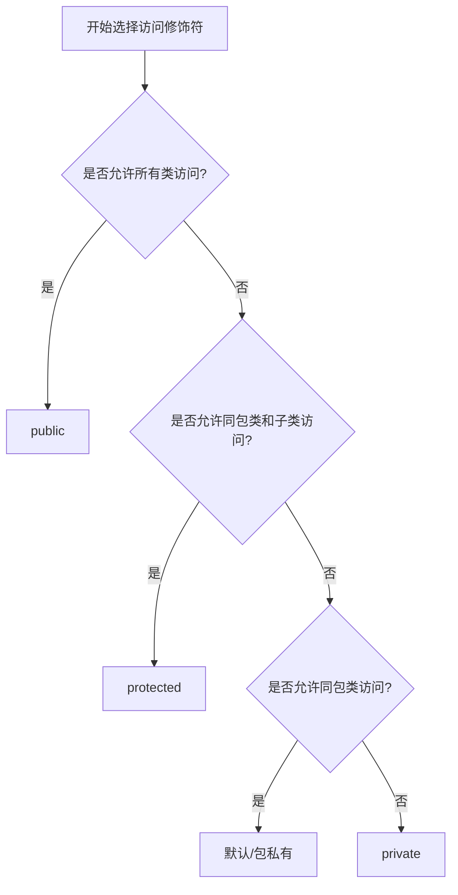

# Java 修饰符详解

## 1. 概述

Java修饰符是用于定义类、方法、变量及其他程序元素的行为和访问级别的关键字。它们分为两大类：**访问控制修饰符**和**非访问控制修饰符**。合理使用这些修饰符是实现面向对象编程封装性、安全性和模块化的重要基础。

修饰符通常放在语句的最前端，语法格式为：

```java
[修饰符] class ClassName {
    [修饰符] dataType variableName;
    [修饰符] returnType methodName(parameters) {
        // 方法体
    }
}
```

## 2. 访问控制修饰符

Java提供了四种访问控制修饰符，用于控制类、变量、方法和构造方法的访问权限。

### 2.1 public（公共访问）

- **访问范围**：无任何限制，对所有类可见
- **适用场景**：对外公开的API、常量、工具类方法等
- **可修饰对象**：类、接口、枚举、方法、变量

```java
// 文件：PublicExample.java
package com.example;

public class PublicExample {
    public int publicVariable = 40;

    public void publicMethod() {
        System.out.println("This is a public method.");
    }
}

// 文件：Main.java（可在不同包中）
package com.another;
import com.example.PublicExample;

public class Main {
    public static void main(String[] args) {
        PublicExample example = new PublicExample();
        System.out.println(example.publicVariable); // 合法访问
        example.publicMethod(); // 合法调用
    }
}
```

### 2.2 protected（受保护访问）

- **访问范围**：同一包内的类、不同包中的子类
- **适用场景**：需要被子类继承或重写的成员
- **可修饰对象**：方法、变量（不能修饰外部类）

```java
// 文件：ProtectedExample.java
package com.example;

public class ProtectedExample {
    protected int protectedVariable = 30;

    protected void protectedMethod() {
        System.out.println("This is a protected method.");
    }
}

// 文件：SubClass.java（不同包）
package com.another;
import com.example.ProtectedExample;

public class SubClass extends ProtectedExample {
    public void accessProtectedMembers() {
        System.out.println(protectedVariable); // 子类可访问
        protectedMethod(); // 子类可调用
    }
}
```

### 2.3 default（包私有访问）

- **访问范围**：仅同一包内的类（默认，不写任何修饰符）
- **适用场景**：包内共享的辅助方法或类
- **可修饰对象**：类、接口、枚举、方法、变量

```java
// 文件：PackageExample.java
package com.example;

class PackageExample { // 默认访问修饰符
    int defaultVariable = 20; // 默认访问修饰符

    void defaultMethod() {
        System.out.println("This is a default method.");
    }
}

// 文件：Main.java（同一包内）
package com.example;

public class Main {
    public static void main(String[] args) {
        PackageExample example = new PackageExample();
        System.out.println(example.defaultVariable); // 合法访问
        example.defaultMethod(); // 合法调用
    }
}
```

### 2.4 private（私有访问）

- **访问范围**：仅当前类内部
- **适用场景**：隐藏类的内部实现细节，保护数据
- **可修饰对象**：方法、变量（不能修饰外部类）

```java
public class PrivateExample {
    private int privateVariable = 10;

    private void privateMethod() {
        System.out.println("This is a private method.");
    }

    // 通过公共方法提供受控访问
    public int getPrivateVariable() {
        return privateVariable;
    }

    public void setPrivateVariable(int value) {
        if (value >= 0) {
            this.privateVariable = value;
        }
    }
}

public class Main {
    public static void main(String[] args) {
        PrivateExample example = new PrivateExample();
        // System.out.println(example.privateVariable); // 编译错误
        // example.privateMethod(); // 编译错误

        System.out.println(example.getPrivateVariable()); // 通过公共方法访问
        example.setPrivateVariable(20); // 通过公共方法修改
    }
}
```

### 2.5 访问控制修饰符总结

| 修饰符      | 当前类 | 同包类 | 不同包子类 | 不同包非子类 |
| ----------- | ------ | ------ | ---------- | ------------ |
| `public`    | ✓      | ✓      | ✓          | ✓            |
| `protected` | ✓      | ✓      | ✓          | ✗            |
| `default`   | ✓      | ✓      | ✗          | ✗            |
| `private`   | ✓      | ✗      | ✗          | ✗            |

_表：Java访问控制修饰符的访问范围对比_

## 3. 非访问控制修饰符

非访问控制修饰符提供特殊功能或限制，用于控制继承、线程安全等特性。

### 3.1 static（静态修饰符）

- **作用**：创建独立于对象的类级别成员
- **适用对象**：变量、方法、代码块、内部类
- **特点**：所有实例共享静态变量；静态方法可直接通过类名调用

```java
public class StaticExample {
    // 静态变量（类变量）
    public static int count = 0;

    // 实例变量
    private int instanceId;

    // 静态代码块（类加载时执行一次）
    static {
        System.out.println("类已加载，初始化静态资源");
    }

    public StaticExample() {
        instanceId = ++count; // 每次创建实例时count增加
    }

    // 静态方法
    public static void printCount() {
        System.out.println("当前实例数量: " + count);
        // System.out.println(instanceId); // 错误：不能访问非静态成员
    }

    // 实例方法
    public void printInstanceId() {
        System.out.println("实例ID: " + instanceId);
        System.out.println("总实例数: " + count); // 可以访问静态变量
    }

    public static void main(String[] args) {
        // 直接通过类名访问静态成员
        StaticExample.printCount(); // 输出: 当前实例数量: 0

        StaticExample obj1 = new StaticExample();
        StaticExample obj2 = new StaticExample();

        StaticExample.printCount(); // 输出: 当前实例数量: 2

        obj1.printInstanceId(); // 输出: 实例ID: 1
        obj2.printInstanceId(); // 输出: 实例ID: 2
    }
}
```

### 3.2 final（最终修饰符）

- **作用**：防止修改/继承
- **适用对象**：类、方法、变量
- **特点**：final类不可继承；final方法不可重写；final变量不可修改

```java
// final类：不能被继承
final class FinalClass {
    // final变量：必须初始化且不能修改
    public final int MAX_VALUE = 100;

    // final方法：不能被子类重写
    public final void finalMethod() {
        System.out.println("这是一个final方法");
    }
}

class Example {
    // final参数：方法内部不能修改参数值
    public void process(final int input) {
        // input = 5; // 编译错误：不能修改final参数
        System.out.println("输入值: " + input);
    }

    public void demonstrate() {
        // final局部变量：一旦赋值不能修改
        final String message = "Hello";
        // message = "World"; // 编译错误：不能修改final变量

        // 引用类型的final变量：引用不可变，但对象内容可变
        final List<String> list = new ArrayList<>();
        list.add("Item1"); // 允许：修改对象内容
        list.add("Item2");
        // list = new ArrayList<>(); // 错误：不能修改引用
    }
}
```

### 3.3 abstract（抽象修饰符）

- **作用**：定义抽象实体
- **适用对象**：类、方法
- **特点**：抽象类不能实例化；抽象方法只有声明没有实现

```java
// 抽象类
abstract class Animal {
    private String name;

    // 抽象方法：没有实现体
    public abstract void makeSound();

    // 普通方法
    public void sleep() {
        System.out.println(name + " is sleeping");
    }

    public String getName() {
        return name;
    }

    public void setName(String name) {
        this.name = name;
    }
}

// 具体子类必须实现所有抽象方法
class Dog extends Animal {
    @Override
    public void makeSound() {
        System.out.println(getName() + " says: Woof!");
    }
}

class Cat extends Animal {
    @Override
    public void makeSound() {
        System.out.println(getName() + " says: Meow!");
    }
}

public class AbstractExample {
    public static void main(String[] args) {
        Animal myDog = new Dog();
        myDog.setName("Buddy");
        myDog.makeSound(); // 输出: Buddy says: Woof!
        myDog.sleep();     // 输出: Buddy is sleeping

        Animal myCat = new Cat();
        myCat.setName("Whiskers");
        myCat.makeSound(); // 输出: Whiskers says: Meow!

        // Animal animal = new Animal(); // 错误：不能实例化抽象类
    }
}
```

### 3.4 synchronized（同步修饰符）

- **作用**：实现线程同步，保证多线程安全访问
- **适用对象**：方法、代码块
- **特点**：同步方法一次只能被一个线程访问

```java
public class Counter {
    private int count = 0;

    // 同步方法
    public synchronized void increment() {
        count++;
    }

    public synchronized void decrement() {
        count--;
    }

    public synchronized int getCount() {
        return count;
    }

    // 同步代码块（更细粒度的控制）
    public void performOperation() {
        // 非同步操作...

        // 同步代码块
        synchronized(this) {
            // 需要同步的操作
            count += 10;
        }

        // 更多非同步操作...
    }
}

class CounterThread extends Thread {
    private Counter counter;
    private boolean increment;

    public CounterThread(Counter counter, boolean increment) {
        this.counter = counter;
        this.increment = increment;
    }

    @Override
    public void run() {
        for (int i = 0; i < 1000; i++) {
            if (increment) {
                counter.increment();
            } else {
                counter.decrement();
            }
        }
    }
}

public class SynchronizedExample {
    public static void main(String[] args) throws InterruptedException {
        Counter counter = new Counter();

        // 创建多个线程同时操作同一个计数器
        Thread t1 = new CounterThread(counter, true);
        Thread t2 = new CounterThread(counter, true);
        Thread t3 = new CounterThread(counter, false);

        t1.start();
        t2.start();
        t3.start();

        t1.join();
        t2.join();
        t3.join();

        // 如果没有synchronized，结果可能不一致
        System.out.println("最终计数: " + counter.getCount());
    }
}
```

### 3.5 volatile（易变修饰符）

- **作用**：保证多线程环境下变量的可见性，禁止指令重排序
- **适用对象**：变量
- **特点**：每次访问都从主内存读取，修改立即写回主内存

```java
public class VolatileExample {
    // volatile变量：确保多线程环境下的可见性
    private volatile boolean active = true;

    public void run() {
        while (active) {
            // 执行任务
            System.out.println("线程运行中...");
            try {
                Thread.sleep(1000);
            } catch (InterruptedException e) {
                e.printStackTrace();
            }
        }
        System.out.println("线程已停止");
    }

    public void stop() {
        active = false; // 所有线程都会立即看到这个变化
    }

    public static void main(String[] args) throws InterruptedException {
        VolatileExample example = new VolatileExample();

        Thread workerThread = new Thread(() -> example.run());
        workerThread.start();

        // 运行5秒后停止
        Thread.sleep(5000);
        example.stop();

        workerThread.join();
        System.out.println("主线程结束");
    }
}
```

### 3.6 transient（瞬态修饰符）

- **作用**：标记不需要序列化的字段
- **适用对象**：变量
- **特点**：序列化对象时跳过被transient修饰的变量

```java
import java.io.*;

public class User implements Serializable {
    private String username;
    private transient String password; // 不序列化密码

    public User(String username, String password) {
        this.username = username;
        this.password = password;
    }

    // getter和setter方法
    public String getUsername() { return username; }
    public void setUsername(String username) { this.username = username; }

    public String getPassword() { return password; }
    public void setPassword(String password) { this.password = password; }

    @Override
    public String toString() {
        return "User{username='" + username + "', password='" + password + "'}";
    }
}

class TransientExample {
    public static void main(String[] args) {
        User user = new User("admin", "secret123");

        // 序列化对象
        try (ObjectOutputStream oos =
             new ObjectOutputStream(new FileOutputStream("user.ser"))) {
            oos.writeObject(user);
        } catch (IOException e) {
            e.printStackTrace();
        }

        // 反序列化对象
        try (ObjectInputStream ois =
             new ObjectInputStream(new FileInputStream("user.ser"))) {
            User deserializedUser = (User) ois.readObject();
            System.out.println("反序列化后: " + deserializedUser);
            // 输出: User{username='admin', password='null'}
        } catch (IOException | ClassNotFoundException e) {
            e.printStackTrace();
        }
    }
}
```

### 3.7 其他非访问修饰符

#### 3.7.1 native（本地修饰符）

```java
public class NativeExample {
    // native方法：由本地代码（如C/C++）实现
    public native void nativeMethod();

    // 加载包含本地方法实现的本地库
    static {
        System.loadLibrary("NativeLibrary");
    }
}
```

#### 3.7.2 strictfp（严格浮点修饰符）

```java
// strictfp类：所有方法都使用严格浮点计算
public strictfp class StrictFPExample {
    // 所有浮点计算都遵循IEEE-754标准，确保跨平台一致性
    public double calculate() {
        double a = 10.5;
        double b = 3.2;
        return a / b;
    }
}
```

## 4. 修饰符的应用场景与最佳实践

### 4.1 修饰符选择指南

选择访问修饰符时，可以遵循以下决策流程：



_图：访问修饰符选择流程图_

### 4.2 最佳实践示例：封装银行账户

```java
// 文件: BankAccount.java
public class BankAccount {
    // 私有字段：保护账户数据
    private String accountNumber;
    private double balance;

    // 公共构造方法
    public BankAccount(String accountNumber) {
        this.accountNumber = accountNumber;
        this.balance = 0.0;
    }

    // 公共访问器方法
    public double getBalance() {
        return balance;
    }

    // 公共方法：存款
    public void deposit(double amount) {
        if (amount > 0) {
            balance += amount;
            logTransaction("存款", amount);
        }
    }

    // 公共方法：取款
    public boolean withdraw(double amount) {
        if (amount > 0 && balance >= amount) {
            balance -= amount;
            logTransaction("取款", amount);
            return true;
        }
        return false;
    }

    // 受保护方法：内部转账（允许子类扩展）
    protected boolean transfer(BankAccount recipient, double amount) {
        if (amount <= 0 || balance < amount) {
            return false;
        }

        balance -= amount;
        recipient.balance += amount;
        logTransaction("转账", amount);
        return true;
    }

    // 包私有方法：生成对账单（仅同包可见）
    String generateStatement() {
        return "账户: " + accountNumber + "\n余额: ¥" + balance;
    }

    // 私有方法：记录交易（内部实现细节）
    private void logTransaction(String type, double amount) {
        System.out.println(type + "操作: ¥" + amount + ", 新余额: ¥" + balance);
    }
}

// 文件: SavingsAccount.java
public class SavingsAccount extends BankAccount {
    private double interestRate;

    public SavingsAccount(String accountNumber, double interestRate) {
        super(accountNumber);
        this.interestRate = interestRate;
    }

    public void applyInterest() {
        double interest = getBalance() * interestRate / 100;
        deposit(interest); // 调用公共方法
    }

    // 正确使用受保护方法
    public boolean transferTo(SavingsAccount target, double amount) {
        return transfer(target, amount); // 可以访问父类protected方法
    }
}
```

### 4.3 修饰符使用建议

1. **遵循最小权限原则**：总是使用最严格的访问修饰符
2. **字段私有化**：使用private保护类的内部状态
3. **通过方法暴露功能**：使用公共方法提供受控访问
4. **合理使用final**：用于设计不可变对象和防止继承或重写
5. **慎用static**：只在真正需要类级别成员时使用
6. **同步策略**：优先使用同步块而不是同步方法，减少性能影响

## 5. 总结

Java修饰符提供了精细的访问控制和行为定义机制，是实现面向对象编程封装性、安全性和模块化的基础。合理使用这些修饰符对于编写健壮、可维护的Java代码至关重要。

| 修饰符类型       | 主要修饰符                          | 核心作用                       |
| ---------------- | ----------------------------------- | ------------------------------ |
| 访问控制修饰符   | public, protected, default, private | 控制可见性和访问范围           |
| 非访问控制修饰符 | static, final, abstract             | 定义类、方法和变量的特性       |
| 线程相关修饰符   | synchronized, volatile              | 控制多线程环境下的行为         |
| 特殊用途修饰符   | transient, native, strictfp         | 处理序列化、本地方法和浮点运算 |

_表：Java修饰符分类及作用总结_

通过熟练掌握各种修饰符的用法和适用场景，开发者可以创建出结构清晰、安全可靠且易于维护的Java应用程序。遵循最小权限原则和封装原则，能够有效地减少类之间的耦合，防止意外修改内部状态，创建更清晰的API边界。
