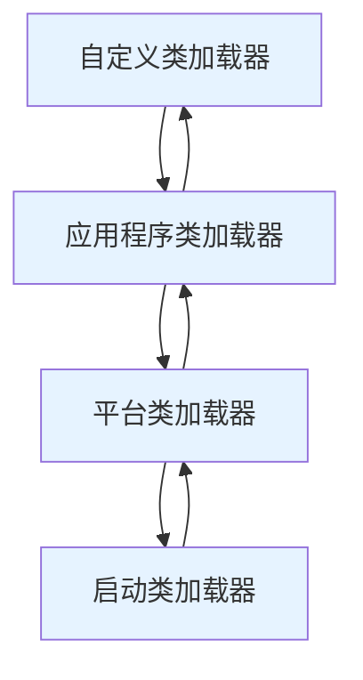
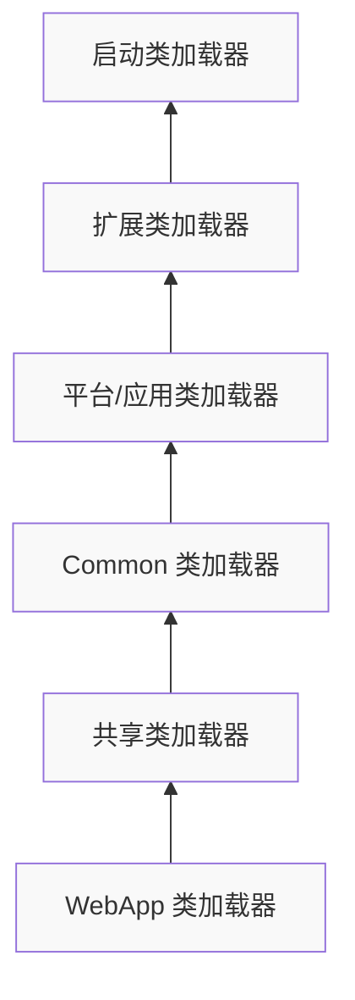

# Java 类加载机制详解与最佳实践

## 1. 类加载机制概述

Java 虚拟机（JVM）的**类加载机制**是 Java 平台的核心组成部分，它负责将 Java 类动态加载到内存中，并为程序的执行做好准备。与静态编译语言不同，Java 采用"**动态加载**"策略，即在程序运行时按需加载类，而非一次性加载所有类。这种设计带来了显著的灵活性，允许程序在运行时动态扩展功能。

### 1.1 类加载的重要性

类加载机制不仅仅是简单地将类从字节码文件加载到内存中，它还承担着以下重要职责：

- **确保类的唯一性**：同一个类在 JVM 中只存在一个 Class 对象，避免了类的重复加载和内存浪费
- **实现安全性验证**：通过严格的验证过程防止恶意代码破坏 JVM 运行环境
- **提供灵活性**：支持热部署、动态代理等高级特性，为复杂应用提供技术基础

### 1.2 类加载的组件

Java 类加载机制主要由三个组件协同工作：

1. **ClassLoader**（类加载器）：负责读取类的二进制数据并完成加载过程
2. **方法区**：用于存储已被加载的类信息、常量、静态变量等数据
3. **堆内存**：存放类的 Class 对象和实例对象

_表：Java 三类核心加载器及其特点_

| **加载器类型**              | **实现方式**             | **加载路径**              | **职责范围**                                           |
| :-------------------------- | :----------------------- | :------------------------ | :----------------------------------------------------- |
| **Bootstrap ClassLoader**   | C++ 实现，无 Java 类对应 | $JAVA_HOME/lib 核心库     | 加载 Java 核心类库（如 rt.jar）                        |
| **Platform ClassLoader**    | Java 实现（JDK 9+）      | $JAVA_HOME/lib/ext 扩展库 | 加载扩展目录中的类（替代原有的 Extension ClassLoader） |
| **Application ClassLoader** | Java 实现                | 应用类路径（-classpath）  | 加载用户类路径下的类                                   |

```java
// 示例：查看当前线程使用的类加载器
public class ClassLoaderDemo {
    public static void main(String[] args) {
        System.out.println("Current Thread's ClassLoader: " +
            Thread.currentThread().getContextClassLoader());
        System.out.println("String ClassLoader: " +
            String.class.getClassLoader()); // 由Bootstrap加载器加载，返回null
        System.out.println("HashMap ClassLoader: " +
            java.util.HashMap.class.getClassLoader());
        System.out.println("This Class's ClassLoader: " +
            ClassLoaderDemo.class.getClassLoader());
    }
}
```

理解类加载机制对于开发复杂应用程序、特别是涉及到插件系统、模块化设计和自定义类加载逻辑的应用程序至关重要。它不仅帮助我们编写更高效的代码，还能在出现类相关问题时快速定位和解决故障。

## 2. 类加载过程详解

Java 虚拟机的类加载过程可以分为**五个严格有序的阶段**，每个阶段都有其特定的职责和限制条件。深入理解这些阶段有助于诊断类加载相关问题和优化应用性能。

### 2.1 加载（Loading）

加载阶段是类加载过程的起点，主要完成以下三项工作：

1. **获取类的二进制字节流**：通过类的全限定名获取定义此类的二进制字节流。JVM 规范并未限定字节流的获取来源，可以从文件系统、ZIP/JAR 包、网络、运行时计算生成（动态代理）或其他文件生成（JSP）等方式获取。
2. **转换静态结构为运行时数据结构**：将字节流所代表的静态存储结构转换为方法区的运行时数据结构。
3. **创建 Class 对象**：在堆中生成一个代表该类的 `java.lang.Class` 对象，作为方法区数据的访问入口。

```java
// 示例：演示类加载时机
public class LoadingExample {
    public static void main(String[] args) {
        // 访问静态字段会导致类初始化
        System.out.println(Initializer.staticField);

        // 创建数组不会导致元素类初始化
        Initializer[] array = new Initializer[10];

        // 通过Class.forName()强制初始化类
        try {
            Class.forName("Initializer");
        } catch (ClassNotFoundException e) {
            e.printStackTrace();
        }
    }
}

class Initializer {
    static final String staticField = "静态字段值";

    static {
        System.out.println("Initializer类正在初始化...");
    }
}
```

### 2.2 验证（Verification）

验证阶段确保加载的类符合 JVM 规范且不会危害虚拟机安全。这一阶段包括四个检验过程：

- **文件格式验证**：验证字节流是否符合 Class 文件格式规范，包括魔数（0xCAFEBABE）、版本号等。
- **元数据验证**：对类的元数据信息进行语义检查，确保符合 Java 语言规范。
- **字节码验证**：通过数据流和控制流分析，确定程序语义是否合法、符合逻辑。
- **符号引用验证**：确保解析动作能正常执行，验证符号引用能否找到对应的类、方法或字段。

_表：验证阶段的主要检查内容_

| **验证类型**     | **检查目标**                         | **失败后果**                             |
| :--------------- | :----------------------------------- | :--------------------------------------- |
| **文件格式验证** | 魔数、版本号、常量池类型             | ClassFormatError                         |
| **元数据验证**   | 继承关系、final 修饰符、抽象方法实现 | IncompatibleClassChangeError             |
| **字节码验证**   | 操作数栈类型、跳转指令合法性         | VerifyError                              |
| **符号引用验证** | 引用是否存在、访问权限               | NoClassDefFoundError, IllegalAccessError |

### 2.3 准备（Preparation）

在准备阶段，JVM 为**类变量**（static 变量）分配内存并设置初始值。这里需要注意：

- 初始值通常是数据类型的**零值**（如 0、0L、null、false 等）
- 对于 **final static 常量**，会直接初始化为定义的值
- 实例变量不会在此阶段初始化，它们将在对象实例化时分配在堆中

```java
public class PreparationExample {
    // 准备阶段：staticVar会被赋值为0（默认值）
    public static int staticVar = 123;

    // 准备阶段：FINAL_CONST会被直接赋值为456
    public static final int FINAL_CONST = 456;

    // 实例变量在准备阶段不会被处理
    public int instanceVar = 789;
}
```

### 2.4 解析（Resolution）

解析阶段将**常量池内的符号引用**替换为**直接引用**（内存地址指针）。这一过程可能发生在初始化之前，也可能延迟到首次使用该符号引用时才进行（延迟解析）。解析主要针对以下七类符号引用：

1. 类或接口
2. 字段
3. 类方法
4. 接口方法
5. 方法类型
6. 方法句柄
7. 调用点限定符

### 2.5 初始化（Initialization）

初始化阶段是执行类构造器 `<clinit>()` 方法的过程，该方法由编译器自动收集类中所有**类变量的赋值动作**和**静态语句块**合并产生。初始化阶段有以下特点：

- JVM 保证**父类的 `<clinit>()` 先于子类**执行
- 如果类没有静态变量赋值或静态语句块，编译器可能不会生成 `<clinit>()` 方法
- 多线程环境下，JVM 会保证 `<clinit>()` 方法被正确地加锁同步

```java
public class InitializationExample {
    public static String staticField = "静态字段";

    static {
        System.out.println("静态初始化块执行");
        staticField = "修改后的值";
    }

    // 初始化顺序示例
    public static void main(String[] args) {
        System.out.println(Child.staticField);
    }
}

class Parent {
    static {
        System.out.println("父类静态初始化块");
    }
    public static String staticField = "父类静态字段";
}

class Child extends Parent {
    static {
        System.out.println("子类静态初始化块");
    }
}
```

**类初始化的触发条件**包括：

- 创建类的实例（new 关键字）
- 访问类的静态变量（getstatic 字节码指令）
- 调用类的静态方法（invokestatic 字节码指令）
- 反射调用类方法（Class.forName()）
- 初始化子类会触发父类初始化
- JVM 启动时指定的主类

## 3. 类加载器体系结构

Java 的类加载器采用**分层树状结构**和**双亲委派模型**，这种设计既保证了安全性，又保持了灵活性。理解类加载器体系结构对于实现自定义加载器和解决类冲突问题至关重要。

### 3.1 三类核心加载器

JVM 中主要有以下三种类加载器：

1. **启动类加载器（Bootstrap ClassLoader）**：
   - 由 C++ 实现，是 JVM 的一部分，没有对应的 Java 类
   - 负责加载 `$JAVA_HOME/lib` 目录下的核心类库（如 rt.jar）
   - 是唯一没有父加载器的加载器

2. **平台类加载器（Platform ClassLoader，JDK 9+）**：
   - 由 `jdk.internal.loader.ClassLoaders$PlatformClassLoader` 实现
   - 负责加载 `$JAVA_HOME/lib/ext` 目录下的扩展类
   - 父加载器为启动类加载器
   - 在 JDK 8 及之前称为扩展类加载器（Extension ClassLoader）

3. **应用程序类加载器（Application ClassLoader）**：
   - 由 `jdk.internal.loader.ClassLoaders$AppClassLoader` 实现
   - 负责加载用户类路径（classpath）上的类库
   - 父加载器为平台类加载器
   - 是默认的系统类加载器

```java
// 示例：查看各类加载器的层次关系
public class ClassLoaderHierarchy {
    public static void main(String[] args) {
        ClassLoader appClassLoader = ClassLoader.getSystemClassLoader();
        System.out.println("应用类加载器: " + appClassLoader);

        ClassLoader platformClassLoader = appClassLoader.getParent();
        System.out.println("平台类加载器: " + platformClassLoader);

        ClassLoader bootstrapClassLoader = platformClassLoader.getParent();
        System.out.println("启动类加载器: " + bootstrapClassLoader); // 输出null
    }
}
```

### 3.2 双亲委派模型

**双亲委派模型（Parent Delegation Model）** 是 Java 类加载器的工作原则，其工作流程如下：

1. 当一个类加载器收到加载请求时，首先不会尝试自己加载，而是委派给父加载器
2. 这个委派过程一直向上，直到启动类加载器
3. 只有当父加载器反馈无法完成加载请求时，子加载器才会尝试自己加载

这种模型的好处在于：

- **避免类的重复加载**：确保一个类在 JVM 中只存在一个 Class 对象
- **保证核心 API 的安全**：防止核心类被篡改，确保 Java 核心库的类型安全
- **提供灵活性**：允许开发者通过自定义类加载器扩展加载机制



### 3.3 模块化系统的影响（JDK 9+）

从 JDK 9 开始，Java 引入了**模块化系统**（JPMS），对类加载机制产生了重要影响：

- 类加载基于模块描述（`module-info.java`），严格隔离未导出包
- 扩展类加载器被重命名为平台类加载器，职责扩展为加载标准模块
- 引入了更精细的类加载控制，支持模块级隔离和依赖

```java
// 示例：模块化环境下的类加载
public class ModuleClassLoading {
    public static void main(String[] args) {
        // 获取当前模块
        Module module = ModuleClassLoading.class.getModule();
        System.out.println("模块名称: " + module.getName());
        System.out.println("模块描述符: " + module.getDescriptor());

        // 检查模块导出包
        module.getDescriptor().exports().forEach(export ->
            System.out.println("导出包: " + export.source()));
    }
}
```

理解类加载器的层次结构和双亲委派模型，有助于解决日常开发中的类冲突问题和实现高级功能如热部署、插件化系统等。

## 4. 双亲委派模型原理与实践

**双亲委派模型**是 Java 类加载机制的核心设计原则，它通过一种**层级委托机制**保证了类加载的安全性和一致性。理解这一模型的原理和实践应用，对于深入掌握 Java 类加载机制至关重要。

### 4.1 双亲委派模型的工作机制

双亲委派模型要求除了顶层的启动类加载器外，其余的类加载器都应有自己的父加载器。这些加载器之间的关系不是通过继承，而是使用**组合关系**来复用父加载器的代码。

```java
// 示例：双亲委派模型的代码实现（简化版）
public class ClassLoader {
    // 父类加载器
    private final ClassLoader parent;

    protected ClassLoader(ClassLoader parent) {
        this.parent = parent;
    }

    // 加载类的核心方法，实现双亲委派
    public Class<?> loadClass(String name) throws ClassNotFoundException {
        // 1. 检查类是否已被加载
        Class<?> c = findLoadedClass(name);
        if (c != null) {
            return c;
        }

        // 2. 委托给父加载器
        if (parent != null) {
            try {
                c = parent.loadClass(name);
                if (c != null) {
                    return c;
                }
            } catch (ClassNotFoundException e) {
                // 父加载器找不到类，继续向下委托
            }
        }

        // 3. 父加载器找不到时，调用自己的findClass方法
        return findClass(name);
    }

    // 子类需要重写的方法
    protected Class<?> findClass(String name) throws ClassNotFoundException {
        throw new ClassNotFoundException(name);
    }
}
```

### 4.2 打破双亲委派的场景

尽管双亲委派模型是 Java 类加载的基本原则，但在某些特殊场景下需要**打破**这一机制：

1. **SPI 服务发现机制**：Java 的标准服务提供者接口（如 JDBC、JNDI）需要由启动类加载器加载的 API 能够调用到由应用类加载器提供的实现。这通过**线程上下文类加载器**实现。

2. **OSGi 等模块化框架**：需要实现更灵活的类加载策略，允许模块间有选择的共享和隐藏类。

3. **热部署需求**：如 Tomcat 等 Web 容器需要隔离不同 Web 应用的类，同时支持应用的重载。

```java
// 示例：使用线程上下文类加载器打破双亲委派
public class ThreadContextClassLoader {
    public static void main(String[] args) {
        // 获取当前线程的上下文类加载器
        ClassLoader contextClassLoader = Thread.currentThread().getContextClassLoader();
        System.out.println("上下文类加载器: " + contextClassLoader);

        // 设置新的上下文类加载器
        Thread.currentThread().setContextClassLoader(new CustomClassLoader());

        // 使用上下文类加载器加载类
        try {
            Class<?> clazz = Thread.currentThread()
                .getContextClassLoader()
                .loadClass("com.example.MyService");
            System.out.println("使用上下文类加载器加载: " + clazz.getName());
        } catch (ClassNotFoundException e) {
            e.printStackTrace();
        }
    }
}
```

### 4.3 双亲委派模型的优势与局限

**优势**：

- **安全性**：防止核心 API 被篡改，确保 Java 核心库的类型安全
- **避免重复加载**：同一个类只会被一个加载器加载，避免内存浪费
- **结构清晰**：层级结构使类加载职责明确，便于管理和理解

**局限**：

- **上层加载器无法访问下层加载器加载的类**：导致 SPI 等机制需要特殊处理
- **不够灵活**：严格的层级委托不适合所有场景，如模块化热部署

_表：双亲委派模型的优势与局限_

| **优势**           | **局限**           | **解决方案**       |
| :----------------- | :----------------- | :----------------- |
| **避免类重复加载** | 上层无法访问下层类 | 线程上下文类加载器 |
| **保证核心类安全** | 不适合模块化热部署 | OSGi 类加载架构    |
| **职责清晰明确**   | 灵活性受限         | 自定义类加载器策略 |

### 4.4 实际应用案例

在实际框架中，双亲委派模型的打破和遵守是需要精心设计的平衡。以下是一些常见案例：

**Tomcat 的类加载器架构**：



Tomcat 为每个 Web 应用创建一个独立的类加载器，优先加载自己应用下的类，找不到时才委托给父加载器，这**反向**了双亲委派模型的顺序。

**JDBC DriverManager 的 SPI 机制**：

```java
// DriverManager 使用上下文类加载器加载驱动实现
public class DriverManager {
    static {
        loadInitialDrivers(); // 使用上下文类加载器
        println("JDBC DriverManager initialized");
    }

    private static void loadInitialDrivers() {
        // 通过SPI机制发现并加载驱动
        ServiceLoader<Driver> loadedDrivers =
            ServiceLoader.load(Driver.class); // 使用TCCL
        // ...
    }
}
```

理解双亲委派模型的原理和实践，有助于我们在实际开发中正确处理类加载问题，设计灵活的模块化系统，并在必要时安全地打破这一机制。

## 5. 自定义类加载器实现

**自定义类加载器**是 Java 类加载机制的高级应用，它允许开发者扩展 JVM 的类加载能力，实现诸如**热部署**、**代码加密**和**模块隔离**等高级功能。本节将详细介绍自定义类加载器的实现方法和最佳实践。

### 5.1 应用场景

自定义类加载器在以下场景中特别有用：

- **插件系统**：需要动态加载和卸载插件，且每个插件在自己的命名空间中运行
- **热部署**：在不重启应用的情况下更新代码，常见于 Web 容器和应用服务器
- **隔离环境**：隔离不同组件或模块以避免类冲突，如 Tomcat 隔离 Web 应用
- **从非标准源加载类**：如从数据库、网络、加密文件等来源加载类
- **安全考虑**：加载加密的类文件并在内存中解密，保护知识产权

### 5.2 实现步骤

实现自定义类加载器通常需要以下步骤：

1. **继承 ClassLoader 类**：创建一个类继承 `java.lang.ClassLoader`
2. **重写 findClass 方法**：实现自己的类加载逻辑，而不是重写 loadClass 方法以保持双亲委派模型
3. **实现字节码获取逻辑**：从特定来源（文件、网络、数据库等）获取类的字节码
4. **调用 defineClass 方法**：将字节数组转换为 Class 对象

```java
// 示例：基础自定义类加载器实现
public class CustomClassLoader extends ClassLoader {
    private String classPath;

    public CustomClassLoader(String classPath) {
        // 指定父加载器为当前类的加载器
        super(CustomClassLoader.class.getClassLoader());
        this.classPath = classPath;
    }

    @Override
    protected Class<?> findClass(String name) throws ClassNotFoundException {
        byte[] classData = loadClassData(name);
        if (classData == null) {
            throw new ClassNotFoundException();
        }
        return defineClass(name, classData, 0, classData.length);
    }

    private byte[] loadClassData(String className) {
        // 将类名转换为文件路径
        String path = classPath +
                     className.replace('.', '/') + ".class";
        try (InputStream is = new FileInputStream(path);
             ByteArrayOutputStream byteStream = new ByteArrayOutputStream()) {

            int nextValue;
            while ((nextValue = is.read()) != -1) {
                byteStream.write(nextValue);
            }

            return byteStream.toByteArray();
        } catch (IOException e) {
            e.printStackTrace();
            return null;
        }
    }
}
```

### 5.3 打破双亲委派的自定义加载器

在某些场景下，需要打破双亲委派模型，实现自己的加载逻辑。

```java
// 示例：打破双亲委派的自定义加载器
public class BreakingDelegationClassLoader extends ClassLoader {
    private String classPath;

    public BreakingDelegationClassLoader(String classPath) {
        // 不指定父加载器，实现独立加载
        super(null);
        this.classPath = classPath;
    }

    @Override
    public Class<?> loadClass(String name) throws ClassNotFoundException {
        // 1. 检查类是否已加载
        Class<?> c = findLoadedClass(name);
        if (c != null) {
            return c;
        }

        // 2. 核心类仍委托给启动类加载器
        if (name.startsWith("java.")) {
            return super.loadClass(name);
        }

        // 3. 尝试自己加载非核心类
        try {
            c = findClass(name);
            if (c != null) {
                return c;
            }
        } catch (ClassNotFoundException e) {
            // 忽略异常，继续尝试父加载器
        }

        // 4. 自己加载失败时，委托给父加载器
        return super.loadClass(name);
    }

    @Override
    protected Class<?> findClass(String name) throws ClassNotFoundException {
        // 与前面示例相同的实现
        byte[] classData = loadClassData(name);
        if (classData == null) {
            throw new ClassNotFoundException();
        }
        return defineClass(name, classData, 0, classData.length);
    }

    private byte[] loadClassData(String className) {
        // 与前面示例相同的实现
        // ...
    }
}
```

### 5.4 加密类加载器示例

下面是一个更复杂的示例，演示如何加载加密的类文件：

```java
// 示例：加密类加载器
public class EncryptedClassLoader extends ClassLoader {
    private String classPath;
    private byte[] key;

    public EncryptedClassLoader(String classPath, byte[] key) {
        super(EncryptedClassLoader.class.getClassLoader());
        this.classPath = classPath;
        this.key = key;
    }

    @Override
    protected Class<?> findClass(String name) throws ClassNotFoundException {
        byte[] encryptedData = loadEncryptedClassData(name);
        byte[] decryptedData = decrypt(encryptedData, key);
        return defineClass(name, decryptedData, 0, decryptedData.length);
    }

    private byte[] loadEncryptedClassData(String className) {
        String path = classPath +
                     className.replace('.', '/') + ".encrypted";
        try (InputStream is = new FileInputStream(path);
             ByteArrayOutputStream byteStream = new ByteArrayOutputStream()) {

            int nextValue;
            while ((nextValue = is.read()) != -1) {
                byteStream.write(nextValue);
            }

            return byteStream.toByteArray();
        } catch (IOException e) {
            e.printStackTrace();
            return null;
        }
    }

    private byte[] decrypt(byte[] data, byte[] key) {
        // 简单的XOR解密算法（实际应用中应使用更安全的算法）
        byte[] decrypted = new byte[data.length];
        for (int i = 0; i < data.length; i++) {
            decrypted[i] = (byte) (data[i] ^ key[i % key.length]);
        }
        return decrypted;
    }
}
```

### 5.5 最佳实践与注意事项

实现自定义类加载器时，需要注意以下事项：

1. **遵循双亲委派原则**：除非有充分理由，否则不要轻易打破双亲委派模型
2. **安全性考虑**：确保加载的类来源可靠，避免安全风险
3. **内存管理**：及时卸载不再使用的类和类加载器，防止内存泄漏
4. **性能优化**：缓存已加载的类，避免重复加载开销
5. **兼容性**：确保自定义加载器与 JVM 的其他部分兼容

```java
// 示例：使用自定义类加载器
public class CustomClassLoaderDemo {
    public static void main(String[] args) throws Exception {
        String classPath = "/path/to/classes/";
        byte[] encryptionKey = {0x12, 0x34, 0x56, 0x78};

        // 创建自定义加载器
        EncryptedClassLoader loader =
            new EncryptedClassLoader(classPath, encryptionKey);

        // 加载类
        Class<?> clazz = loader.loadClass("com.example.EncryptedClass");

        // 创建实例
        Object instance = clazz.getDeclaredConstructor().newInstance();

        // 调用方法
        Method method = clazz.getMethod("execute");
        method.invoke(instance);

        System.out.println("类加载器: " + clazz.getClassLoader());
        System.out.println("父加载器: " + clazz.getClassLoader().getParent());
    }
}
```

自定义类加载器是 Java 高级开发中的重要技术，合理使用可以极大地增强应用的灵活性和动态性。但同时需要谨慎处理类隔离、内存管理和安全性等问题。

## 6. 类加载性能优化与最佳实践

**类加载性能优化**是提升 Java 应用启动速度和运行效率的关键环节。合理的优化策略可以显著减少类加载时间、降低内存占用，并提高系统整体稳定性。本节将详细介绍类加载性能优化的各种技术和最佳实践。

### 6.1 类加载性能监控

在进行优化之前，首先需要掌握类加载性能的监控方法。Java 提供了多种工具来监控类加载情况：

```bash
# 查看JVM进程ID
jps -l

# 查看类加载统计信息
jcmd <pid> VM.class_loader_stats

# 监控类加载情况
jstat -class <pid> 1000 10  # 每1秒采样一次，共10次

# 生成类加载详细日志
java -verbose:class MyApplication
```

```java
// 示例：编程方式监控类加载
public class ClassLoadingMonitor {
    public static void main(String[] args) {
        // 注册JMX监控
        ManagementFactory.getClassLoadingMXBean().setVerbose(true);

        // 获取类加载信息
        ClassLoadingMXBean classLoadingMXBean =
            ManagementFactory.getClassLoadingMXBean();

        System.out.println("已加载类数: " +
            classLoadingMXBean.getTotalLoadedClassCount());
        System.out.println("已卸载类数: " +
            classLoadingMXBean.getUnloadedClassCount());
        System.out.println("当前加载类数: " +
            classLoadingMXBean.getLoadedClassCount());
    }
}
```

### 6.2 优化策略

#### 6.2.1 减少不必要的类加载

**延迟加载（Lazy Loading）** 是减少启动时间的关键技术：

```java
// 示例：实现延迟加载
public class LazyLoader {
    // 需要时才加载的类
    private static class HeavyClassHolder {
        static final HeavyClass INSTANCE = new HeavyClass();
    }

    public static HeavyClass getHeavyInstance() {
        return HeavyClassHolder.INSTANCE;
    }

    // 需要时才初始化的资源
    private static volatile Resource expensiveResource;

    public static Resource getExpensiveResource() {
        if (expensiveResource == null) {
            synchronized (LazyLoader.class) {
                if (expensiveResource == null) {
                    expensiveResource = initializeExpensiveResource();
                }
            }
        }
        return expensiveResource;
    }

    private static Resource initializeExpensiveResource() {
        // 耗时的初始化操作
        return new Resource();
    }
}
```

#### 6.2.2 使用类缓存

**类缓存**可以避免重复加载相同的类，特别适用于自定义类加载器场景：

```java
// 示例：实现带缓存的自定义类加载器
public class CachingClassLoader extends ClassLoader {
    private final Map<String, Class<?>> classCache =
        new ConcurrentHashMap<>();
    private String classPath;

    public CachingClassLoader(String classPath) {
        super(CachingClassLoader.class.getClassLoader());
        this.classPath = classPath;
    }

    @Override
    protected Class<?> findClass(String name) throws ClassNotFoundException {
        // 首先检查缓存
        Class<?> clazz = classCache.get(name);
        if (clazz != null) {
            return clazz;
        }

        // 加载类数据
        byte[] classData = loadClassData(name);
        if (classData == null) {
            throw new ClassNotFoundException();
        }

        // 定义类并缓存
        clazz = defineClass(name, classData, 0, classData.length);
        classCache.put(name, clazz);

        return clazz;
    }

    private byte[] loadClassData(String className) {
        // 加载类数据的实现
        // ...
    }
}
```

#### 6.2.3 并行类加载

Java 7 引入了**并行类加载**特性，可以通过 JVM 参数启用：

```bash
# 启用并行类加载
java -XX:+UseParallelClassLoading MyApplication

# 设置并行类加载线程数
java -XX:+UseParallelClassLoading -XX:ParallelClassLoaderThreads=4 MyApplication
```

#### 6.2.4 类数据共享（CDS）

**类数据共享**可以显著减少启动时间和内存占用：

```bash
# 创建存档文件
java -Xshare:dump -XX:SharedArchiveFile=app-cds.jsa -cp myapp.jar

# 使用存档文件
java -Xshare:on -XX:SharedArchiveFile=app-cds.jsa -cp myapp.jar MainClass
```

### 6.3 常见问题与解决方案

#### 6.3.1 类加载冲突

**类加载冲突**通常表现为 `ClassCastException` 或 `NoClassDefFoundError`，解决方案包括：

- 遵循双亲委派模型，确保公共类由父加载器加载
- 使用模块化设计，明确类加载边界
- 避免重复部署相同的类库

#### 6.3.2 内存泄漏

**类加载器内存泄漏**是常见问题，特别是应用重新部署时：

```java
// 示例：诊断类加载器泄漏
public class ClassLoaderLeakDetector {
    public static void detectLeaks() {
        // 检查已加载的类数量
        ClassLoadingMXBean bean =
            ManagementFactory.getClassLoadingMXBean();

        long loadedCount = bean.getLoadedClassCount();
        long unloadedCount = bean.getUnloadedClassCount();

        System.out.println("已加载: " + loadedCount +
                         ", 已卸载: " + unloadedCount);

        if (unloadedCount == 0 && loadedCount > 1000) {
            System.out.println("可能存在类加载器泄漏");
        }
    }
}
```

#### 6.3.3 元空间优化

JDK 8+ 使用**元空间**替代永久代，需要不同的优化策略：

```bash
# 监控元空间使用
jstat -gcmetacapacity <pid>

# 设置元空间大小
java -XX:MaxMetaspaceSize=256m -XX:MetaspaceSize=64m MyApplication

# 启用元空间垃圾回收
java -XX:+UseConcMarkSweepGC -XX:+CMSPerm
```
