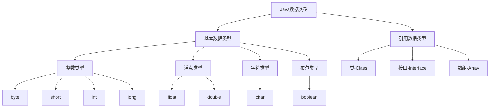

# Java 基本数据类型详解

Java 是一种强类型语言，所有变量在使用前必须明确声明其数据类型。数据类型决定了变量可以存储什么样的数据、占用多少内存空间以及能够进行哪些操作。掌握 Java 的数据类型是编程的第一步，也是编写高效、健壮代码的基础。

## 1 数据类型总览

Java 的数据类型分为两大类：**基本数据类型**（Primitive Data Types）和**引用数据类型**（Reference Data Types）。

- **基本数据类型**：直接存储数据值，包括 6 种数字类型（4 种整数型、2 种浮点型）、1 种字符型和 1 种布尔型，共 8 种。
- **引用数据类型**：存储对象的引用（内存地址），包括类（Class）、接口（Interface）、数组（Array）等。除基本数据类型外，其他所有类型都是引用数据类型。

以下是 Java 数据类型的分类概览：



## 2 基本数据类型详解

Java 的 8 种基本数据类型具有固定的大小和格式，直接存储在栈内存中。下面是它们的详细特性：

### 2.1 整数类型

整数类型用于存储整数值，包括四种不同范围的类型。

| 数据类型 | 存储大小      | 默认值 | 取值范围                                               | 包装类    | 应用场景                   |
| :------- | :------------ | :----- | :----------------------------------------------------- | :-------- | :------------------------- |
| `byte`   | 8 位 (1字节)  | `0`    | -128 ~ 127                                             | `Byte`    | 小范围数值，如文件流操作   |
| `short`  | 16 位 (2字节) | `0`    | -32,768 ~ 32,767                                       | `Short`   | 较小整数，如屏幕分辨率     |
| `int`    | 32 位 (4字节) | `0`    | -2,147,483,648 ~ 2,147,483,647 (约 ±21 亿)             | `Integer` | 最常用整数，如循环索引     |
| `long`   | 64 位 (8字节) | `0L`   | -9,223,372,036,854,775,808 ~ 9,223,372,036,854,775,807 | `Long`    | 大数值，如时间戳、文件大小 |

**代码示例**：

```java
// 整数类型声明示例
byte fileData = 120;          // 文件流中的字节数据
short screenWidth = 1920;     // 屏幕宽度
int population = 1000000;     // 人口数量
long timestamp = 13800000000L; // 时间戳（必须加L后缀）
```

**注意事项**：

- Java 中整数常量默认为 `int` 类型
- 声明 `long` 类型时必须在数字后加 `L` 或 `l`（推荐大写 `L`，避免与数字 `1` 混淆）
- 各整数类型有固定的表数范围和字段长度，不受操作系统影响，保证了Java的可移植性

### 2.2 浮点类型

浮点类型用于存储小数，包括两种不同精度的类型。

| 数据类型 | 存储大小      | 默认值 | 取值范围             | 精度             | 包装类   | 应用场景                 |
| :------- | :------------ | :----- | :------------------- | :--------------- | :------- | :----------------------- |
| `float`  | 32 位 (4字节) | `0.0f` | ±1.4E-45 ~ ±3.4E38   | 约 7 位有效数字  | `Float`  | 科学计算，对精度要求不高 |
| `double` | 64 位 (8字节) | `0.0d` | ±4.9E-324 ~ ±1.8E308 | 约 15 位有效数字 | `Double` | 金融计算，需要高精度     |

**代码示例**：

```java
// 浮点类型声明示例
float temperature = 23.5f;    // 温度值（必须加f后缀）
double price = 1299.99;       // 商品价格（默认浮点类型）
```

**注意事项**：

- Java 中浮点数常量默认为 `double` 类型
- 声明 `float` 类型时必须在数字后加 `F` 或 `f`
- **浮点数精度问题**：由于计算机使用二进制表示浮点数，某些十进制小数无法精确表示，可能导致精度损失

  ```java
  // 浮点数精度问题示例
  System.out.println(0.1 + 0.2); // 输出 0.30000000000000004
  ```

  对于需要精确计算的场景（如金融计算），建议使用 `BigDecimal` 类

### 2.3 字符类型

字符类型用于存储单个字符。

| 数据类型 | 存储大小      | 默认值     | 取值范围                 | 包装类      | 应用场景     |
| :------- | :------------ | :--------- | :----------------------- | :---------- | :----------- |
| `char`   | 16 位 (2字节) | `'\u0000'` | 0 ~ 65,535 (Unicode字符) | `Character` | 存储单个字符 |

**代码示例**：

```java
// 字符类型声明示例
char grade = 'A';              // 字母等级
char gender = '男';            // 中文字符
char newline = '\n';           // 转义字符-换行
char unicodeChar = '\u0041';   // Unicode编码（表示'A'）
```

**注意事项**：

- Java 使用 Unicode 编码标准，`char` 类型可以存储任何 Unicode 字符，包括中文字符
- 字符常量用单引号（`'`）括起来
- `char` 类型本质上是整数，可以参与数值运算

  ```java
  // 字符运算示例
  char char1 = 'A';
  char char2 = 'B';
  int sum = char1 + char2;     // 结果为 131（65 + 66）
  System.out.println("Sum: " + sum);
  ```

### 2.4 布尔类型

布尔类型用于表示逻辑值。

| 数据类型  | 存储大小                      | 默认值  | 取值范围       | 包装类    | 应用场景 |
| :-------- | :---------------------------- | :------ | :------------- | :-------- | :------- |
| `boolean` | 通常为1位（实际占用可能更多） | `false` | `true`/`false` | `Boolean` | 逻辑判断 |

**代码示例**：

```java
// 布尔类型声明示例
boolean isJavaFun = true;      // 逻辑值
boolean hasPassedExam = false;

// 用于条件判断
if (isJavaFun) {
    System.out.println("Java is fun!");
}

// 用于循环控制
while (!hasPassedExam) {
    // 学习Java...
}
```

**注意事项**：

- `boolean` 类型只有两个值：`true` 和 `false`
- 不能与其他数据类型进行转换或混合运算
- 在不同的 JVM 实现中占用的空间可能不同，不应假设其具体的空间占用

## 3 类型转换

在 Java 程序中，经常需要在不同的数据类型之间进行转换。类型转换分为两种：自动类型转换和强制类型转换。

### 3.1 自动类型转换（隐式转换）

自动类型转换是指 Java 自动将一种数据类型转换为另一种数据类型，而不需要程序员显式地进行转换。这种转换通常发生在从小范围类型向大范围类型转换时，不会导致数据丢失。

**转换规则**（按范围从小到大）：

```bash
byte → short → int → long → float → double
```

```bash
char → int → long → float → double
```

**代码示例**：

```java
// 自动类型转换示例
byte smallNumber = 100;
int mediumNumber = smallNumber;  // byte自动转换为int

int integerValue = 100;
double doubleValue = integerValue; // int自动转换为double（结果为100.0）

char character = 'A';
int unicodeValue = character;   // char自动转换为int（结果为65）
```

### 3.2 强制类型转换（显式转换）

强制类型转换是指程序员通过显式的方式将一种数据类型转换为另一种数据类型。这种转换通常发生在从大范围类型向小范围类型转换时，可能会导致数据丢失或精度损失。

**语法格式**：

```java
(targetType) value;
```

**代码示例**：

```java
// 强制类型转换示例
double price = 99.99;
int roundedPrice = (int) price; // double强制转换为int（结果为99，丢失小数部分）

long bigNumber = 123456789L;
int smallerNumber = (int) bigNumber; // long强制转换为int（可能丢失数据）

int largeValue = 200;
byte smallValue = (byte) largeValue; // int强制转换为byte（可能溢出，结果为-56）
```

**注意事项**：

- 强制类型转换可能会导致**数据溢出**或**精度损失**，需谨慎使用
- 浮点数转换为整数时，小数部分会被直接舍弃（不进行四舍五入）
- 可以使用 `Math.round()` 等方法进行更合理的转换：

  ```java
  double price = 99.99;
  long roundedPrice = Math.round(price); // 四舍五入（结果为100）
  ```

## 4 包装类与自动装箱拆箱

Java 为每种基本数据类型提供了对应的包装类（Wrapper Class），属于引用数据类型。

| 基本数据类型 | 包装类      |
| :----------- | :---------- |
| `byte`       | `Byte`      |
| `short`      | `Short`     |
| `int`        | `Integer`   |
| `long`       | `Long`      |
| `float`      | `Float`     |
| `double`     | `Double`    |
| `char`       | `Character` |
| `boolean`    | `Boolean`   |

### 4.1 自动装箱与拆箱

从 Java 5 开始，引入了自动装箱（Autoboxing）和自动拆箱（Unboxing）机制。

- **自动装箱**：基本数据类型自动转换为对应的包装类对象
- **自动拆箱**：包装类对象自动转换为对应的基本数据类型

**代码示例**：

```java
// 自动装箱
Integer integerValue = 100;    // 基本类型int自动装箱为Integer对象
Double doubleValue = 3.14;     // 基本类型double自动装箱为Double对象

// 自动拆箱
int primitiveInt = integerValue; // Integer对象自动拆箱为基本类型int
double primitiveDouble = doubleValue; // Double对象自动拆箱为基本类型double
```

### 4.2 包装类的应用场景

1. **集合框架中存储基本数据类型**：

   ```java
   // 集合中只能存储对象，不能存储基本数据类型
   ArrayList<Integer> numbers = new ArrayList<>();
   numbers.add(10);  // 自动装箱为Integer对象
   numbers.add(20);
   ```

2. **提供有用的方法和常量**：

   ```java
   // 使用包装类提供的常量和方法
   System.out.println("int最大值: " + Integer.MAX_VALUE);
   System.out.println("int最小值: " + Integer.MIN_VALUE);

   String numberStr = "123";
   int parsedNumber = Integer.parseInt(numberStr); // 字符串转int
   ```

3. **允许null值**：

   ```java
   Integer age = null; // 包装类可以表示null
   // int age = null;  // 编译错误，基本数据类型不能为null
   ```

### 4.3 包装类的缓存机制

Java 对部分包装类提供了缓存机制，以提高性能。

```java
// Integer缓存范围：-128 到 127
Integer a = 100;
Integer b = 100;
System.out.println(a == b); // true（在缓存范围内，引用相同对象）

Integer c = 200;
Integer d = 200;
System.out.println(c == d); // false（超出缓存范围，引用不同对象）

// 正确比较包装类对象的值应使用equals()方法
System.out.println(c.equals(d)); // true（值相等）
```

**缓存范围**：

- `Byte`：全部缓存（-128~127）
- `Short`、`Integer`、`Long`：-128~127
- `Character`：0~127
- `Boolean`：缓存 `TRUE` 和 `FALSE`

## 5 性能优化建议

正确选择和使用数据类型对程序性能有重要影响。

1. **选择合适的数据类型**：
   - 根据数据范围选择最小但足够的类型，如范围小的整数使用 `byte` 或 `short` 而不是 `int`
   - 浮点数选择：精度要求不高时使用 `float`，精度要求高时使用 `double`

2. **基本类型与包装类的选择**：
   - 性能敏感的局部变量、数组存储使用基本类型
   - 集合中的元素、需要表示 null 值的场景使用包装类

3. **避免不必要的装箱拆箱**：

   ```java
   // 低效做法：循环中频繁装箱拆箱
   Long sum = 0L;
   for (int i = 0; i < 100000; i++) {
       sum += i; // 每次循环发生拆箱和装箱
   }

   // 改进做法：使用基本类型
   long sum = 0L;
   for (int i = 0; i < 100000; i++) {
       sum += i; // 直接使用基本类型运算
   }
   ```

4. **数组与集合的选择**：
   - 性能要求高、元素类型相同且数量固定时，使用基本类型数组
   - 需要动态大小、元素类型可以不同或需要丰富操作时，使用集合框架

## 6 常见问题与陷阱

1. **整数溢出**：

   ```java
   int max = Integer.MAX_VALUE;
   int result = max + 1; // 溢出，结果为-2147483648
   System.out.println("最大值加1: " + result);
   ```

   **解决方案**：使用更大范围的数据类型（如 `long`）或进行检查

2. **浮点数精度问题**：

   ```java
   System.out.println(0.1 + 0.2); // 输出0.30000000000000004
   ```

   **解决方案**：需要精确计算时使用 `BigDecimal` 类

3. **字符与字符串混淆**：

   ```java
   char grade = 'A';      // 正确：字符使用单引号
   String name = "Java"; // 正确：字符串使用双引号
   // char error = "A";  // 错误：双引号表示字符串，不能赋值给char
   ```

4. **类型转换溢出**：

   ```java
   long bigValue = 1234567890123L;
   int converted = (int) bigValue; // 可能丢失数据
   ```

   **解决方案**：转换前进行范围检查

## 7 总结

Java 的基本数据类型是构建程序的基石，它们提供了简单、高效的数据存储和操作方式。正确理解和使用这些数据类型对于编写高质量 Java 代码至关重要：

1. Java 有 8 种基本数据类型：6 种数字类型（`byte`、`short`、`int`、`long`、`float`、`double`）、1 种字符类型（`char`）和 1 种布尔类型（`boolean`）
2. 基本数据类型直接存储值，占用固定内存空间，效率高
3. 类型转换分为自动转换（小范围到大范围）和强制转换（大范围到小范围，可能丢失数据）
4. 包装类将基本数据类型封装为对象，用于需要对象的场景，并提供了自动装箱和拆箱机制
5. 在实际开发中，应根据数据特性和业务需求选择合适的数据类型，并注意常见陷阱

熟练掌握 Java 数据类型的特点和使用方法，是编写高效、健壮 Java 程序的基础。建议通过实际编程练习来加深理解，并在 IDE 中运行代码观察结果，以巩固学习效果。
