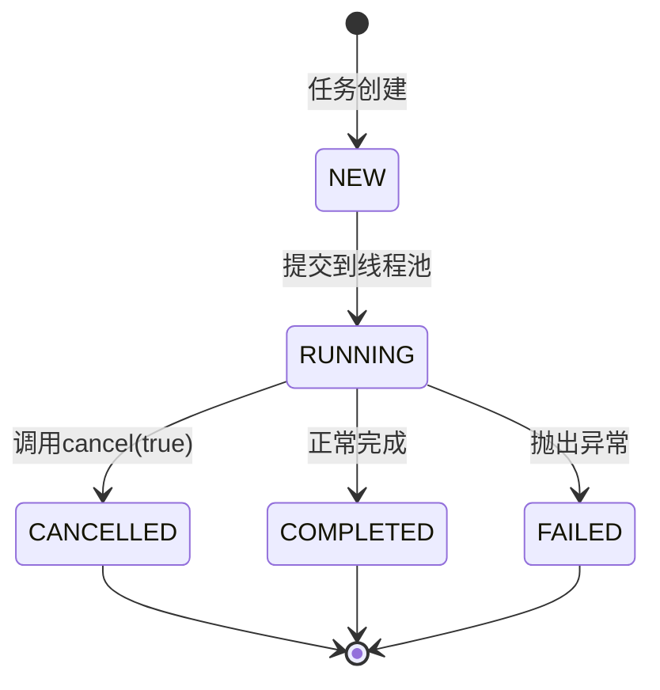

# Java Future 接口详解与最佳实践

作为 Java 并发编程的核心组件，`Future` 接口为异步计算提供了基础支持。本文将深入解析 `Future` 的设计理念、工作机制、使用方法和最佳实践。

## 1. Future 概述

`Future` 接口（`java.util.concurrent.Future`）是 Java 5 引入的异步计算抽象，它代表一个可能尚未完成的异步任务的结果。通过 `Future`，开发者可以提交任务到线程池异步执行，在需要时获取计算结果，并能够控制任务的生命周期。

**核心价值**：

- ✅ **解耦任务提交与结果处理**：主线程提交任务后可以继续执行其他操作
- ✅ **提供统一的任务控制接口**：检查状态、获取结果、取消任务
- ✅ **保证跨线程内存可见性**：确保线程间的数据同步

## 2. 核心工作机制

### 2.1 状态机模型

`Future` 任务遵循以下状态流转：



### 2.2 核心方法解析

| 方法 | 说明 | 阻塞性 |
|------|------|--------|
| `get()` | 获取计算结果，未完成时阻塞 | 阻塞 |
| `get(long, TimeUnit)` | 带超时的结果获取 | 有条件阻塞 |
| `isDone()` | 检查任务是否完成 | 非阻塞 |
| `cancel(boolean)` | 尝试取消任务 | 非阻塞 |
| `isCancelled()` | 判断任务是否已取消 | 非阻塞 |

**方法行为总结**：

| 场景 | 行为 |
|------|------|
| 调用已完成任务的 `get()` | 立即返回计算结果 |
| 调用未完成任务的 `get()` | 阻塞当前线程直至结果就绪 |
| 调用已取消任务的 `get()` | 抛出 `CancellationException` |
| 重复调用 `cancel(true)` | 首次调用可能成功取消，后续调用无效 |

## 3. 基础用法与代码示例

### 3.1 基本使用模式

```java
import java.util.concurrent.*;

public class FutureBasicDemo {
    public static void main(String[] args) throws Exception {
        // 创建线程池
        ExecutorService executor = Executors.newSingleThreadExecutor();

        // 提交Callable任务
        Future<Integer> future = executor.submit(() -> {
            System.out.println("任务开始执行");
            Thread.sleep(2000); // 模拟耗时操作
            return 42; // 返回计算结果
        });

        // 主线程继续执行其他操作
        System.out.println("主线程继续执行其他任务");

        // 非阻塞检查任务状态
        if (!future.isDone()) {
            System.out.println("任务尚未完成，可执行其他操作");
        }

        try {
            // 阻塞获取结果（带3秒超时）
            Integer result = future.get(3, TimeUnit.SECONDS);
            System.out.println("计算结果: " + result);
        } catch (TimeoutException e) {
            System.out.println("计算超时");
            future.cancel(true); // 尝试中断任务
        } finally {
            executor.shutdown(); // 关闭线程池
        }
    }
}
```

### 3.2 多任务并发执行

```java
import java.util.*;
import java.util.concurrent.*;

public class MultiTaskFutureDemo {
    public static void main(String[] args) throws InterruptedException, ExecutionException {
        ExecutorService executor = Executors.newFixedThreadPool(3);
        List<Future<Integer>> futures = new ArrayList<>();

        // 提交多个任务
        for (int i = 1; i <= 5; i++) {
            int taskId = i;
            Callable<Integer> task = () -> {
                System.out.println("任务 " + taskId + " 开始执行");
                Thread.sleep(1000); // 模拟耗时操作
                return taskId * 2;
            };
            futures.add(executor.submit(task));
        }

        // 获取所有任务结果
        for (Future<Integer> future : futures) {
            System.out.println("任务结果: " + future.get());
        }

        executor.shutdown();
    }
}
```

### 3.3 异常处理

```java
import java.util.concurrent.*;

public class FutureExceptionHandling {
    public static void main(String[] args) {
        ExecutorService executor = Executors.newSingleThreadExecutor();

        // 提交可能抛出异常的任务
        Future<Integer> future = executor.submit(() -> {
            if (Math.random() < 0.5) {
                throw new RuntimeException("模拟任务执行失败");
            }
            Thread.sleep(2000);
            return 123;
        });

        try {
            Integer result = future.get();
            System.out.println("任务结果: " + result);
        } catch (ExecutionException e) {
            // 捕获任务执行中的异常
            System.out.println("捕获到任务异常: " + e.getCause().getMessage());
        } catch (InterruptedException e) {
            System.out.println("任务被中断: " + e.getMessage());
        } finally {
            executor.shutdown();
        }
    }
}
```

## 4. FutureTask 实用类

`FutureTask` 是 `Future` 接口的实现类，同时实现了 `Runnable` 接口，既可提交到线程池执行，也可直接作为 `Thread` 的目标。

```java
import java.util.concurrent.*;

public class FutureTaskDemo {
    public static void main(String[] args) throws InterruptedException, ExecutionException {
        // 使用FutureTask包装Callable
        FutureTask<Integer> futureTask = new FutureTask<>(() -> {
            Thread.sleep(1000);
            return 10 + 22;
        });

        // 创建线程并启动
        Thread thread = new Thread(futureTask);
        thread.start();

        try {
            // 获取结果
            Integer result = futureTask.get();
            System.out.println("计算结果: " + result);
        } catch (ExecutionException e) {
            e.printStackTrace();
        }
    }
}
```

## 5. 任务取消机制深度剖析

### 5.1 取消操作的两种模式

| 模式 | 触发方式 | 中断处理 |
|------|----------|----------|
| 不可中断 | `cancel(false)` | 仅标记取消状态，不中断线程 |
| 可中断 | `cancel(true)` | 调用 `Thread.interrupt()` 尝试中断 |

### 5.2 优雅取消实现模板

```java
import java.util.concurrent.*;

public class GracefulCancellationDemo {
    public static void main(String[] args) throws InterruptedException {
        ExecutorService executor = Executors.newSingleThreadExecutor();

        Future<?> future = executor.submit(() -> {
            while (!Thread.currentThread().isInterrupted()) {
                try {
                    // 模拟工作单元
                    System.out.println("Working...");
                    Thread.sleep(500);
                } catch (InterruptedException e) {
                    // 响应中断请求
                    System.out.println("检测到中断请求，优雅退出");
                    Thread.currentThread().interrupt(); // 重新设置中断状态
                }
            }
            System.out.println("任务已终止");
        });

        // 让任务运行一段时间
        Thread.sleep(2000);

        // 发送取消请求（可中断方式）
        System.out.println("发送取消请求");
        future.cancel(true);

        executor.shutdown();
    }
}
```

### 5.3 取消操作的局限性

- **无法终止阻塞操作**：如 `Socket.accept()` 等原生阻塞调用不响应中断
- **状态不可逆**：已完成的任务调用 `cancel()` 返回 `false`
- **资源泄漏风险**：被中断线程可能遗留未关闭的资源

## 6. Future 与 CompletableFuture 的对比

### 6.1 功能差异

| 特性 | Future | CompletableFuture |
|------|--------|-------------------|
| 手动完成 | ❌ | ✅ |
| 异常处理链 | 手动捕获 `ExecutionException` | 支持 `exceptionally()` 处理链 |
| 组合操作 | ❌ | ✅ (`thenCombine`等) |
| 非阻塞回调 | ❌ | ✅ (`thenApply`等) |
| 超时控制 | 需显式指定 | 内置 `orTimeout()` 方法 |

### 6.2 迁移策略建议

- **简单场景**：直接使用 Future + ExecutorService
- **复杂流水线**：优先选择 CompletableFuture
- **混合使用**：通过 `CompletableFuture.supplyAsync()` 包装现有 Future

## 7. 最佳实践与常见陷阱

### 7.1 超时控制

**务必使用带超时的 get 方法**，防止永久阻塞：

```java
try {
    Integer result = future.get(3, TimeUnit.SECONDS);
    System.out.println("计算结果: " + result);
} catch (TimeoutException e) {
    System.out.println("任务超时，尝试取消");
    future.cancel(true); // 取消任务
}
```

### 7.2 资源释放

**通过 finally 块确保关闭 ExecutorService**：

```java
ExecutorService executor = Executors.newSingleThreadExecutor();
try {
    Future<Integer> future = executor.submit(() -> {
        // 任务逻辑
        return 42;
    });
    Integer result = future.get();
    System.out.println("结果: " + result);
} finally {
    executor.shutdown(); // 确保线程池被关闭
    // 或者使用: executor.shutdownNow(); // 尝试立即终止所有任务
}
```

### 7.3 异常处理

**捕获 ExecutionException 获取任务内部异常**：

```java
try {
    future.get();
} catch (ExecutionException e) {
    Throwable cause = e.getCause(); // 获取实际异常
    System.out.println("任务执行失败: " + cause.getMessage());
}
```

### 7.4 状态检查

**结合 isDone() 实现进度监控**：

```java
while (!future.isDone()) {
    System.out.println("任务仍在执行中...");
    // 可以添加超时控制
    double elapsedTimeInSec = (System.nanoTime() - startTime) / 1000000000.0;
    if (elapsedTimeInSec > 1) {
        future.cancel(true); // 超时取消
    }
    Thread.sleep(500);
}
```

### 7.5 特殊用法 Future<?>

当不需要返回有效结果，但需要保留可取消性时，可以使用 `Future<?>`：

```java
Future<?> future = executor.submit(() -> {
    while (!Thread.currentThread().isInterrupted()) {
        // 执行无返回值但需要可取消的任务
        System.out.println("Working without return value...");
        Thread.sleep(1000);
    }
});

// 当需要取消时
future.cancel(true); // 保留可取消性
```

## 8. 总结

Java `Future` 接口作为异步计算的基石，其核心价值在于实现任务提交与结果获取的解耦，使开发者能够构建高效、响应式的并发应用程序。

**适用场景**：

- 高消耗的科学计算场景（如深度学习中的张量计算）
- 海量复杂结构数据处理（大数据处理）
- 异步大文件下载、异步爬虫爬取数据
- 其他高耗时、海量数据的异步 Web 服务

**选择建议**：

| 场景 | 推荐技术 |
|------|----------|
| 简单异步任务 | Future + ExecutorService |
| 需要任务取消能力 | Future + 可中断逻辑 |
| 复杂异步流水线 | CompletableFuture |
| 多个任务组合 | CompletableFuture |
| 非阻塞回调需求 | CompletableFuture |

随着 Java 并发API的演进，`CompletableFuture` 提供了更强大的异步编程能力，但传统的 `Future` 接口在简单场景下仍然是轻量且有效的选择。理解 `Future` 的工作原理和最佳实践，是为现代Java并发编程奠定坚实基础的关键步骤。
