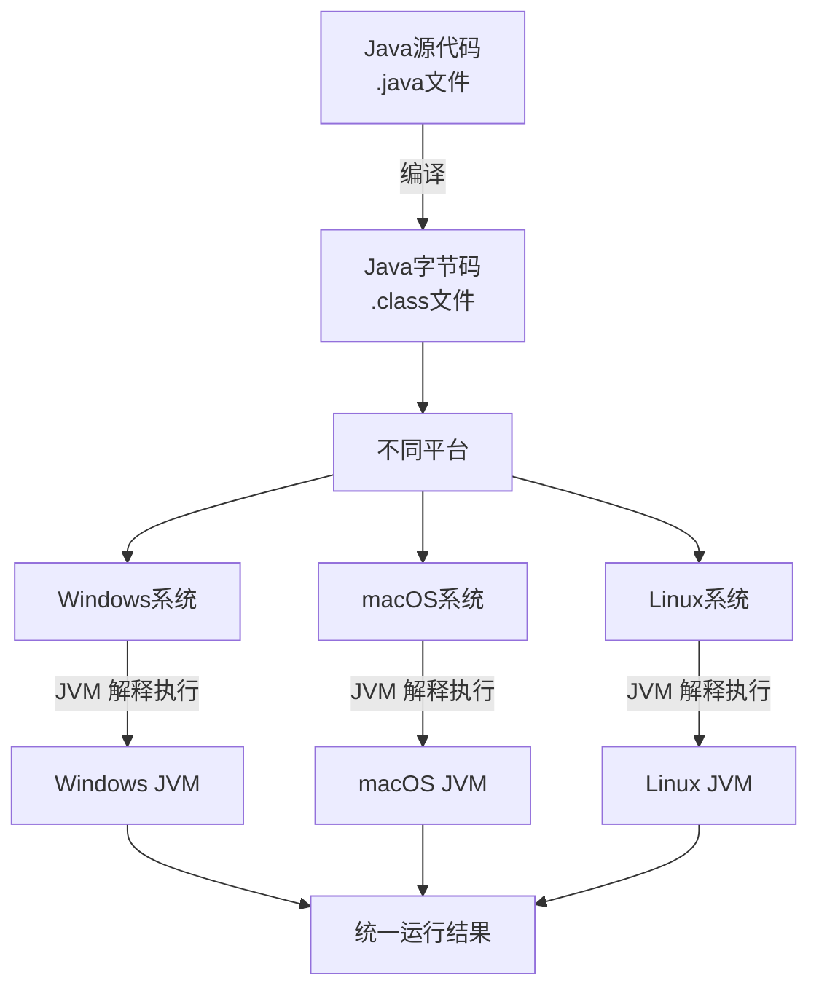

# Java 编程语言简介

## 1. 什么是 Java？

Java 是一门流行的、高级的、面向对象的编程语言，也是一种平台，最初由 Sun Microsystems（现为 Oracle Corporation 的一部分）于1995年5月正式推出。它的设计目标是让开发者能够"**一次编写，到处运行**"（Write Once, Run Anywhere, WORA），这意味着编译后的 Java 代码（字节码）可以在所有支持 Java 的平台上运行，而无需重新编译。

Java 是一种静态类型的语言，这意味着在编译时必须声明变量的类型，而不是在运行时确定。这使得 Java 代码更加安全、可靠，并且在调试时更容易发现错误。

Java 不仅是一种编程语言，更是一个完整的技术生态系统。它包含了强大的开发工具（如 IDE、构建工具）、丰富的标准类库（Java API）、高性能的运行时环境（JRE）以及活跃的开源社区。据统计，全球已有超过 **150亿台设备** 运行 Java 程序，应用范围涵盖企业软件、Android 移动应用、云计算、微服务、大数据处理、人工智能等众多领域，是当今最受欢迎的编程语言之一。

## 2. Java 的历史与起源

Java 的故事始于 **1991年**。当时 Sun Microsystems 的一个团队（Green Team）由 James Gosling 领导，致力于为消费电子设备（如机顶盒）开发一种新的编程语言。这个项目最初命名为 **Oak**（以 Gosling 办公室外的一棵橡树命名）。

然而，Oak 在当时并未获得巨大成功。转折点来自于 **互联网的兴起** 和万维网（WWW）的快速发展。Sun 的工程师敏锐地察觉到，Oak 的架构中立、可移植、安全等特性非常适合网络环境。他们将 Oak 技术应用于 Web，开发了 **HotJava 浏览器**（支持 Java Applet），展示了动态 Web 内容的潜力。

1995年，Oak 正式更名为 **Java**（据说是因为这个名字来自于开发团队成员常喝的咖啡，因此标志也是一杯热气腾腾的咖啡），并于同年正式发布。Java 的跨平台能力和为 Web 带来的交互性，使其迅速流行起来。

::: info Java 版本发展历程

- **JDK 1.0 (1996)**: Java 正式发布的第一个版本。
- **JDK 1.1 (1997)**: 引入了内部类、JavaBeans、JDBC、RMI、反射等。
- **J2SE 1.2 (1998)**: 引入集合框架、JIT 编译器、Swing GUI 工具包。
- **J2SE 1.3 (2000)**: 引入 HotSpot JVM、JNDI、JPDA、JavaSound。
- **J2SE 1.4 (2002)**: 引入 assert、正则表达式、NIO、日志 API、XML 解析器。
- **J2SE 5.0 (2004)**: 增加泛型、注解、枚举、可变参数、foreach 循环、自动装箱/拆箱等。
- **Java SE 6 (2006)**: 提供脚本语言支持、JDBC 4.0、改进性能和监控。
- **Java SE 7 (2011)**: 加入 try-with-resources、钻石操作符、switch 支持字符串、Fork/Join 框架。
- **Java SE 8 (2014)**: 重要的 LTS 版本。引入 Lambda 表达式、Stream API、新的日期时间 API、Optional 类。
- **Java SE 9 (2017)**: 引入模块系统 (Jigsaw)、JShell、集合工厂方法。
- **Java SE 10 (2018)**: 引入局部变量类型推断(var)。
- **Java SE 11 (2018)**: 重要的 LTS 版本。HTTP Client API 标准化、删除 Java EE 模块。
- **Java SE 12 (2019)**: Switch 表达式预览。
- **Java SE 13 (2019)**: 文本块预览、Switch 表达式改进。
- **Java SE 14 (2020)**: Records 预览、Pattern Matching 预览。
- **Java SE 15 (2020)**: 密封类预览、隐藏类、Edwards-Curve 加密算法。
- **Java SE 16 (2021)**: Records 和 Pattern Matching 正式版。
- **Java SE 17 (2021)**: LTS 版本。密封类正式版、增强伪随机数生成器。
- **Java SE 18 (2022)**: UTF-8 默认编码、简单 Web 服务器。
- **Java SE 19 (2022)**: 虚拟线程预览、结构化并发预览。
- **Java SE 20 (2023)**: 作用域值预览、记录模式预览。
- **Java SE 21 (2023)**: LTS 版本。虚拟线程正式版、字符串模板预览、序列集合。
- **Java SE 22 (2024)**: 未命名变量和模式（预览）、String 模板（第二次预览）。
- **Java SE 23 (2024)**: 未命名模式和变量（预览）、未命名类和实例主方法（预览）、数学函数增强。
- **Java SE 24 (2025)**: 模式匹配扩展、字符串模板（正式版）、ZGC 改进。
  :::

**重要说明**：

- 从 Java 9 开始，Oracle 采用每六个月发布一个特性版本的节奏。
- LTS（长期支持）版本包括 Java 8、11、17、21，提供更长期的更新支持。
- 2009 年 Oracle 收购 Sun 后，Java 的开发和维护由 Oracle 负责。

## 3. Java 的主要特性

Java 之所以能经久不衰，得益于其一系列核心特性：

| 特性                                           | 说明                                                                                                                                                                                   |
| :--------------------------------------------- | :------------------------------------------------------------------------------------------------------------------------------------------------------------------------------------- |
| **简单性 (Simple)**                            | 语法类似于 C/C++，但摒弃了其中复杂且容易出错的特性的（如指针、操作符重载、多继承）。提供了自动内存管理（垃圾回收），降低了学习成本和编程复杂度。                                       |
| **面向对象 (Object-Oriented)**                 | 一切皆对象。支持封装、继承、多态等面向对象编程的基本特性（Java 是单继承，但接口可以多继承）。                                                                                          |
| **分布式 (Distributed)**                       | Java 提供了丰富的网络编程类库（如 `java.net`），可以方便地开发分布式应用。                                                                                                             |
| **健壮性 (Robust)**                            | 强类型机制、异常处理、垃圾回收机制和内存管理，帮助编写稳定可靠的程序。避免了许多编程错误。                                                                                             |
| **安全性 (Secure)**                            | 提供了多层次的安全机制，防止恶意代码攻击。常用于网络环境中。                                                                                                                           |
| **体系结构中立/跨平台 (Architecture-Neutral)** | 编译器生成与特定计算机体系结构无关的**字节码**（bytecode），而不是原始的机器指令。字节码由 **Java 虚拟机 (JVM)** 解释执行，这使得编译后的 Java 程序可以在任何安装了 JVM 的设备上运行。 |
| **可移植性 (Portable)**                        | 跨平台特性是实现可移植性的基础。此外，Java 本身（编译器用 Java 实现，运行时环境用ANSI C实现）和其基础类库也提供了良好的可移植性。                                                      |
| **解释型 (Interpreted)**                       | Java 字节码通常在运行时由 JVM 解释执行（现代 JVM 大多使用即时编译技术 JIT 来提高性能）。                                                                                               |
| **高性能 (High Performance)**                  | 虽然早期 Java 因解释执行而性能较低，但**即时编译 (JIT)** 等技术的引入，使得其性能已接近 C/C++。                                                                                        |
| **多线程 (Multithreaded)**                     | 语言级别支持多线程，允许同时执行多个任务，便于开发高性能的并发程序。                                                                                                                   |
| **动态性 (Dynamic)**                           | 库中可以自由添加新方法和实例变量，而不会影响客户端程序。支持在运行时动态加载类。                                                                                                       |

## 4. Java 平台体系

Java 平台主要分为三个版本，针对不同的开发需求：

1. **Java SE (Java Platform, Standard Edition)**
   - **Java 标准版**，是核心平台。
   - 提供了 Java 语言的基础 API、开发工具、运行时环境 (JRE) 和虚拟机 (JVM)。
   - 用于开发和部署桌面应用程序、控制台程序和一些简单的服务器应用。
   - 是学习 Java 的起点，也是其他版本的基础。

2. **Java EE (Java Platform, Enterprise Edition)**, 现更名为 **Jakarta EE**
   - **Java 企业版**，构建在 Java SE 之上。
   - 提供了一套用于开发大规模、多层次、可扩展、可靠和安全的企业级应用程序（如电子商务系统、分布式系统）的 API 和技术规范。
   - 常见技术包括 Servlets, JSP, JPA, EJB, JMS 等。
   - 现由 Eclipse 基金会管理，并更名为 Jakarta EE。

3. **Java ME (Java Platform, Micro Edition)**
   - **Java 微型版**。
   - 为嵌入式设备和移动设备（如早期功能手机、PDA、物联网设备）提供的 Java 平台。
   - 包含高度优化的运行时环境和一组针对资源受限环境的 API。

## 5. Java 如何工作？理解 JVM、JRE 和 JDK

Java 实现"一次编写，到处运行"的关键在于下图所示的编译和运行机制：



与这三个核心概念密切相关：

- **JDK (Java Development Kit) - Java 开发工具包**
  - **功能**：提供给开发者使用的工具集，用于**开发** Java 应用程序。
  - **包含**：
    - **JRE** (所以安装了JDK就不需要再单独安装JRE)。
    - **编译器 (javac)**：将 `.java` 源文件编译成 `.class` 字节码文件。
    - **其他工具**：如打包工具 (jar)、文档生成工具 (javadoc)、调试工具 (jdb) 等。

- **JRE (Java Runtime Environment) - Java 运行时环境**
  - **功能**：用于**运行**已编译的 Java 程序（字节码）。如果你不需要开发，只需要运行 Java 程序，安装 JRE 即可。
  - **包含**：
    - **JVM**。
    - **Java 核心类库 (API)**：程序运行时需要的基础库文件。

- **JVM (Java Virtual Machine) - Java 虚拟机**
  - **功能**：是 **JRE 的核心**。负责**加载**、**校验**、**解释执行** Java 字节码。正是针对不同操作系统的特定 JVM 实现，屏蔽了底层操作系统的差异，实现了跨平台。
  - **重要机制**：
    - **垃圾回收 (Garbage Collection, GC)**：自动管理内存分配和回收，释放不再使用的对象所占用的内存。
    - **即时编译 (Just-In-Time Compilation, JIT)**：将频繁执行的字节码编译成本地机器码并缓存，大幅提升执行效率。

**关系总结**：JDK > JRE > JVM。开发者安装 **JDK**；用户运行程序只需安装 **JRE**（但现在大多数 JDK 安装包也自带 JRE，且对于简单应用，Oracle 也倾向于推荐用户直接安装完整的 JDK）。

## 6. 第一个 Java 程序

让我们编写一个经典的 "Hello, World!" 程序。

1. **编写代码**：创建一个名为 `HelloWorld.java` 的文件，内容如下。

   ```java
   // 声明一个公共类，类名必须与文件名完全一致（区分大小写）
   public class HelloWorld {

       // 主方法，是Java应用程序的入口点
       public static void main(String[] args) {

           // 向控制台输出信息
           System.out.println("Hello, World!");
       }
   }
   ```

2. **编译代码**：打开终端或命令提示符，导航到文件所在目录，运行 `javac` 命令进行编译。

   ```bash
   javac HelloWorld.java
   ```

   如果编译成功，会生成一个 `HelloWorld.class` 的字节码文件。

3. **运行程序**：使用 `java` 命令运行编译后的字节码（**不需要加 `.class` 后缀**）。

   ```bash
   java HelloWorld
   ```

   输出应为：

   ```bash
   Hello, World!
   ```

## 7. Java 的应用领域

Java 是一门多功能语言，其应用非常广泛：

- **企业级应用 (Enterprise Applications)**：Java EE (Jakarta EE) 是开发大型、分布式企业系统的首选平台之一。常用框架如 Spring, Hibernate。
- **Android 应用开发 (Android App Development)**：Android 官方应用开发语言，虽然现在也有 Kotlin，但 Java 仍是其基础。
- **Web 应用程序 (Web Applications)**：通过 Servlets, JSP, Spring MVC 等技术开发服务器端应用。
- **大数据技术 (Big Data)**：Hadoop, Spark, Flink 等大数据处理框架大量使用 Java 或其衍生语言（如Scala）。
- **服务器端程序与中间件 (Server-side Programs & Middleware)**：广泛应用于 Web 服务器、应用服务器、消息中间件等。
- **科学计算与科研应用 (Scientific Computing & Research)**：因其稳定性、健壮性和丰富的库支持。
- **软件工具 (Software Tools)**：许多开发工具（如 Eclipse, IntelliJ IDEA, NetBeans）、构建工具（Maven, Gradle）都是用 Java 编写的。
- **嵌入式系统与物联网 (Embedded Systems & IoT)**：Java ME 和 newer embedded frameworks。

## 8. 学习 Java 的建议

- **打好基础**：从 **Java SE** 开始，扎实掌握面向对象、异常处理、集合、多线程、I/O 等核心概念。
- **多实践**：编程是实践性极强的技能，**多写代码**、多调试、多阅读优秀的代码。
- **理解原理**：不仅要会用，还要理解背后的原理，如 JVM 内存模型、垃圾回收机制等。
- **善用工具**：熟悉使用主流的集成开发环境 (IDE)，如 **IntelliJ IDEA** 或 **Eclipse**，它们能极大提高开发效率。
- **融入社区**：Java 拥有庞大而活跃的社区，遇到问题时善于利用 AI 助手、Stack Overflow、官方文档、技术博客等资源。

_编程语言：Java, Python, Go 的简单对比_

| 特性     | Java         | Python     | Go         |
| -------- | ------------ | ---------- | ---------- |
| 类型系统 | 静态强类型   | 动态弱类型 | 静态强类型 |
| 并发模型 | 线程+锁      | GIL 限制   | Goroutine  |
| 执行方式 | JIT 编译     | 解释执行   | 编译执行   |
| 包管理   | Maven/Gradle | pip        | go mod     |
| 标准库   | 丰富         | 标准库较小 | 标准库较小 |
| 性能     | 较高         | 中等       | 较高       |
| 语法     | 复杂         | 简单       | 简单       |

## 9. 总结

Java 凭借其**跨平台能力**、**健壮性**、**安全性**和**丰富的生态系统**，在过去二十多年里一直是全球最流行、最受开发者欢迎的编程语言之一。尽管面临许多新语言的挑战，但它在企业级开发、Android 生态和大数据等领域依然占据着**不可动摇的主导地位**，并且其本身也在通过快速的版本迭代不断进化（如模块化、新 GC 算法、Project Loom 等），保持其现代性和竞争力。

无论你是编程新手还是经验丰富的开发者，学习 Java 都是一项非常有价值的投资。
