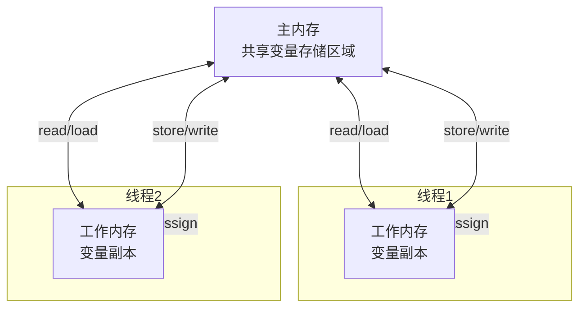

# Java 内存模型（JMM）详解与最佳实践

## 1 JMM概述与重要性

Java 内存模型（Java Memory Model, JMM）是 Java 虚拟机规范中定义的一套**关键规则**，它规定了多线程环境下变量的访问方式，以及线程之间如何通过内存进行交互。JMM 的核心目标是**屏蔽各种硬件和操作系统的内存访问差异**，使 Java 程序在不同平台上都能达到一致的内存访问效果，从而保证并发程序的正确性、可靠性和可移植性。

在多线程编程中，由于现代计算机体系结构的复杂性（如多级缓存、指令重排序等），线程间的数据共享可能面临三大问题：**原子性问题**、**可见性问题和有序性问题**。JMM 通过定义一系列的规则和机制来解决这些问题，为开发者提供了一套可靠的并发编程基础。

理解 JMM 对于编写正确、高效且线程安全的并发程序至关重要。它不仅帮助开发者避免诸如**数据竞争**、**死锁**和**内存不一致**等常见并发问题，还为使用 Java 提供的各种同步机制（如 `synchronized`、`volatile` 和锁对象）提供了理论基础。

## 2 核心概念与内存结构

### 2.1 主内存与工作内存

JMM 定义了**主内存（Main Memory）** 和**工作内存（Working Memory）** 两种内存概念：

- **主内存**：所有线程共享的内存区域，存储了所有实例变量、静态变量和数组元素。主内存是线程间数据交互的**唯一真相源**。
- **工作内存**：每个线程独有的内存空间，保存了该线程使用到的变量的主内存副本。线程对变量的所有操作（读取、赋值等）都必须在工作内存中进行，不能直接操作主内存中的变量。

这种内存模型的设计类似于现代计算机的 CPU 缓存架构，工作内存对应 CPU 缓存，主内存对应计算机主存。线程、工作内存和主内存的交互关系如下所示：



### 2.2 内存间交互操作与规则

JMM 定义了 8 种**原子操作**来完成主内存与工作内存之间的交互：

| 操作       | 作用                                                       |
| ---------- | ---------------------------------------------------------- |
| **lock**   | 作用于主内存变量，将其标记为一条线程独占状态               |
| **unlock** | 作用于主内存变量，释放变量的锁定状态                       |
| **read**   | 作用于主内存变量，将变量值从主内存传输到线程的工作内存     |
| **load**   | 作用于工作内存变量，将read得到的值放入工作内存的变量副本中 |
| **use**    | 作用于工作内存变量，将变量值传递给执行引擎                 |
| **assign** | 作用于工作内存变量，将执行引擎接收到的值赋给变量           |
| **store**  | 作用于工作内存变量，将变量值传输到主内存                   |
| **write**  | 作用于主内存变量，将store得到的值存入主内存变量中          |

这些操作需要满足以下**交互规则**：

- read/load 和 store/write 必须**成对出现**且按顺序执行
- 线程对变量实施 use/assign 操作前必须先执行 load/read 操作
- 一个变量同一时间只能被一条线程 lock，但同一线程可以多次 lock
- 如果线程 lock 了一个变量，将会清空工作内存中此变量的值，需要重新执行 load 或 assign 初始化
- 线程不能对未 lock 的变量执行 unlock 操作，也不能 unlock 其他线程 lock 的变量

## 3 关键特性：原子性、可见性与有序性

### 3.1 原子性(Atomicity)

**原子性**是指一个操作或多个操作要么**全部执行完成**且不受中断，要么就**完全不执行**。JMM 保证了基本数据类型（如int、long等）的读写操作具有原子性，但对于复合操作（如i++）则无法保证原子性。

```java
// 原子性问题的示例
public class AtomicityProblem {
    private static int count = 0;

    public static void main(String[] args) throws InterruptedException {
        Runnable task = () -> {
            for (int i = 0; i < 10000; i++) {
                count++;  // 非原子操作：包含read、increment、assign三个步骤
            }
        };

        Thread t1 = new Thread(task);
        Thread t2 = new Thread(task);

        t1.start();
        t2.start();
        t1.join();
        t2.join();

        System.out.println("Count: " + count); // 结果可能小于20000
    }
}
```

**解决方案**：

- 使用 `synchronized` 关键字保证代码块的原子性
- 使用 `java.util.concurrent.atomic` 包中的原子类（如 AtomicInteger）
- 使用显式锁（如 ReentrantLock）

### 3.2 可见性(Visibility)

**可见性**是指当一个线程修改了共享变量的值后，其他线程能够**立即感知**到这个修改。由于每个线程操作的是主内存中变量的副本，修改后可能不会立即写回主内存，导致其他线程看不到最新值。

```java
// 可见性问题的示例
public class VisibilityProblem {
    private static boolean flag = true; // 未使用volatile修饰

    public static void main(String[] args) throws InterruptedException {
        Thread worker = new Thread(() -> {
            while (flag) {
                // 循环执行，可能永远无法退出
                // 因为worker线程可能看不到主线程对flag的修改
            }
            System.out.println("Worker thread stopped.");
        });

        worker.start();
        Thread.sleep(1000); // 主线程休眠1秒
        flag = false; // 修改flag值
        System.out.println("Main thread set flag to false.");
        worker.join();
    }
}
```

**解决方案**：

- 使用 `volatile` 关键字修饰变量，保证可见性
- 使用 `synchronized` 同步代码块，在释放锁前会将修改刷回主内存
- 使用 `final` 关键字（对于正确构造的对象）

### 3.3 有序性(Ordering)

**有序性**指程序执行的顺序按照代码的先后顺序执行。为了提高性能，**编译器和处理器**可能会对指令进行重排序，单线程环境下不会影响结果，但在多线程环境下可能导致意想不到的问题。

```java
// 有序性问题的示例
public class OrderingProblem {
    private static int x = 0;
    private static int y = 0;
    private static boolean ready = false;

    public static void main(String[] args) throws InterruptedException {
        Thread t1 = new Thread(() -> {
            x = 1;
            y = 2;
            ready = true; // 编译器可能重排序，使ready=true提前执行
        });

        Thread t2 = new Thread(() -> {
            if (ready) {
                System.out.println("x: " + x + ", y: " + y); // 可能输出x:0, y:0
            }
        });

        t1.start();
        t2.start();
        t1.join();
        t2.join();
    }
}
```

**解决方案**：

- 使用 `volatile` 关键字禁止指令重排序
- 使用 `synchronized` 同步代码块保证有序性
- 使用 `final` 关键字

## 4 Happens-Before 原则

JMM 通过 **Happens-Before** 规则来定义操作之间的偏序关系，确保如果一个操作"happens-before"另一个操作，那么第一个操作的结果对第二个操作**可见**，且第一个操作按顺序排在第二个操作之前。

Happens-Before 原则包括以下 8 条规则：

1. **程序次序规则**：在同一线程内，按照程序代码顺序，前面的操作先于后面的操作
2. **监视器锁规则**：对一个锁的解锁操作先于后续对这个锁的加锁操作
3. **volatile 变量规则**：对一个 volatile 变量的写操作先于后续对这个变量的读操作
4. **线程启动规则**：Thread 对象的 start() 方法先于此线程的每一个动作
5. **线程终止规则**：线程中的所有操作都先于对此线程的终止检测（如 Thread.join()）
6. **线程中断规则**：对线程 interrupt()方法的调用先于被中断线程检测到中断事件
7. **对象终结规则**：一个对象的初始化完成（构造函数执行结束）先于它的 finalize() 方法的开始
8. **传递性规则**：如果 A happens-before B，且 B happens-before C，那么 A happens-before C

Happens-Before 原则的本质是**内存可见性的保证**，只要两个操作之间存在 happens-before 关系，前一个操作的结果就对后一个操作可见。

## 5 同步机制与关键字详解

### 5.1 volatile 关键字

`volatile` 是 Java 提供的**轻量级同步机制**，主要用于保证变量的可见性和禁止指令重排序，但**不保证复合操作的原子性**。

**特性与原理**：

- **保证可见性**：当一个线程修改了 volatile 变量的值，新值会立即被刷新到主内存中，其他线程每次读取时都会直接从主内存中读取最新值。
- **禁止指令重排序**：通过插入**内存屏障**（Memory Barrier）指令，阻止编译器和处理器对 volatile 变量相关的指令进行重排序优化。

**适用场景**：

- 状态标志位（如开关控制）
- 多线程环境下的懒加载（单例模式的双重检查锁）
- 读多写少的共享变量

**代码示例**：

```java
// 正确使用volatile的示例：状态标志位
public class VolatileExample {
    private volatile boolean running = true;

    public void stop() {
        running = false; // 修改后立即对其他线程可见
    }

    public void run() {
        while (running) {
            // 执行任务
        }
        System.out.println("Thread stopped.");
    }

    public static void main(String[] args) throws InterruptedException {
        VolatileExample example = new VolatileExample();

        Thread worker = new Thread(example::run);
        worker.start();

        Thread.sleep(1000);
        example.stop(); // 停止工作线程
        worker.join();
    }
}
```

**限制与注意事项**：

- `volatile` 不能保证复合操作（如i++）的原子性
- 过度使用 `volatile` 可能会影响性能，因为每次访问都需要直接操作主内存

### 5.2 synchronized 关键字

`synchronized` 是 Java 提供的**重量级同步机制**，可以保证操作的原子性、可见性和有序性。它通过**监视器锁（Monitor Lock）** 机制实现同步，确保同一时刻只有一个线程可以执行同步代码块或方法。

**特性与原理**：

- **原子性保证**：通过互斥执行同步代码块，保证复合操作的原子性
- **可见性保证**：线程在进入 synchronized 块前会清空工作内存，从主内存重新加载变量；在退出 synchronized 块前会将修改的变量刷新回主内存
- **有序性保证**：as-if-serial 语义保证单线程内有序性，锁机制保证多线程间的有序性

**使用方式**：

- 实例方法同步：锁对象是当前实例（this）
- 静态方法同步：锁对象是当前类的 Class 对象
- 同步代码块：可以指定锁对象，提供更细粒度的控制

**代码示例**：

```java
// 使用synchronized保证原子性的示例
public class SynchronizedExample {
    private int count = 0;
    private final Object lock = new Object(); // 专用锁对象

    // 同步方法方式
    public synchronized void increment() {
        count++;
    }

    // 同步代码块方式
    public void decrement() {
        synchronized (lock) {
            count--;
        }
    }

    // 静态方法同步
    public static synchronized void staticMethod() {
        // 同步的静态方法
    }

    public int getCount() {
        synchronized (lock) {
            return count;
        }
    }
}
```

**锁优化技术**：
现代 JVM 对 `synchronized` 进行了多项优化，包括：

- **偏向锁**：优化同一线程重复获取锁的性能
- **轻量级锁**：针对短时间锁竞争的优化
- **自适应自旋**：根据锁竞争情况动态调整自旋次数
- **锁粗化**：将连续多个锁请求合并为一个，减少锁请求次数
- **锁消除**：编译器根据逃逸分析移除不可能存在共享竞争的锁

### 5.3 final 关键字

`final` 关键字用于修饰类、方法和变量，在并发编程中，final 变量具有特殊的**内存语义**，可以保证可见性和防止重排序。

**内存语义**：

- JMM 保证 final 字段的**安全初始化**：只要对象是正确构造的（没有 this 引用逸出），那么不需要同步就可以保证其他线程看到 final 字段的正确初始化值
- 禁止编译器对 final 字段的写操作与构造函数返回对象引用之间的重排序

**代码示例**：

```java
// 使用final保证安全发布
public class FinalExample {
    private final int x;
    private static FinalExample instance;

    public FinalExample() {
        x = 42; // final字段的初始化
    }

    public static void init() {
        instance = new FinalExample(); // 安全发布
    }

    public static void printX() {
        if (instance != null) {
            System.out.println(instance.x); // 总是看到正确初始化的值42
        }
    }
}
```

**注意事项**：

- 必须确保对象是**正确构造**的，避免在构造函数中使 this 引用逸出
- 对于含有 final 字段的对象，引用必须安全发布（如通过 volatile 或 synchronized）

## 6 实战应用与最佳实践

### 6.1 典型应用场景与代码示例

#### 6.1.1 单例模式（双重检查锁定）

```java
// 使用volatile的双重检查锁定单例模式
public class Singleton {
    private static volatile Singleton instance; // 必须使用volatile

    private Singleton() {
        // 私有构造函数
    }

    public static Singleton getInstance() {
        if (instance == null) { // 第一次检查
            synchronized (Singleton.class) {
                if (instance == null) { // 第二次检查
                    instance = new Singleton(); // 实例化
                }
            }
        }
        return instance;
    }
}
```

**说明**：volatile 关键字在这里防止了指令重排序，确保实例化操作（new Singleton()）完全完成后再赋值给 instance 变量，避免了其他线程获取到未完全初始化的对象。

#### 6.1.2 高效线程安全计数器

```java
// 使用Atomic类实现高效计数器
import java.util.concurrent.atomic.LongAdder;

public class ConcurrentCounter {
    private final LongAdder count = new LongAdder();

    public void increment() {
        count.increment();
    }

    public long getCount() {
        return count.sum();
    }
}

// 使用 synchronized 实现计数器（对比）
class SynchronizedCounter {
    private long count = 0;

    public synchronized void increment() {
        count++;
    }

    public synchronized long getCount() {
        return count;
    }
}
```

**说明**：`LongAdder` 在高并发环境下比 `AtomicLong` 和 `synchronized` 更高效，它通过分散热点数据减少竞争。

#### 6.1.3 线程间通信（状态标志）

```java
// 使用volatile实现线程间通信
public class TaskRunner {
    private volatile boolean isRunning = true;

    public void stop() {
        isRunning = false;
    }

    public void runTasks() {
        while (isRunning) {
            // 执行任务
            try {
                Thread.sleep(100);
            } catch (InterruptedException e) {
                Thread.currentThread().interrupt();
                break;
            }
        }
        System.out.println("Task runner stopped.");
    }

    public static void main(String[] args) throws InterruptedException {
        TaskRunner runner = new TaskRunner();
        Thread worker = new Thread(runner::runTasks);
        worker.start();

        Thread.sleep(1000);
        runner.stop(); // 通知工作线程停止
        worker.join();
    }
}
```

### 6.2 最佳实践建议

基于 JMM 的特性和原理，以下是 Java 并发编程的**最佳实践**：

1. **最小化锁范围**：尽可能减少同步代码块的大小，降低锁竞争可能性
2. **优先使用并发工具类**：如 `java.util.concurrent` 包中的 `ConcurrentHashMap`、`CountDownLatch`等
3. **使用适当的同步机制**：
   - 对于状态标志，优先使用 `volatile`
   - 对于复合操作，使用 `synchronized`或显式锁
   - 对于计数器，考虑使用 `LongAdder` 代替 `AtomicLong`
4. **避免死锁**：按固定顺序获取多个锁，使用超时机制
5. **注意对象发布**：确保对象正确构造后再发布，避免this引用逸出
6. **使用线程局部变量**：对于不需要共享的数据，使用 `ThreadLocal` 减少同步需求
7. **考虑不可变对象**：不可变对象天生线程安全，可简化并发编程
8. **避免过度同步**：过度同步可能导致性能问题和死锁
9. **使用读写锁**：对于读多写少的场景，使用 `ReadWriteLock` 提高并发性
10. **注意 CPU 缓存行**：对于高度并发的计数器，考虑缓存行填充避免伪共享
11. **优先使用高级并发工具**：如 `ExecutorService`、`ForkJoinPool` 等
12. **使用条件变量代替轮询**：避免忙等待，减少 CPU 资源浪费
13. **谨慎使用DCL（双重检查锁定）**：必须与 `volatile` 配合使用
14. **及时释放资源**：使用 try-finally 或 try-with-resources 确保锁和资源及时释放
15. **编写可测试的并发代码**：使并发代码易于测试和验证

### 6.3 常见陷阱与规避方法

| 陷阱               | 描述                                       | 规避方法                                   |
| ------------------ | ------------------------------------------ | ------------------------------------------ |
| **丢失更新**       | 多个线程同时更新共享变量，导致部分更新丢失 | 使用同步机制或原子变量                     |
| **脏读**           | 读取到未完全初始化的对象或过期的数据       | 正确使用 final 和 volatile，安全发布对象   |
| **死锁**           | 多个线程相互等待对方释放锁                 | 按固定顺序获取锁，使用超时机制             |
| **活锁**           | 线程不断重试失败的操作，无法继续执行       | 引入随机退避机制，调整重试策略             |
| **资源竞争**       | 过多线程竞争有限资源，导致性能下降         | 使用资源池，限制并发线程数                 |
| **内存一致性错误** | 由于可见性问题，线程看到的数据不一致       | 正确使用同步机制，理解 happens-before 关系 |

## 7 总结

Java 内存模型（JMM）是 Java 并发编程的**基石**，它通过定义线程与内存之间的交互规则，解决了多线程环境下的原子性、可见性和有序性问题。深入理解 JMM 对于编写正确、高效且线程安全的并发程序至关重要。

**核心要点回顾**：

- JMM 通过**主内存**和**工作内存**的抽象概念，定义了线程间数据交互的规则
- **原子性**、**可见性**和**有序性**是多线程编程必须关注的三大特性
- **Happens-Before 原则**提供了判断操作可见性和有序性的实用规则
- **volatile**、**synchronized** 和 **final** 是实现线程安全的三大关键字，各有其适用场景
- 遵循**最佳实践**和避免常见陷阱是编写高质量并发代码的关键

随着 Java 版本的演进，JMM 和并发 API 仍在不断发展。建议开发者持续关注 Java 并发编程的新特性和最佳实践，结合具体应用场景选择合适的并发工具和模式，才能编写出既正确又高效的并发程序。
