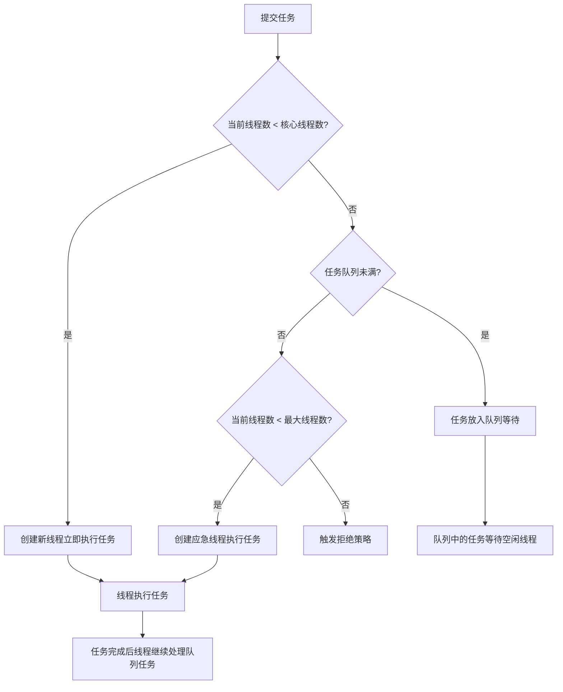

# Java 线程池详解与最佳实践

## 1 线程池概述与重要性

在现代多核 CPU 的计算机系统中，**线程池（ThreadPool）** 是一种管理和复用线程的机制，它通过维护一组预先创建的工作线程来执行并发任务，从而避免频繁创建和销毁线程带来的性能开销。线程池的核心价值在于它将**线程生命周期管理**与**任务执行**分离开来，使开发者能够专注于业务逻辑而不是线程管理细节。

使用线程池带来的主要优势包括：

- **降低资源消耗**：通过复用已创建的线程，减少线程创建和销毁的性能开销（通常线程创建需要1MB栈内存，内核态与用户态切换耗时约1-5微秒）
- **提高响应速度**：任务到达时无需等待线程创建，可直接由现有空闲线程执行
- **提高线程可管理性**：线程是稀缺资源，无限制创建会导致系统资源耗尽，使用线程池可以进行统一分配、调优和监控
- **流量削峰**：通过队列缓冲突发任务，防止系统在高峰期过载

## 2 线程池核心参数与工作机制

### 2.1 核心参数解析

Java 线程池的核心实现是 `ThreadPoolExecutor` 类，其构造函数包含7个关键参数，共同决定了线程池的行为特性：

```java
public ThreadPoolExecutor(
    int corePoolSize,        // 核心线程数（常驻线程）
    int maximumPoolSize,     // 最大线程数（应急线程）
    long keepAliveTime,      // 空闲线程存活时间
    TimeUnit unit,           // 时间单位
    BlockingQueue<Runnable> workQueue, // 任务队列
    ThreadFactory threadFactory,       // 线程工厂
    RejectedExecutionHandler handler   // 拒绝策略
)
```

_表：线程池核心参数说明_

| **参数名**        | **作用说明**                               | **推荐设置考虑**                                                    |
| ----------------- | ------------------------------------------ | ------------------------------------------------------------------- |
| `corePoolSize`    | 核心线程数，即使空闲也不会被回收的线程数量 | CPU 密集型：N+1<br>IO 密集型：2N+1<br>(N 为 CPU 核心数)             |
| `maximumPoolSize` | 线程池能够容纳同时执行的最大线程数         | 根据系统负载和任务执行时间设置，避免资源耗尽                        |
| `keepAliveTime`   | 非核心线程空闲时的存活时间                 | 根据任务突发频率调整，通常30-60秒                                   |
| `workQueue`       | 用于缓存待执行任务的阻塞队列               | 根据任务优先级和系统负载选择合适队列类型                            |
| `threadFactory`   | 用于创建新线程的工厂                       | 自定义线程命名、优先级等，便于排查问题                              |
| `handler`         | 当队列和线程池满时的拒绝策略               | 根据业务重要性选择，如 `AbortPolicy`（默认）、`CallerRunsPolicy` 等 |

### 2.2 线程池工作流程

Java 线程池处理任务的核心流程遵循一套精心设计的逻辑，如下图所示：



这个工作流程确保了线程池能够高效地处理任务提交，同时在系统资源允许范围内进行弹性扩展。当线程池中线程数量超过核心线程数时，空闲线程在超过 keepAliveTime 后会被自动回收，直到线程数量降至核心线程数。

## 3 Java 内置线程池类型与适用场景

Java 通过 `Executors` 工厂类提供了几种常见的线程池实现，每种都有其特定的适用场景和潜在风险。

### 3.1 FixedThreadPool（固定大小线程池）

```java
// 创建固定大小的线程池
ExecutorService executor = Executors.newFixedThreadPool(5);

// 提交任务
IntStream.range(0, 10).forEach(i ->
    executor.submit(() -> {
        System.out.println("Task " + i + " executed by " +
            Thread.currentThread().getName());
        processTask(i);
    })
);
```

**特点**：

- 核心线程数 = 最大线程数 = 指定数量
- 使用无界队列 `LinkedBlockingQueue`（默认容量 `Integer.MAX_VALUE`）
- 空闲线程不会自动回收

**适用场景**：适用于已知并发量的稳定负载场景，如 CPU 密集型任务。

**潜在风险**：无界队列可能导致任务堆积，最终引发内存溢出(OOM)。

### 3.2 CachedThreadPool（缓存线程池）

```java
// 创建缓存线程池
ExecutorService executor = Executors.newCachedThreadPool();

// 提交短期异步任务
executor.execute(() -> handleQuickTask());
```

**特点**：

- 核心线程数 = 0，最大线程数 = `Integer.MAX_VALUE`
- 使用同步移交队列`SynchronousQueue`
- 空闲线程60秒自动回收

**适用场景**：适用于大量短期异步任务或低并发场景。

**潜在风险**：可能引发线程爆炸（Thread Explosion），因为理论上可以创建无限多的线程。

### 3.3 SingleThreadExecutor（单线程线程池）

```java
// 创建单线程线程池
ExecutorService executor = Executors.newSingleThreadExecutor();

// 顺序执行任务
executor.execute(() -> log.info("顺序任务1"));
executor.execute(() -> log.info("顺序任务2"));
```

**特点**：

- 核心线程数 = 最大线程数 = 1
- 使用无界队列`LinkedBlockingQueue`
- 所有任务顺序执行

**适用场景**：需要保证任务顺序执行的场景，如日志处理、串行化任务。

**潜在风险**：队列无限增长可能导致内存溢出。

### 3.4 ScheduledThreadPool（定时线程池）

```java
// 创建定时线程池
ScheduledExecutorService scheduler = Executors.newScheduledThreadPool(3);

// 延迟执行
scheduler.schedule(() -> task(), 5, TimeUnit.SECONDS);

// 周期性执行
scheduler.scheduleAtFixedRate(() -> log(), 1, 10, TimeUnit.SECONDS);
```

**特点**：

- 使用`DelayedWorkQueue`实现定时功能
- 支持固定速率/固定延迟两种模式
- 核心线程数固定，但可以不断创建新线程执行后续任务

**适用场景**：定时/周期性任务调度，如心跳检测、定期数据同步。

## 4 自定义线程池配置指南

在实际生产环境中，阿里巴巴 Java 开发规范明确禁止使用 `Executors` 快捷方式创建线程池，推荐通过 `ThreadPoolExecutor` 构造函数手动创建，以便明确线程池的运行规则，规避资源耗尽风险。

### 4.1 线程池参数配置公式

根据任务特性选择合适的参数配置：

- **CPU 密集型任务**（如计算、加解密、压缩解压缩）：
  线程数 = CPU 核心数 + 1

- **IO 密集型任务**（如网络请求、数据库操作）：
  线程数 = CPU 核心数 \* 2 + 1
  或者更精确的计算公式：
  线程数 = CPU 核心数 \* (1 + 平均等待时间 / 平均计算时间)

- **混合型任务**：需要根据具体场景进行测试和调优

### 4.2 任务队列选择策略

_表：线程池任务队列对比_

| **队列类型**            | **特点**                     | **适用场景**                         | **风险提示**                 |
| ----------------------- | ---------------------------- | ------------------------------------ | ---------------------------- |
| `ArrayBlockingQueue`    | 有界队列，FIFO策略，固定容量 | 高稳定性场景（如支付系统），流量削峰 | 队列满时可能频繁触发拒绝策略 |
| `LinkedBlockingQueue`   | 无界队列（默认容量极大）     | 任务量可控的低并发场景               | 可能导致任务堆积和内存溢出   |
| `SynchronousQueue`      | 不存储任务，直接移交线程     | 高吞吐量短任务（如即时消息处理）     | 需配合较大的maximumPoolSize  |
| `PriorityBlockingQueue` | 按优先级排序的无界队列       | 任务优先级分明的场景                 | 可能导致低优先级任务饥饿     |

### 4.3 完整自定义线程池示例

```java
import java.util.concurrent.*;
import java.util.stream.IntStream;

public class CustomThreadPoolDemo {

    // 自定义线程工厂，用于设置识别性线程名称
    static class CustomThreadFactory implements ThreadFactory {
        private final String namePrefix;
        private final AtomicInteger threadNumber = new AtomicInteger(1);

        public CustomThreadFactory(String poolName) {
            this.namePrefix = poolName + "-thread-";
        }

        @Override
        public Thread newThread(Runnable r) {
            Thread thread = new Thread(r, namePrefix + threadNumber.getAndIncrement());
            thread.setPriority(Thread.NORM_PRIORITY);
            return thread;
        }
    }

    public static void main(String[] args) {
        // 获取处理器核心数
        int cpuCores = Runtime.getRuntime().availableProcessors();

        // 创建自定义线程池
        ThreadPoolExecutor customPool = new ThreadPoolExecutor(
            cpuCores + 1,           // 核心线程数 = CPU核心数 + 1
            cpuCores * 2 + 1,           // 最大线程数 = CPU核心数 * 2 + 1
            30,                     // 空闲线程存活时间
            TimeUnit.SECONDS,       // 时间单位
            new ArrayBlockingQueue<>(100), // 有界队列防止内存溢出
            new CustomThreadFactory("custom-pool"), // 自定义线程命名
            new ThreadPoolExecutor.CallerRunsPolicy() // 拒绝策略
        );

        try {
            // 提交任务示例
            IntStream.range(0, 20).forEach(i -> {
                customPool.submit(() -> {
                    System.out.println(Thread.currentThread().getName() +
                                     " processing task " + i);
                    try {
                        // 模拟任务执行时间
                        Thread.sleep(1000);
                    } catch (InterruptedException e) {
                        Thread.currentThread().interrupt();
                    }
                });
            });
        } finally {
            // 优雅关闭线程池
            gracefulShutdown(customPool);
        }
    }

    // 优雅关闭线程池通用方法
    private static void gracefulShutdown(ExecutorService pool) {
        pool.shutdown(); // 停止接收新任务
        try {
            // 等待现有任务完成
            if (!pool.awaitTermination(60, TimeUnit.SECONDS)) {
                pool.shutdownNow(); // 取消等待任务
                if (!pool.awaitTermination(60, TimeUnit.SECONDS)) {
                    System.err.println("线程池未完全关闭");
                }
            }
        } catch (InterruptedException e) {
            pool.shutdownNow();
            Thread.currentThread().interrupt();
        }
    }
}
```

## 5 任务提交与异常处理

### 5.1 execute() vs submit()

线程池提供了两种主要的方法来提交任务：

```java
// execute()方法用于提交不需要返回值的任务
executor.execute(() -> {
    try {
        riskyOperation();
    } catch (Exception e) {
        // 必须在任务内部处理异常
        log.error("操作失败", e);
    }
});

// submit()方法用于提交需要返回值的任务
Future<?> future = executor.submit(() -> riskyOperation());
try {
    future.get(); // 获取结果时可能抛出ExecutionException
} catch (ExecutionException e) {
    log.error("任务执行异常", e.getCause());
}
```

_表：execute() 方法与 submit() 方法对比_

| **方法**    | **返回值** | **异常处理**                               | **适用场景**            |
| ----------- | ---------- | ------------------------------------------ | ----------------------- |
| `execute()` | `void`     | 直接抛出异常，需要在任务内部处理           | 简单任务，不需要返回值  |
| `submit()`  | `Future`   | 异常封装在Future中，通过`future.get()`获取 | 需要结果/异常处理的场景 |

### 5.2 异常处理最佳实践

在线程池任务中，**未捕获的异常会导致工作线程终止**，这可能造成线程泄漏。以下是推荐的异常处理方案：

```java
// 方案1：在任务内部捕获所有Checked Exception
executor.execute(() -> {
    try {
        processTask();
    } catch (Exception e) {
        log.error("Task failed", e);
    }
});

// 方案2：通过Future.get()处理未捕获异常
Future<?> future = executor.submit(() -> riskyOperation());
try {
    future.get();
} catch (ExecutionException e) {
    log.error("Uncaught exception in task", e.getCause());
}

// 方案3：使用UncaughtExceptionHandler处理运行时异常
ThreadFactory factory = r -> {
    Thread t = new Thread(r);
    t.setUncaughtExceptionHandler((thread, throwable) -> {
        log.error("Uncaught exception in thread " + thread.getName(), throwable);
    });
    return t;
};
```

## 6 拒绝策略详解

当线程池达到最大线程数且工作队列已满时，新提交的任务将触发拒绝策略。Java 线程池提供了4种内置拒绝策略：

### 6.1 AbortPolicy（默认策略）

```java
new ThreadPoolExecutor.AbortPolicy()
```

**行为**：直接抛出`RejectedExecutionException`异常阻止系统正常运行。
**适用场景**：需要明确知道任务被拒绝的场景，适用于关键业务。

### 6.2 CallerRunsPolicy（调用者运行策略）

```java
new ThreadPoolExecutor.CallerRunsPolicy()
```

**行为**：由提交任务的线程直接执行该任务，从而降低新任务的流量。
**适用场景**：不允许任务丢失但可以接受同步执行的场景，适用于关键业务。

### 6.3 DiscardPolicy（丢弃策略）

```java
new ThreadPoolExecutor.DiscardPolicy()
```

**行为**：静默丢弃新任务，不做任何处理也不抛出异常。
**适用场景**：允许任务丢失的场景，如日志收集、心跳检测等非关键业务。

### 6.4 DiscardOldestPolicy（丢弃最旧策略）

```java
new ThreadPoolExecutor.DiscardOldestPolicy()
```

**行为**：丢弃队列中最旧的任务，然后重新提交当前任务。
**适用场景**：可以接受丢弃旧任务以尝试执行新任务的场景，如实时数据流处理。

### 6.5 自定义拒绝策略

```java
public class CustomRejectHandler implements RejectedExecutionHandler {
    @Override
    public void rejectedExecution(Runnable r, ThreadPoolExecutor executor) {
        // 1. 记录日志
        log.error("Task rejected, saving to backup storage");

        // 2. 保存任务到数据库或文件系统
        saveToBackupStorage(r);

        // 3. 通知监控系统
        notifyMonitorSystem();

        // 4. 尝试重新提交（需谨慎）
        if (!executor.isShutdown()) {
            executor.execute(r);
        }
    }
}
```

## 7 线程池监控与性能优化

### 7.1 监控指标与方法

有效的监控是优化线程池性能的关键，以下是一些核心监控指标：

```java
public class ThreadPoolMonitor {
    private ThreadPoolExecutor executor;

    public void monitor() {
        // 核心监控指标
        int poolSize = executor.getPoolSize();           // 当前线程数
        int activeCount = executor.getActiveCount();   // 活跃线程数
        long completedTaskCount = executor.getCompletedTaskCount(); // 已完成任务数
        int queueSize = executor.getQueue().size();     // 队列积压任务数

        // 扩展监控指标
        long taskCount = executor.getTaskCount();       // 总任务数
        int largestPoolSize = executor.getLargestPoolSize(); // 历史最大线程数

        System.out.println(String.format(
            "Pool: %d, Active: %d, Completed: %d, Queue: %d",
            poolSize, activeCount, completedTaskCount, queueSize
        ));
    }
}
```

建议通过定时任务（如每5秒）收集这些指标，并集成到应用的监控系统中。

### 7.2 性能优化技巧

1. **动态调参**：根据系统负载动态调整线程池参数

   ```java
   // 运行时修改核心参数
   executor.setCorePoolSize(16);
   executor.setMaximumPoolSize(32);
   executor.setKeepAliveTime(5, TimeUnit.MINUTES);
   ```

2. **任务超时控制**：避免长时间阻塞的任务

   ```java
   Future<?> future = executor.submit(task);
   try {
       future.get(30, TimeUnit.SECONDS); // 设置超时时间
   } catch (TimeoutException e) {
       future.cancel(true); // 取消任务
       log.warn("Task timeout, cancelled");
   }
   ```

3. **线程池级联**：不同优先级任务使用不同线程池

   ```java
   // 主池处理HTTP请求，子池处理DB操作
   ExecutorService mainPool = Executors.newFixedThreadPool(8);
   ExecutorService dbPool = new ThreadPoolExecutor(4, 8, 60,
       TimeUnit.SECONDS, new SynchronousQueue<>());

   mainPool.submit(() -> {
       // HTTP处理逻辑
       dbPool.execute(() -> { /* 数据库操作 */ });
   });
   ```

## 8 最佳实践总结

根据上述分析，以下是 Java 线程池的最佳实践总结：

1. **禁止使用 Executors 快捷方法**
   直接通过 `ThreadPoolExecutor` 构造函数创建线程池，避免无界队列导致 OOM。

2. **合理配置线程池参数**
   - CPU密集型任务：线程数 = (CPU核心数 + 1)
   - IO密集型任务：线程数 = (CPU核心数 \* 2 + 1) 或使用更精确公式
   - 使用有界队列（如 `ArrayBlockingQueue`）并设置合理容量

3. **选择合适的拒绝策略**
   - 关键业务：使用 `CallerRunsPolicy` 防止数据丢失
   - 非关键业务：可使用 `DiscardPolicy` 或 `DiscardOldestPolicy`

4. **实现完善的异常处理**
   - 在任务内部捕获所有 Checked Exception
   - 通过 `Future.get()` 处理未捕获异常
   - 实现 `UncaughtExceptionHandler` 处理运行时异常

5. **建立监控和动态调优机制**
   - 监控活跃线程数、队列大小、完成任务数等关键指标
   - 根据流量波动动态调整线程池参数
   - 使用优雅关闭方案确保任务不丢失

6. **线程命名和日志记录**
   - 自定义 `ThreadFactory` 设置识别性线程名称
   - 在 `beforeExecute()` 和 `afterExecute()` 中添加任务日志

通过遵循这些最佳实践，开发者可以充分发挥线程池的优势，构建高效、稳定的并发应用程序，同时避免常见的线程池陷阱和性能问题。
