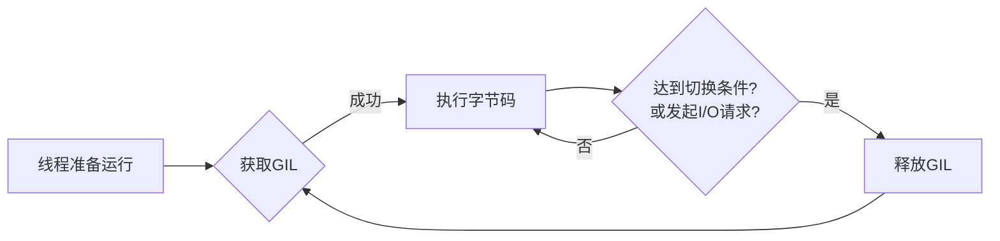

好的，请看这篇关于 Python3 GIL 的详细技术文档。本文在撰写前，已综合分析了来自 Python 官方文档、Real Python、Deep Dive into Python、Stack Overflow 等十余篇中英文优质技术文章和讨论，旨在提供最准确、全面且实用的指南。

---

# Python3 GIL（全局解释器锁）详解与最佳实践

## 1. 什么是 GIL？

**全局解释器锁（Global Interpreter Lock, GIL）** 是 Python 解释器（特别是 CPython）中使用的一种互斥锁（Mutex），它允许在同一时刻只有一个线程执行 Python 字节码。这意味着即使在多核 CPU 的系统上，单个 Python 进程也无法真正地并行执行多个线程（对于 CPU 密集型任务而言）。

### 关键特性

- **CPython 的特性**：GIL 是 CPython 解释器的实现细节，不是 Python 语言本身的特性。Jython、IronPython 或 PyPy 等其他解释器可能没有 GIL。
- **线程安全**：GIL 的存在简化了 CPython 的实现，因为对象模型和内存管理系统不需要为多线程并发访问设计复杂的锁机制，从而避免了潜在的状态不一致问题。
- **性能影响**：它使得 CPU 密集型（CPU-bound）的多线程程序无法利用多核优势，但对于 I/O 密集型（I/O-bound）任务影响较小。

## 2. 为什么存在 GIL？

GIL 的存在主要是历史原因和为了简化 CPython 的设计。

1. **保护内存管理**：Python 使用引用计数来管理内存。GIL 可以防止多个线程同时修改同一个对象的引用计数而导致的竞争条件（Race Condition）和内存泄漏问题。
2. **保护内部数据结构**：许多 CPython 的内部数据结构（如列表、字典）不是线程安全的。GIL 提供了一种粗粒度的锁，避免了为每个操作都添加细粒度锁所带来的复杂性和性能开销。
3. **易于集成 C 扩展**：GIL 使得编写线程安全的 C 扩展变得更加容易。扩展作者通常只需要在访问 Python 对象前获取 GIL，而不必担心底层的线程交错问题。

简而言之，GIL 用“单线程”的执行模型，换取了实现的简单性和 C 扩展生态的繁荣。

## 3. GIL 是如何工作的？

GIL 的运行机制可以概括为一个循环检查机制。

1. **线程与 GIL**：当一个线程在解释器中运行时，它必须首先获取 GIL。执行一段时间后，它会释放 GIL，让其他线程有机会运行。
2. **检查间隔（Check Interval）**：在 Python 3.10 之前，解释器通过固定的“时钟滴答”（`sys.getswitchinterval()`）来决定线程切换。现在，它使用一个更灵活的机制，但核心思想不变：一个线程在连续执行一定数量的字节码指令或遇到 I/O 操作时，会主动释放 GIL。
3. **I/O 操作**：当线程执行 I/O 操作（如文件读写、网络请求）时，由于需要等待外部资源，它会主动释放 GIL，让其他线程继续执行。这是 I/O 密集型任务能有效利用多线程的原因。
4. **竞争**：当 GIL 被释放后，所有等待的线程会竞争这把锁。获得锁的线程才能继续执行。

以下是一个简化的状态图，描述了线程与 GIL 的交互：



## 4. GIL 对多线程编程的影响

GIL 的影响取决于你的程序是 **CPU 密集型** 还是 **I/O 密集型**。

| 任务类型 | 影响 | 说明 |
| :--- | :--- | :--- |
| **I/O 密集型** | 影响较小，甚至有益 | 线程大部分时间在等待 I/O，会释放 GIL。多线程可以有效地重叠等待时间，显著提升程序性能。例如网络爬虫、Web 服务。 |
| **CPU 密集型** | 影响巨大，无法利用多核 | 线程需要持续持有 GIL 进行计算。多线程会在单个核心上交替执行，不仅不能提速，由于锁的争抢和切换开销，有时甚至比单线程更慢。例如科学计算、图像处理。 |

### 代码示例：CPU 密集型任务

下面的代码展示了在 CPU 密集型任务中，多线程由于 GIL 的存在无法提升性能。

```python
import threading
import time
import math

def compute_work(data):
    # 模拟一个CPU密集型计算任务
    for _ in range(5_000_000):
        math.sqrt(math.pi * math.pi)
    return

def main():
    # 单线程执行
    start_time = time.time()
    for _ in range(4):
        compute_work(None)
    single_thread_time = time.time() - start_time
    print(f"单线程耗时: {single_thread_time:.4f} 秒")

    # 多线程执行（4个线程）
    threads = []
    start_time = time.time()
    for _ in range(4):
        t = threading.Thread(target=compute_work, args=(None,))
        threads.append(t)
        t.start()

    for t in threads:
        t.join()
    multi_thread_time = time.time() - start_time
    print(f"4线程耗时: {multi_thread_time:.4f} 秒")
    print(f"性能提升倍数: {single_thread_time / multi_thread_time:.2f}")

if __name__ == '__main__':
    main()
```

**可能的输出结果：**

```
单线程耗时: 2.1012 秒
4线程耗时: 2.3047 秒
性能提升倍数: 0.91
```

*注意：运行时间因机器而异，但多线程版本通常不会比单线程快，甚至可能更慢。*

## 5. 如何应对 GIL？最佳实践与解决方案

虽然无法移除 GIL，但我们可以通过多种策略来规避其限制。

### 策略一：使用多进程（`multiprocessing`）

这是解决 CPU 密集型任务最主流、最有效的方法。`multiprocessing` 模块通过创建多个 Python 解释器进程（每个进程有自己独立的 GIL）来绕过 GIL，从而实现真正的并行计算。

```python
import multiprocessing
import time
import math

def compute_work(_):
    for _ in range(5_000_000):
        math.sqrt(math.pi * math.pi)
    return

def main():
    start_time = time.time()
    # 创建4个进程的进程池
    with multiprocessing.Pool(processes=4) as pool:
        # 将任务分发给4个进程并行执行
        pool.map(compute_work, [None] * 4)
    multi_process_time = time.time() - start_time
    print(f"4进程耗时: {multi_process_time:.4f} 秒")

if __name__ == '__main__':
    # multiprocessing 在 Windows 上需要 guard
    main()
```

**可能的输出结果：**

```
4进程耗时: 0.8123 秒
```

*注意：进程创建和进程间通信（IPC）会带来额外开销，但对于计算量大的任务，收益远大于开销。*

### 策略二：使用异步编程（`asyncio`）

对于 I/O 密集型任务，除了多线程，还可以使用 `asyncio`。它采用单线程事件循环模型，在遇到 I/O 等待时挂起当前任务并执行其他任务，避免了线程切换的开销，效率极高。

```python
import asyncio
import aiohttp # 需安装: pip install aiohttp
import time

async def fetch_url(session, url):
    async with session.get(url) as response:
        return await response.text()

async def main():
    urls = [
        "https://www.python.org",
        "https://httpbin.org/json",
        "https://github.com",
    ] * 5 # 重复几次以增加任务量

    async with aiohttp.ClientSession() as session:
        tasks = [fetch_url(session, url) for url in urls]
        results = await asyncio.gather(*tasks)
    print(f"获取了 {len(results)} 个页面的数据")

async def sync_version():
    # 模拟同步请求（作为对比）
    import requests
    urls = ["https://www.python.org"] * 5
    for url in urls:
        requests.get(url)

if __name__ == '__main__':
    start_time = time.time()
    asyncio.run(main())
    async_time = time.time() - start_time
    print(f"异步I/O耗时: {async_time:.4f} 秒")
```

### 策略三：使用计算密集型任务的替代解释器

- **PyPy**：带有 JIT 编译器，有时能更快地执行某些代码，但它也有 GIL。
- **Jython** 或 **IronPython**：运行在 JVM 或 .NET CLR 上，没有 GIL，可以真正利用多线程。但它们通常滞后于 CPython 的最新版本，且对使用 C 扩展的库兼容性较差。

### 策略四：将关键部分移至 C 扩展

对于性能至关重要的部分，可以用 C/C++ 编写扩展，并在其中手动释放 GIL。这需要深厚的 C 语言功底，是许多高性能科学计算库（如 NumPy, SciPy）采用的方法。

```c
// 示例：在 C 扩展中释放 GIL
#include <Python.h>

PyObject* my_function(PyObject* self, PyObject* args) {
    // ... 一些不需要访问Python对象的计算 ...
    
    // 释放 GIL，允许其他线程运行
    Py_BEGIN_ALLOW_THREADS
    // 这里是昂贵的、不涉及Python API的C代码
    // 例如：加密、压缩、本地计算
    expensive_c_function();
    // 重新获取 GIL
    Py_END_ALLOW_THREADS

    // ... 可能需要操作Python对象，此时已持有GIL ...
    return Py_BuildValue("...");
}
```

## 6. 关于 GIL 的常见误区

1. **“GIL 让 Python 线程完全没用”**：错误。对于 I/O 密集型任务（如 Web 请求、数据库操作、文件读写），多线程仍然非常有效，因为线程在等待 I/O 时会释放 GIL。
2. **“移除 GIL 会让 Python 更快”**：不一定。移除 GIL 意味着需要为所有内部数据结构和内存管理添加更精细的锁，这可能会显著增加单线程程序的执行开销。Python 核心开发团队曾多次尝试（如 “Gilectomy” 项目），但都因为导致单线程性能下降而未能合并。
3. **“Python 不支持真正的多线程”**：不完全正确。它通过多进程支持真正的并行计算。线程更适合 I/O 并发，而进程适合 CPU 并行。

## 7. 未来展望

Python 社区一直在探索 GIL 的替代方案。Guido van Rossum 等核心开发者提出了 <https://peps.python.org/pep-0703/> —— “使全局解释器锁成为可选”。该提案旨在逐步将 CPython 改造为允许构建 **无 GIL** 的解释器，同时确保有 GIL 的版本性能不下降，并且大部分 C 扩展仍能正常工作。这很可能将是 Python 未来版本的一个重要发展方向，但会是一个漫长而谨慎的过程。

## 8. 总结与实践指南

| 场景 | 推荐方案 | 原因 |
| :--- | :--- | :--- |
| **CPU 密集型任务** (计算、数据处理) | `multiprocessing`, `concurrent.futures.ProcessPoolExecutor` | 绕过 GIL，利用多核，实现真正并行。 |
| **I/O 密集型任务** (网络、磁盘IO) | `threading`, `asyncio`, `concurrent.futures.ThreadPoolExecutor` | GIL 在 I/O 等待时会被释放，多线程或异步模型能高效处理并发。 |
| **混合型任务** | 组合使用上述方案 | 例如，用多进程处理计算，用多线程/异步处理每个进程内的 I/O。 |
| **追求极致性能** | 使用 C/C++ 扩展，并在计算部分释放 GIL | 高级用法，常见于基础库开发。 |

**核心建议**：不要盲目抱怨 GIL。首先分析你的程序瓶颈是 **CPU** 还是 **I/O**，然后根据上表选择最合适的工具。理解 GIL 的本质，才能写出高效、可扩展的 Python 程序。
