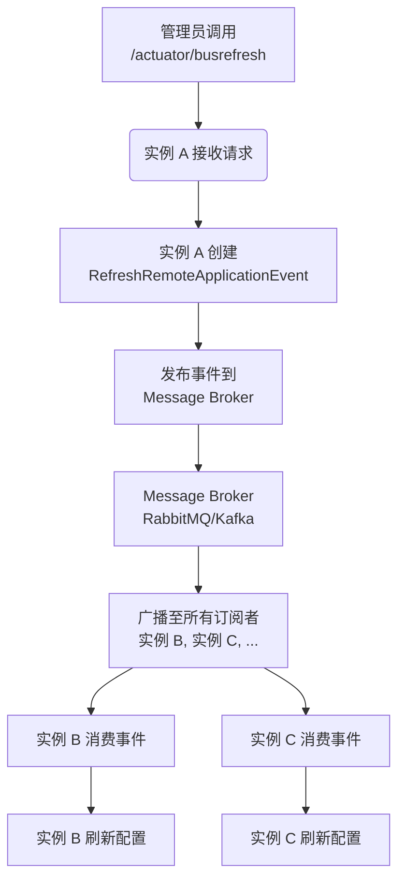

好的，没有问题。作为您的 Spring 编程技术专家和 Markdown 技术文档大师，我将为您呈现一篇详尽、准确且实用的 **Spring Cloud Bus 详解与最佳实践** 文档。

本文档融合了当前社区的主流实践、官方文档的精髓以及在实际项目中总结出的经验，旨在为您提供一份高质量的学习资料。

---

# Spring Cloud Bus 详解与最佳实践

## 1. 概述

### 1.1 什么是 Spring Cloud Bus？

Spring Cloud Bus 是 Spring Cloud 体系中的一个子项目，它通过轻量级的**消息代理**（如 RabbitMQ 或 Kafka）将分布式的多个节点连接起来，用于**广播状态变更**（如配置更改）或**管理指令**。

您可以将其理解为一个**分布式消息总线**，它整合了 Java 的事件驱动模型（`ApplicationEvent`）和消息代理的能力。微服务应用中的所有实例都连接到这条总线上，当总线上的某个实例触发一个事件（如刷新配置），这个事件会通过消息代理广播出去，被所有连接到总线的其他实例消费，从而实现分布式系统间状态的高效协同。

### 1.2 为什么需要 Spring Cloud Bus？

在微服务架构中，服务实例的数量可能非常庞大。假设您有 100 个微服务实例，它们都从 Spring Cloud Config Server 获取配置。当您在 Git 中修改了某个配置后，您需要让所有这 100 个实例都重新获取最新配置。

**没有 Spring Cloud Bus 时**：
您需要手动或通过脚本逐个调用每个实例的 `POST /actuator/refresh` 端点。这种方式繁琐、低效，且容易出错，难以维护。

**有 Spring Cloud Bus 时**：
您只需要对**任意一个**连接到总线的实例调用一次 `POST /actuator/busrefresh` 端点。该实例会将一个 `RefreshRemoteApplicationEvent` 事件发布到总线上，消息代理会确保所有其他服务实例都能接收到这个事件并自动刷新其配置。**一次调用，全部生效**。

### 1.3 核心概念

- **事件（Event）**： `Spring Cloud Bus` 传输的核心是事件，例如 `RefreshRemoteApplicationEvent`（刷新配置）、`EnvironmentChangeRemoteApplicationEvent`（环境变更）等。
- **消息代理（Message Broker）**： 作为事件传输的中间件，负责事件的广播和路由。`Spring Cloud Bus` 默认支持 `RabbitMQ` 和 `Kafka`。
- **目的地（Destination）**： 在消息代理中，服务通过监听特定的目的地（如 Exchange、Topic）来收发消息。

## 2. 工作原理

Spring Cloud Bus 的工作流程可以概括为以下几步：

1. **连接消息代理**： 所有微服务实例（包括 Config Server）启动时，都会根据配置连接到指定的消息代理（如 RabbitMQ），并订阅特定主题（Topic）。
2. **触发事件**： 当管理员通过 HTTP 端点（如 `/actuator/busrefresh`）触发一个事件时，接收到请求的实例会创建一个相应的 `RemoteApplicationEvent`。
3. **发布事件**： 该实例将事件序列化后，发布到消息代理的特定 Exchange 或 Topic 中。
4. **广播事件**： 消息代理负责将消息广播给所有订阅了该 Topic 的消费者（即其他所有微服务实例）。
5. **消费与处理**： 各个微服务实例接收到消息后，反序列化出事件对象，并在本地应用程序上下文中重新发布该事件。
6. **执行动作**： 本地应用程序的事件监听器（如 `RefreshEventListener`）会捕获到这个事件，并执行相应的业务逻辑，例如刷新 `@RefreshScope` 的 Bean。

下图清晰地展示了这一流程：



## 3. 快速开始

### 3.1 前提条件

- JDK 1.8 或更高版本
- Maven 或 Gradle
- 一个正在运行的 RabbitMQ 或 Kafka 服务。以 RabbitMQ 为例，您可以通过 Docker 快速启动一个：

  ```bash
  docker run -d --name some-rabbit -p 5672:5672 -p 15672:15672 rabbitmq:3-management
  ```

  管理界面：<http://localhost:15672> (用户名/密码：guest/guest)

### 3.2 添加依赖

在需要进行配置刷新或需要连接到总线的微服务中（通常是 Config Client 和 Config Server），添加 `spring-cloud-starter-bus-amqp` 依赖（如果使用 Kafka，则添加 `spring-cloud-starter-bus-kafka`）。

**Maven:**

```xml
<dependency>
    <groupId>org.springframework.cloud</groupId>
    <artifactId>spring-cloud-starter-bus-amqp</artifactId>
</dependency>
```

**Gradle:**

```gradle
implementation 'org.springframework.cloud:spring-cloud-starter-bus-amqp'
```

> **注意**： 添加 `bus-amqp` 依赖后，通常就无需再单独引入 `spring-boot-starter-actuator`，因为 bus 依赖会传递包含它。但为了清晰，显式声明 `actuator` 也是一个好习惯。

### 3.3 配置消息代理

在服务的 `application.yml` 或 `bootstrap.yml` 中配置 RabbitMQ 连接信息。

```yaml
spring:
  rabbitmq:
    host: localhost
    port: 5672
    username: guest
    password: guest

# 暴露 busrefresh 端点（Spring Boot 2.x 后需要显式暴露）
management:
  endpoints:
    web:
      exposure:
        include: busrefresh, health, info
```

### 3.4 编写一个可刷白的 Bean

创建一个配置类或 Bean，并使用 `@RefreshScope` 注解标注。

```java
import org.springframework.beans.factory.annotation.Value;
import org.springframework.cloud.context.config.annotation.RefreshScope;
import org.springframework.web.bind.annotation.GetMapping;
import org.springframework.web.bind.annotation.RestController;

@RestController
@RefreshScope // 这个注解是关键，它标记了这个 Bean 需要在刷新时被重新初始化
public class MessageController {

    @Value("${my.message:Hello default}") // 从配置中心或本地配置读取
    private String message;

    @GetMapping("/message")
    public String getMessage() {
        return this.message;
    }
}
```

### 3.5 触发配置刷新

1. 启动您的 Config Server（如果使用了的话）和多个上述的微服务实例。
2. 修改配置源（如 Git 仓库）中的 `my.message` 属性值。
3. 向 **任意一个** 连接到总线的服务实例发送 **POST** 请求以触发广播刷新。

**使用 curl 命令：**

```bash
curl -X POST http://localhost:8080/actuator/busrefresh
```

_请将 `localhost:8080` 替换为您实际服务实例的地址和端口。_

4. 稍等片刻，再次访问各个实例的 `/message` 端点，您会发现所有实例的配置都已经更新为最新的值，而您只调用了一次接口。

## 4. 端点（Endpoints）

Spring Cloud Bus 主要通过 Actuator 端点进行操作：

- **`/actuator/busrefresh`**： 最常用的端点，用于广播 `RefreshRemoteApplicationEvent`，触发所有服务刷新 `@RefreshScope` Bean。
  - **示例**： `POST http://host:port/actuator/busrefresh`

- **`/actuator/busenv`**： 用于广播 `EnvironmentChangeRemoteApplicationEvent`，并更新特定键的 Environment。
  - **示例**： `POST http://host:port/actuator/busenv?name=key1,key2` (Body: `{"key1": "value1", "key2": "value2"}`)

## 5. 高级特性与最佳实践

### 5.1 定向刷新

您不需要每次都刷新所有服务。Spring Cloud Bus 支持通过 `destination` 参数进行**定向刷新**。

**语法**： `POST /actuator/busrefresh?destination={serviceId}:{port}`

- `serviceId`： 想要刷新的服务的 `spring.application.name`。
- `port` (可选)： 进一步指定该服务的某个特定实例。

**示例**：

- 刷新所有名为 `my-service` 的实例：

  ```bash
  curl -X POST http://localhost:8080/actuator/busrefresh?destination=my-service:**
  ```

- 刷新 `my-service` 服务在 9000 端口上的特定实例：

  ```bash
  curl -X POST http://localhost:8080/actuator/busrefresh?destination=my-service:9000
  ```

这个功能在只想更新某个特定服务或进行灰度发布时非常有用。

### 5.2 与 Spring Cloud Config 完美集成

Spring Cloud Config Server 本身也可以连接到 Bus。当配置发生变更时，您可以直接对 Config Server 调用 `/actuator/busrefresh`，由它来发起广播事件，这是最推荐的做法，逻辑更清晰。

**流程**：

1. 在 Config Server 中添加 `spring-cloud-starter-bus-amqp` 依赖。
2. 配置 Config Server 连接 RabbitMQ。
3. 修改 Git 配置后，向 Config Server 发送刷新请求：

   ```bash
   curl -X POST http://config-server:8888/actuator/busrefresh
   ```

4. Config Server 会广播事件，所有 Config Client 都会自动刷新。

### 5.3 跟踪事件（Trace）

Spring Cloud Bus 内置了事件跟踪功能。当您设置 `spring.cloud.bus.trace.enabled=true` 后，它会记录每个事件的心跳和所有 Ack（确认）。

查看 `/actuator/httptrace` 端点（需要添加 `spring-boot-starter-actuator` 依赖并暴露 `httptrace`），可以观察到事件的传播轨迹，便于调试。

```yaml
spring:
  cloud:
    bus:
      trace:
        enabled: true
```

### 5.4 安全与防护

- **保护端点**： `/actuator/busrefresh` 端点具有强大的功能，必须将其保护起来，禁止未经授权的访问。可以集成 Spring Security 进行认证和授权。
- **网络隔离**： 为不同环境（开发、测试、生产）使用不同的**虚拟主机（VHost）** 或 **Topic**，避免环境间的事件污染。可以通过 `spring.rabbitmq.virtual-host` 配置。
- **权限控制**： 在消息代理层面配置不同的用户和权限，限制应用只能对特定的 Exchange/Topic 进行读写。

### 5.5 高可用性

消息代理本身（RabbitMQ, Kafka）都是支持集群的高可用中间件。只需将微服务连接到集群的多个节点上，即可保证总线的高可用性，不会因为单个消息代理节点宕机而导致整个系统瘫痪。

**RabbitMQ 集群配置示例**：

```yaml
spring:
  rabbitmq:
    addresses: rabbitmq-node1:5672,rabbitmq-node2:5672,rabbitmq-node3:5672
    username: your-username
    password: your-password
    virtual-host: /prod # 建议使用不同的虚拟主机隔离环境
```

## 6. 常见问题与解决方案（FAQ）

**Q1: 调用 `/actuator/busrefresh` 后，服务没有刷新配置？**

- **检查依赖**： 确保引入了 `spring-cloud-starter-bus-amqp`（或 `-kafka`）依赖。
- **检查连接**： 查看日志，确认服务已成功连接到 RabbitMQ/Kafka。
- **检查配置**： 确认需要刷新的 Bean 被 `@RefreshScope` 注解标注。
- **检查端点暴露**： 确认 `management.endpoints.web.exposure.include` 包含了 `busrefresh`。

**Q2: 如何自定义事件？**
您可以继承 `RemoteApplicationEvent` 来创建自己的自定义事件。

1. 创建自定义事件类：

   ```java
   public class MyCustomEvent extends RemoteApplicationEvent {
       public MyCustomEvent() {
           // 反序列化需要默认构造函数
       }
       public MyCustomEvent(Object source, String originService, String destinationService) {
           super(source, originService, destinationService);
       }
       // ... 添加自定义字段和方法
   }
   ```

2. 在 `META-INF/spring.factories` 中注册该事件，以便能被正确反序列化：

   ```
   org.springframework.cloud.bus.event.RemoteApplicationEvent=com.yourpackage.MyCustomEvent
   ```

3. 创建一个 `@EventListener` 方法来处理您的自定义事件。

**Q3: 网络抖动导致事件丢失怎么办？**

- **对于 RabbitMQ**： 使用**持久化（Persistence）**。将 Exchange、Queue 和 Message 都设置为持久化的，这样即使代理重启，消息也不会丢失。
- **对于 Kafka**： 其设计本身即保证了消息的持久性。可以通过调整 `acks` 等参数来控制消息的可靠性级别。

## 7. 总结

Spring Cloud Bus 是微服务架构中实现配置动态刷新和分布式系统协同的利器。它通过抽象的消息层解耦了服务间的直接调用，使得大规模集群的管理变得简单高效。

**最佳实践核心要点**：

1. **与 Config Server 配合使用**： 在 Config Server 上触发刷新，逻辑最清晰。
2. **善用定向刷新**： 避免不必要的全量刷新，实现灰度发布。
3. **重视安全**： 保护 Actuator 端点，隔离不同环境的消息中间件资源。
4. **保证高可用**： 为消息代理配置集群，确保总线可靠性。

希望这篇文档能帮助您深入理解并有效运用 Spring Cloud Bus。
