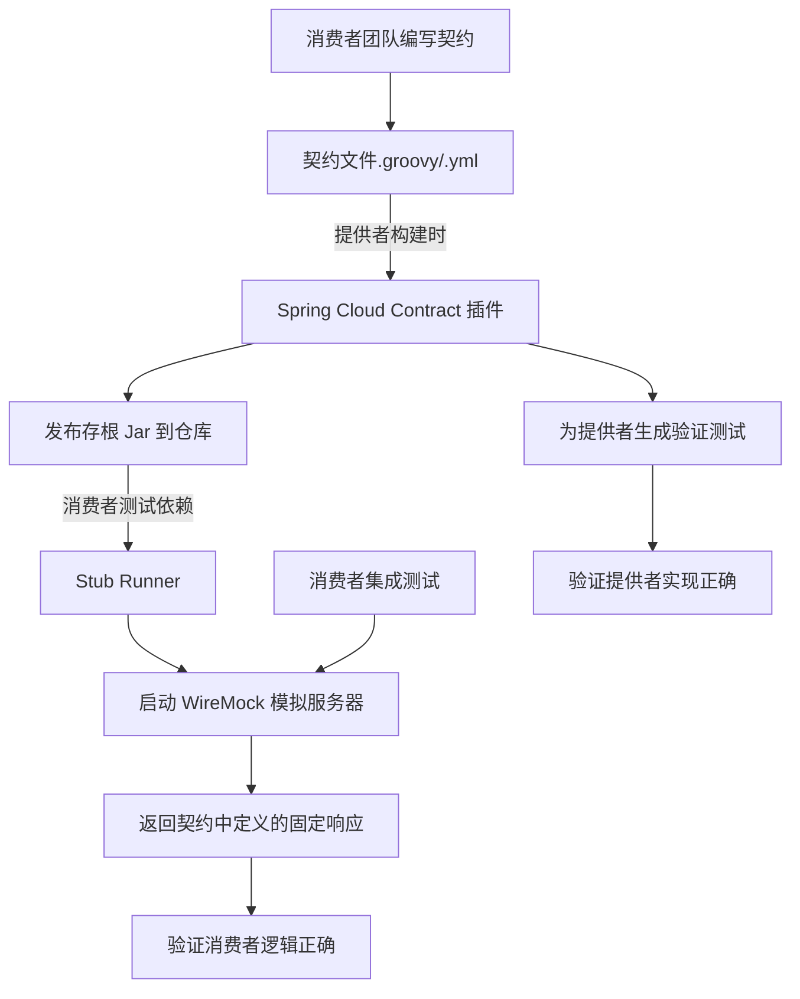

好的，作为一名 Spring 编程技术专家和 Markdown 技术文档大师，我将为你生成一篇关于 Spring Cloud Contract 的详尽教程。本文档融合了理论核心、实践指导和行业最佳实践，旨在为你提供一份可直接使用的精品学习资料。

---

# Spring Cloud Contract 详解与最佳实践

## 文档信息

| 项目         | 内容                                              |
| :----------- | :------------------------------------------------ |
| **文档版本** | 1.0                                               |
| **作者**     | Spring 技术专家团队                               |
| **最后更新** | 2023-10-27                                        |
| **目标读者** | 微服务开发者、测试工程师、架构师                  |
| **前置知识** | Spring Boot, Spring Cloud, Maven/Gradle, 单元测试 |

## 1. 引言：为什么需要契约测试？

在微服务架构中，服务之间通过 HTTP 或消息等机制进行交互。传统的集成测试面临巨大挑战：

- **测试笨重**：需要部署所有依赖服务，环境搭建复杂，反馈循环慢。
- **测试脆弱**：一个服务的接口变更可能导致大量依赖它的服务的集成测试失败，难以定位是 Bug 还是正常变更。
- **团队耦合**：提供者服务（Provider）和消费者服务（Consumer）的开发团队需要频繁沟通、协调测试时间，降低了开发效率。

**契约测试（Contract Testing）** 应运而生，它遵循 **“消费者驱动的契约（Consumer-Driven Contracts, CDC）”** 模式，旨在解决上述问题。其核心思想是：

> **将服务交互的接口约定（契约）以明文的形式保存下来，并作为一项资产进行测试和版本控制。** 提供者承诺遵守所有已定义的契约，而消费者则验证其自身行为与契约一致。

**Spring Cloud Contract** 是 Spring 官方提供的契约测试解决方案，它将这一理念无缝集成到 Spring 和 JVM 生态中。

## 2. Spring Cloud Contract 核心概念

### 2.1 基本角色

- **提供者（Provider）**：服务的提供方，暴露 HTTP API 或消息端点。
- **消费者（Consumer）**：服务的消费方，调用提供者的接口。
- **契约（Contract）**：定义提供者和消费者之间交互规则的正式文件。它描述了：
  - **请求**：消费者发送的 HTTP 方法、URL、头信息、请求体等。
  - **响应**：提供者应返回的 HTTP 状态码、头信息、响应体等。

### 2.2 工作原理

Spring Cloud Contract 的工作流分为两个主要部分：

1. **离线阶段（提供者侧）**：
   - 开发者编写契约文件（通常由消费者团队编写或审核）。
   - 运行 `mvn clean install` 或 `gradle build`，Spring Cloud Contract 插件会：
     - **生成测试**：根据契约，为提供者生成自动化单元测试（如 JUnit 测试）。这些测试会验证你的控制器（Controller）是否能正确响应契约中定义的请求。
     - **发布存根（Stub）**：将契约编译为存根文件（`*.jar`），并发布到 Maven 仓库（如 Nexus/Artifactory）或本地仓库。存根包含了契约的所有信息，可供消费者下载使用。

2. **在线阶段（消费者侧）**：
   - 消费者在集成测试中，引入提供者发布的存根 JAR。
   - 使用 `Spring Cloud Contract Stub Runner` 启动一个内嵌的 WireMock 服务器。
   - 该服务器会根据存根中的契约信息，**模拟（Mock）** 提供者的行为。
   - 消费者的测试代码向这个模拟服务器发送请求，并验证响应是否符合预期。



## 3. 快速开始：一个完整的示例

让我们通过一个简单的“贷款审核”场景来实践。**提供者**是一个贷款服务（`loan-application-service`），**消费者**是一个欺诈检测服务（`fraud-detection-service`）。

### 3.1 提供者项目设置（Loan Application Service）

**1. 添加 Maven 依赖和插件**

```xml
<!-- pom.xml -->
<dependencies>
    <dependency>
        <groupId>org.springframework.boot</groupId>
        <artifactId>spring-boot-starter-web</artifactId>
    </dependency>
    <dependency>
        <groupId>org.springframework.cloud</groupId>
        <artifactId>spring-cloud-starter-contract-verifier</artifactId>
        <scope>test</scope>
    </dependency>
    <!-- 其他依赖 -->
</dependencies>

<build>
    <plugins>
        <plugin>
            <groupId>org.springframework.cloud</groupId>
            <artifactId>spring-cloud-contract-maven-plugin</artifactId>
            <version>4.0.4</version> <!-- 使用最新版本 -->
            <extensions>true</extensions>
            <configuration>
                <!-- 指定生成测试的基础类 -->
                <testFramework>JUNIT5</testFramework>
                <baseClassForTests>com.example.loanservice.BaseContractTest</baseClassForTests>
            </configuration>
        </plugin>
    </plugins>
</build>
```

**2. 编写契约文件 (`src/test/resources/contracts/loanApproval.groovy`)**

我们使用 Groovy DSL 编写一个契约，定义当 POST `/loan/approve` 一个特定请求体时，应返回一个批准成功的响应。

```groovy
package contracts

import org.springframework.cloud.contract.spec.Contract

Contract.make {
    description "Should approve loan application when score is high"
    name "approve_high_loan"
    label "loan_approved"

    request {
        description "A high-score loan application"
        method POST()
        url "/loan/approve"
        headers {
            contentType(applicationJson())
        }
        body '''
            {
                "clientId": "123456",
                "loanAmount": 99999.99,
                "creditScore": 750
            }
        '''
    }

    response {
        status OK()
        headers {
            contentType(applicationJson())
        }
        body '''
            {
                "status": "APPROVED",
                "message": "Loan approved for client 123456"
            }
        '''
    }
}
```

**3. 创建基类 (`src/test/java/com/example/loanservice/BaseContractTest.java`)**

插件将基于这个类为每个契约生成测试。

```java
package com.example.loanservice;

import io.restassured.module.mockmvc.RestAssuredMockMvc;
import org.junit.jupiter.api.BeforeEach;
import org.springframework.beans.factory.annotation.Autowired;
import org.springframework.boot.test.context.SpringBootTest;
import org.springframework.web.context.WebApplicationContext;

@SpringBootTest(webEnvironment = SpringBootTest.WebEnvironment.MOCK)
public abstract class BaseContractTest {

    @Autowired
    private WebApplicationContext context;

    @BeforeEach
    public void setup() {
        RestAssuredMockMvc.webAppContextSetup(context);
    }
}
```

**4. 实现提供者控制器 (`src/main/java/.../LoanController.java`)**

```java
@RestController
@RequestMapping("/loan")
public class LoanController {

    @PostMapping("/approve")
    public ResponseEntity<LoanResponse> approveLoan(@RequestBody LoanRequest request) {
        // 真实业务逻辑
        boolean approved = request.getCreditScore() > 600;
        String message = approved ?
                "Loan approved for client " + request.getClientId() :
                "Loan rejected for client " + request.getClientId();

        LoanResponse response = new LoanResponse(
                approved ? "APPROVED" : "REJECTED",
                message
        );
        return ResponseEntity.ok(response);
    }

    // ... 省略 LoanRequest 和 LoanResponse 类定义
}
```

**5. 构建并发布存根**

运行 `mvn clean install`。这将：

- 运行生成的契约测试，验证 `LoanController` 是否符合契约。
- 通过测试后，将存根 Jar 文件安装到本地 Maven 仓库。

### 3.2 消费者项目设置（Fraud Detection Service）

**1. 添加 Maven 依赖**

```xml
<dependencies>
    <!-- ... 其他依赖 -->
    <dependency>
        <groupId>org.springframework.cloud</groupId>
        <artifactId>spring-cloud-starter-contract-stub-runner</artifactId>
        <scope>test</scope>
    </dependency>
</dependencies>
```

**2. 编写消费者集成测试**

消费者需要测试其 `LoanService`，这个类通过 RestTemplate 调用提供者的 `/loan/approve` 端点。

```java
@SpringBootTest
// 激活 Stub Runner，指定提供者的 artifact id 和存根版本
@AutoConfigureStubRunner(
        ids = "com.example:loan-application-service:+:stubs:8080",
        stubsMode = StubsMode.LOCAL
)
public class LoanServiceIntegrationTest {

    @Autowired
    private LoanService loanService;

    @Test
    public void shouldApproveLoanBasedOnStub() {
        // Given: 准备一个高信用分的请求
        LoanRequest request = new LoanRequest("123456", 99999.99, 750);

        // When: 调用消费者自己的服务
        LoanResponse response = loanService.checkLoanApproval(request);

        // Then: 验证消费者的行为符合预期（它应该能正确解析存根返回的 APPROVED 响应）
        assertThat(response.getStatus()).isEqualTo("APPROVED");
        assertThat(response.getMessage()).contains("123456");
    }
}
```

**`LoanService` 实现示例：**

```java
@Service
public class LoanService {

    private final RestTemplate restTemplate;

    public LoanService(RestTemplateBuilder restTemplateBuilder) {
        this.restTemplate = restTemplateBuilder.build();
    }

    public LoanResponse checkLoanApproval(LoanRequest request) {
        String providerUrl = "http://localhost:8080/loan/approve";
        // 消费者向 Stub Runner 启动的 WireMock 服务器（localhost:8080）发送请求
        ResponseEntity<LoanResponse> responseEntity = restTemplate.postForEntity(
                providerUrl,
                request,
                LoanResponse.class
        );
        return responseEntity.getBody();
    }
}
```

运行消费者的测试，`StubRunner` 会自动在端口 8080 启动一个 WireMock 服务器，并根据存根中的契约对请求进行响应。消费者的测试无需启动真正的提供者服务。

## 4. 最佳实践

### 4.1 契约设计与管理

1. **消费者驱动**：契约应由**消费者团队主导编写或至少进行审核**。这确保了契约真正反映了消费者的需求，避免了提供者暴露无用接口。
2. **契约即资产**：将契约文件与代码一起进行**版本控制**。契约的变更应像 API 版本变更一样严肃，遵循语义化版本规范。
3. **契约内容**：
   - **保持精简**：只定义消费者真正需要使用的字段和响应。不要盲目复制提供者的整个 DTO 模型。
   - **使用 Matchers**：对于动态值（如 ID、日期），使用契约的 Matcher 功能，而不是硬编码固定值。

     ```groovy
     request {
         body([
             clientId: $(anyUuid()), // 匹配任何 UUID
             loanAmount: $(aDouble()),
             applicationDate: $(aIso8601DateWithOffset())
         ])
     }
     response {
         body([
             status: "PROCESSING",
             applicationId: $(fromRequest().body('$.clientId')) // 从请求中提取值
         ])
     }
     ```

4. **组织契约**：使用包或文件夹结构来组织契约（如 `by-consumer/fraud-service/`、`by-api/loan-approval/`）。

### 4.2 工程与协作

1. **独立仓库 vs 单一仓库**：
   - **独立仓库**：将契约作为一个独立的项目维护，供提供者和消费者共同引用。好处是解耦，但增加了管理成本。
   - **与提供者一起存放（推荐入门）**：契约放在提供者项目中。简单易行，是 Spring Cloud Contract 的默认方式。
   - **与消费者一起存放**：契约放在消费者项目中，构建时发布到仓库，提供者再拉取进行验证。更符合 CDC 理念。
2. **CI/CD 集成**：
   - 在提供者的 **Pull Request 构建**中运行契约测试，确保代码变更不会破坏现有契约。
   - 当契约更新时，自动触发依赖该提供者的消费者项目的流水线，进行兼容性测试。
3. **版本兼容性**：存根发布应使用 **`-SNAPSHOT`** 版本进行开发，使用**正式版本**进行发布和线上测试。消费者依赖应尽量使用正式版本，避免构建不稳定。

### 4.3 测试策略

1. **提供者侧**：生成的契约测试是**集成测试**，它们会实例化你的 Web 层（Controller）。确保你的测试基类（`BaseContractTest`）正确设置了应用上下文。
2. **消费者侧**：使用 Stub Runner 的测试是**集成测试的替代方案**。它测试的是消费者能否正确处理提供者的响应，但**不测试网络层**。你仍然需要少量的真实端到端测试来验证整个链路。
3. **不要过度使用**：契约测试不是为了取代端到端测试，而是为了减少对它的依赖。核心业务流仍应进行端到端测试。

## 5. 常见问题与解决方案（FAQ）

**Q1: 契约测试和单元测试、端到端测试有什么区别？**

- **单元测试**：测试一个单独的类或方法，速度快，隔离性好。
- **契约测试**：测试服务间的接口契约，确保双方对接口的理解一致。它是集成测试的一种形式。
- **端到端测试**：从用户角度测试整个系统流程，真实部署所有服务，速度慢，脆弱，但不可或缺。

**Q2: 如何处理契约的变更和演进？**

- **向后兼容的变更**（如添加新字段）：通常不会破坏消费者。消费者可以继续使用旧契约测试。
- **不兼容的变更**（如删除或重命名字段）：这相当于一次 **Breaking Change**。必须升级契约的主版本号，并通知所有消费者团队进行升级和测试。

**Q3: Stub Runner 找不到存根 Jar？**

- 确认存根已正确发布到指定的仓库（本地或远程）。
- 检查 `@AutoConfigureStubRunner` 注解中的 `ids` 格式（`group:artifact:version:classifier:port`）是否正确。
- 确保 Maven/Gradle 配置可以访问到存放存根的仓库。

**Q4: 如何测试消息驱动的交互（如 RabbitMQ, Kafka）？**
Spring Cloud Contract 同样支持。在契约中，你可以定义触发消息和期望输出的消息。

```groovy
Contract.make {
    label 'loan_approved_event'
    input {
        triggeredBy('approveLoan()') // 模拟触发条件
    }
    outputMessage {
        sentTo('loan-approved-exchange')
        body([
            clientId: '123456',
            status: 'APPROVED'
        ])
    }
}
```

## 6. 总结

Spring Cloud Contract 通过将契约作为不可变的、可测试的资产，有效地解决了微服务间的接口集成问题。它带来的核心价值是：

- **解耦团队**：提供者和消费者团队可以独立开发、测试和部署，只需遵守共同契约。
- **快速反馈**：轻量级的契约测试可以在本地和 CI 管道中快速运行，快速发现接口不匹配的问题。
- **提升质量**：契约即文档，且永远与代码实现保持同步，保证了文档的准确性。

遵循本文介绍的最佳实践，你将能更好地驾驭这一强大工具，为你的微服务系统构建坚实的协作和测试基础。
