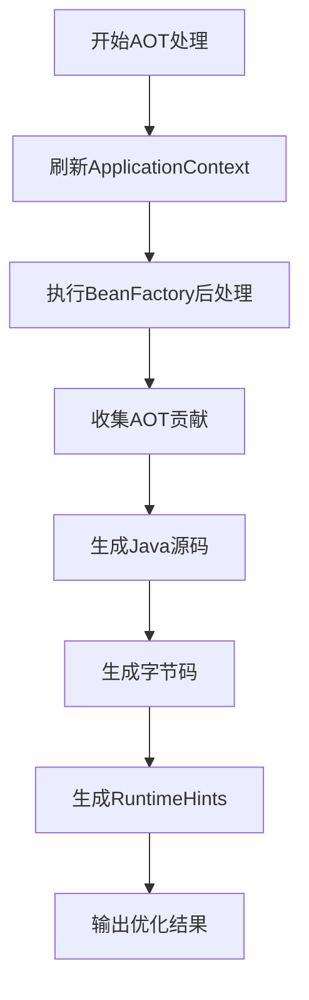

# Spring 框架 AOT 详解与最佳实践

## 1 概述

AOT（Ahead-of-Time）编译是 Spring Framework 6 和 Spring Boot 3 引入的重要特性，旨在通过构建时预处理优化应用程序启动性能和运行时效率。与传统的 JIT（Just-in-Time）编译不同，AOT 在应用部署前执行代码分析、类扫描和配置处理，生成优化后的原生代码和配置文件，显著减少运行时开销。

### 1.1 AOT 与 JIT 对比

| 特性     | JIT (即时编译) | AOT (提前编译)        |
| :------- | :------------- | :-------------------- |
| 编译时机 | 运行时         | 构建时                |
| 启动性能 | 相对较慢       | **显著提升** (30-50%) |
| 内存占用 | 较高           | **降低 20% 左右**     |
| 反射支持 | 动态支持       | 需提前声明            |
| 适用场景 | 开发环境       | 生产环境、云原生      |

### 1.2 AOT 的优势

- **极致启动速度**：减少类加载、解析和初始化时间，适用于容器化环境和微服务架构。
- **降低内存开销**：共享元数据缓存，减少内存占用。
- **更好的原生支持**：为 GraalVM 原生镜像生成提供基础支持。
- **确定性行为**：构建时固定配置，避免运行时意外。

## 2 技术原理

### 2.1 AOT 处理流程

Spring AOT 处理的核心是 `ApplicationContextAotGenerator`，它负责分析应用程序上下文并生成优化代码。其处理流程如下图所示：



**具体处理阶段**：

1. **上下文刷新**：创建 Bean 定义，但不实例化 Bean。
2. **BeanFactory 后处理**：执行 `BeanFactoryPostProcessor`，包括配置类解析、导入选择和类路径扫描。
3. **AOT 贡献收集**：调用 `BeanFactoryInitializationAotProcessor` 生成优化代码。
4. **代码生成**：产出 Java 源代码、字节码和 `RuntimeHints`。

### 2.2 核心组件

- **GenerationContext**：负责管理 AOT 过程中生成的代码、资源和类。
- **RuntimeHints**：声明运行时所需的反射、资源和代理信息。
- **BeanRegistrationAotProcessor**：处理特定 Bean 定义的 AOT 优化。

## 3 环境准备与配置

### 3.1 项目设置

Spring Boot 3.0+ 项目只需添加以下插件即可启用 AOT：

**Maven 配置**：

```xml
<build>
    <plugins>
        <plugin>
            <groupId>org.springframework.boot</groupId>
            <artifactId>spring-boot-maven-plugin</artifactId>
            <executions>
                <execution>
                    <id>process-aot</id>
                    <goals>
                        <goal>process-aot</goal>
                    </goals>
                    <configuration>
                        <!-- 设置构建时激活的配置文件 -->
                        <profiles>profile-a,profile-b</profiles>
                    </configuration>
                </execution>
            </executions>
        </plugin>
    </plugins>
</build>
```

**Gradle 配置**：

```groovy
tasks.withType(org.springframework.boot.gradle.tasks.aot.ProcessAot).configureEach {
    args('--spring.profiles.active=profile-a,profile-b')
}
```

### 3.2 条件评估与 Profile 处理

AOT 处理会在构建时评估 `@Conditional` 注解和 `@Profile` 注解，这意味着**构建时激活的配置将影响最终生成的应用行为**。

> **重要限制**：在构建时通过 AOT 处理创建的 Bean 在运行时将始终被创建，无法被关闭。

## 4 核心功能与实现

### 4.1 RuntimeHints 编程式 API

`RuntimeHints` API 允许开发者显式声明运行时所需的反射、资源和代理配置：

```java
import org.springframework.aot.hint.RuntimeHints;
import org.springframework.aot.hint.RuntimeHintsRegistrar;
import org.springframework.aot.hint.TypeReference;
import org.springframework.aot.hint.MemberCategory;

public class MyRuntimeHints implements RuntimeHintsRegistrar {
    @Override
    public void registerHints(RuntimeHints hints, ClassLoader loader) {
        // 注册反射信息
        hints.reflection().registerType(TypeReference.of("com.example.service.MyService"),
            hint -> hint.withMembers(MemberCategory.INVOKE_PUBLIC_CONSTRUCTORS,
                                    MemberCategory.INVOKE_PUBLIC_METHODS));

        // 注册资源模式
        hints.resources().registerPattern("templates/**/*.html");
        hints.resources().registerPattern("config/*.properties");

        // 注册JDK代理
        hints.proxies().registerJdkProxy(MyService.class, MyServiceImpl.class);
    }
}
```

### 4.2 自动扫描与注册

在 `META-INF/spring/aot.factories` 中注册提示类：

```properties
# META-INF/spring/aot.factories
org.springframework.aot.hint.RuntimeHintsRegistrar=\
  com.example.hints.MyRuntimeHints,\
  com.example.hints.MyOtherHints
```

### 4.3 JPA 仓库的 AOT 支持

Spring Data JPA 通过 AOT 处理预生成查询实现代码，消除反射需求。

**支持的功能**：

- 派生查询方法
- `@Query` 注解方法
- `@Modifying` 修改操作
- 分页和排序
- DTO 投影

**当前限制**：

- 基于 `ScrollPosition` 的键集分页暂未支持
- `QueryRewriter` 仅支持无参构造类

## 5 最佳实践

### 5.1 容器化部署优化

对于容器化部署，Spring Boot 提供 `extract` 命令解压可执行 JAR，与 CDS 或 AOT 缓存结合使用。

**生成分层镜像**：

```dockerfile
# 解压应用依赖
java -Djarmode=layertools -jar your-spring-boot.jar extract

# 针对依赖层生成专用归档
java -XX:ArchiveClassesAtExit=dependencies.jsa -cp "dependencies/BOOT-INF/lib/*" org.springframework.boot.loader.JarLauncher

# 运行应用时复用归档
java -XX:SharedArchiveFile=dependencies.jsa -jar your-spring-boot.jar
```

**安全考虑**：与 CRaC 不同，CDS 和 AOT 缓存不会转储 JVM 内存状态，不存在敏感数据泄露风险。

### 5.2 条件化配置处理

由于 AOT 在构建时评估条件，需要确保构建环境与生产环境一致：

```xml
<!-- Maven 配置示例 -->
<configuration>
    <profiles>production</profiles>
    <environmentVariables>
        <DATABASE_URL>jdbc:postgresql://production-host/db</DATABASE_URL>
    </environmentVariables>
</configuration>
```

### 5.3 第三方库整合

对于第三方库中的反射需求，通过 `RuntimeHintsRegistrar` 显式声明：

```java
public class ThirdPartyHints implements RuntimeHintsRegistrar {
    @Override
    public void registerHints(RuntimeHints hints, ClassLoader loader) {
        // 注册Jackson序列化所需反射
        hints.reflection().registerType(TypeReference.of("com.thirdparty.Model"),
            hint -> hint.withMembers(MemberCategory.INVOKE_PUBLIC_METHODS,
                                    MemberCategory.DECLARED_FIELDS));

        // 注册资源文件
        hints.resources().registerPattern("thirdparty-config.xml");
    }
}
```

### 5.4 调试与诊断

启用详细日志以诊断 AOT 问题：

```bash
# 启用AOT详细日志
./mvnw spring-boot:run -Dspring.aot.debug=true

# Native镜像构建日志
native-image --no-fallback --initialize-at-build-time -jar target/app.jar \
             --enable-logging=graal=info
```

**常见问题诊断**：

- **未声明的反射**：运行时报 `ReflectiveOperationException`，需通过 `RuntimeHints` 补充。
- **资源未包含**：模板/配置文件在镜像中丢失，使用 `hints.resources()` 注册模式。
- **代理缺失**：AOP 或 JDK 动态代理需使用 `hints.proxies().registerJdkProxy(...)` 显式声明。

## 6 性能优化与监控

### 6.1 缓存策略优化

Java 24+ 支持 JEP 483 (JVM AOT Cache)，提供更好的性能：

```bash
# Java 24+ AOT缓存方案
java -XX:AOTLibrary=./libaot.so -jar springapp.jar

# 传统CDS方案（Java <24）
java -XX:ArchiveClassesAtExit=app.jsa -jar springapp.jar
java -XX:SharedArchiveFile=app.jsa -jar springapp.jar
```

### 6.2 监控指标

关注以下 JVM 指标以评估 AOT 效果：

```bash
# 查看共享类内存使用
jstat -gc <pid> | grep "Shared"

# 监控AOT缓存命中率
java -XX:+PrintAOT -XX:+PrintSharedArchiveAndExit -jar app.jar
```

### 6.3 性能对比数据

根据实测数据，在典型 Spring Boot 应用中：

- CDS 可减少 **30%-40%** 的启动时间
- AOT 缓存在此基础上还能额外提升 **10%-15%**
- 内存占用可降低 **20%** 左右

## 7 未来发展方向

Spring AOT 技术仍在快速发展，以下几个方向值得关注：

1. **云原生集成**：与 Tanzu Platform 和 Tanzu Spring 深度整合，实现平台级 AOT 优化。
2. **Java 25+ 支持**：适配 JEP 515（方法级 AOT 预热）与 AOT 编译草案。
3. **混合模式**：结合 JIT 与 AOT 优势，实现自适应优化。
4. **分布式缓存**：云原生环境下的分布式缓存共享机制。

## 8 总结

Spring AOT 为现代云原生应用提供了显著的启动性能和资源效率提升。通过结合构建时优化和运行时提示，开发者可以在保持 Spring 开发模式的同时，获得接近原生编译的性能表现。

**迁移建议**：

1. 从开发环境开始逐步引入 AOT，积累经验后再推广到生产环境
2. 优先为启动敏感的微服务和应用启用 AOT
3. 建立完善的监控机制，评估 AOT 实际效果
4. 关注 Spring 版本更新，及时获取最新优化特性

AOT 技术正在快速演进，建议开发者保持关注并适时评估引入项目，特别是对新项目和云原生应用。
