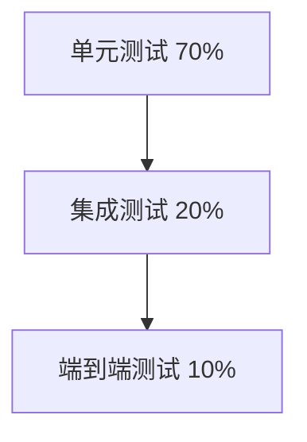

# Spring 框架 Unit Testing 单元测试详解与最佳实践

## 1 单元测试基础概念与重要性

单元测试是软件开发过程中一种**至关重要的测试方法**，它针对程序模块（软件设计的最小单位）来进行正确性检验。在 Spring 框架中，单元测试尤其重要，因为它可以帮助开发者在**复杂的依赖注入**环境下验证单个组件的行为是否符合预期。

### 1.1 什么是单元测试

单元测试是指对软件中的**最小可测试单元**进行检查和验证的过程。对于面向对象编程来说，这通常意味着测试单个类或其方法。单元测试具有以下特点：

- **隔离性**：单元测试应该隔离于外部依赖（如数据库、网络服务等）
- **快速性**：测试执行速度要快，便于频繁运行
- **自动化**：测试应该能够自动执行，不需要人工干预
- **可重复性**：测试结果应该一致，不随环境变化而改变

### 1.2 单元测试的价值

良好的单元测试套件为 Spring 应用程序带来多重价值：

- **早期发现问题**：在开发阶段就能发现代码缺陷，降低修复成本
- **促进良好设计**：编写可测试的代码通常会促使更好的架构和设计决策
- **文档作用**：测试代码本身作为如何使用 API 的活文档
- **重构信心**：良好的测试覆盖为代码重构提供安全网，确保不引入回归缺陷

_表：单元测试在不同阶段的收益对比_

| **项目阶段** | **测试收益**           | **成本节省**     |
| ------------ | ---------------------- | ---------------- |
| **开发期间** | 即时反馈，快速定位问题 | 减少调试时间     |
| **集成阶段** | 减少组件集成问题       | 降低联调成本     |
| **维护阶段** | 确保修改不破坏现有功能 | 降低回归测试成本 |

### 1.3 Spring 单元测试的特殊性

Spring 框架的**依赖注入**和**控制反转**特性使得单元测试有其特殊性：

```java
// 典型的 Spring 组件包含依赖注入
@Service
public class UserService {
    @Autowired
    private UserRepository userRepository;

    @Value("${user.default.role}")
    private String defaultRole;

    // 需要测试的业务方法
    public User createUser(String username) {
        // 方法实现
    }
}
```

测试这类组件时需要处理依赖关系和 Spring 上下文配置，这正是 Spring Test 框架所要解决的核心问题。

## 2 Spring 测试框架核心组件

Spring 测试框架建立在几个核心组件之上，提供了**全面而强大**的测试功能。了解这些组件是编写有效测试的基础。

### 2.1 Spring Test Context 框架

Spring Test Context 框架是 Spring 测试模块的**核心基础设施**，它提供了上下文缓存和依赖注入支持。主要组件包括：

- **TestContext**：提供测试上下文的核心 API
- **TestContextManager**：管理测试上下文的生命周期
- **ContextCache**：缓存已加载的应用上下文，提高测试效率
- **ContextLoader**：负责加载 ApplicationContext

```java
// 基于 Spring Test Context 的基本测试类
@ExtendWith(SpringExtension.class)
@SpringBootTest
public class BasicSpringTest {

    @Autowired
    private ApplicationContext applicationContext;

    @Test
    void contextLoads() {
        assertNotNull(applicationContext);
    }
}
```

### 2.2 JUnit 5 集成

Spring 5 开始全面支持 JUnit 5，提供了**现代化且灵活**的测试基础设施。JUnit 5 由三个主要模块组成：

- **JUnit Platform**：在 JVM 上启动测试框架的基础服务
- **JUnit Jupiter**：新的编程模型和扩展模型
- **JUnit Vintage**：用于运行 JUnit 3 和 4 测试的兼容模块

_表：JUnit 5 与 Spring 测试相关的重要注解_

| **注解**             | **描述**           | **示例用法**                                            |
| -------------------- | ------------------ | ------------------------------------------------------- |
| `@Test`              | 标记测试方法       | `@Test void testMethod() {}`                            |
| `@ParameterizedTest` | 参数化测试         | `@ParameterizedTest @ValueSource(strings = {"a", "b"})` |
| `@RepeatedTest`      | 重复测试           | `@RepeatedTest(5) void repeatTest() {}`                 |
| `@Nested`            | 嵌套测试类         | `@Nested class InnerTests {}`                           |
| `@DisplayName`       | 自定义测试显示名称 | `@DisplayName("特殊场景测试")`                          |

### 2.3 Mockito 模拟框架

Mockito 是 Spring 测试中用于**模拟依赖对象**的核心框架。它允许创建和配置模拟对象，以隔离被测试组件：

```java
// Mockito 在 Spring 测试中的使用示例
@ExtendWith(MockitoExtension.class)
public class MockitoTest {

    @Mock
    private UserRepository userRepository;

    @InjectMocks
    private UserService userService;

    @Test
    void testWithMock() {
        // 配置模拟行为
        when(userRepository.findByUsername("test")).thenReturn(new User());

        // 执行测试
        User result = userService.findUser("test");

        // 验证交互
        verify(userRepository).findByUsername("test");
        assertNotNull(result);
    }
}
```

### 2.4 AssertJ 断言库

AssertJ 提供了**流式API**来编写简洁而强大的断言。相比于 JUnit 的标准断言，AssertJ 提供了更丰富的断言方法和更好的错误消息：

```java
// AssertJ 使用示例
@Test
void assertJExample() {
    String result = someService.doSomething();

    // AssertJ 流式断言
    assertThat(result)
        .isNotBlank()
        .startsWith("Hello")
        .contains("World")
        .hasSize(11);

    List<String> list = someService.getList();
    assertThat(list)
        .isNotEmpty()
        .hasSize(3)
        .containsExactlyInAnyOrder("a", "b", "c");

    Map<String, Integer> map = someService.getMap();
    assertThat(map)
        .containsKey("key")
        .containsValue(100);
}
```

## 3 单元测试与集成测试策略

在 Spring 应用中，区分**单元测试**和**集成测试**并采用适当的策略对于构建高效的测试套件至关重要。

### 3.1 测试金字塔概念

测试金字塔是一个重要的测试策略概念，它建议测试应该分为三个层次：

1. **单元测试**（底层）：数量最多，执行速度快，隔离性好
2. **集成测试**（中间层）：验证组件间协作，数量适中
3. **端到端测试**（顶层）：验证完整流程，数量最少，执行速度慢



Spring Boot 提供了相应的测试注解来支持不同层次的测试。

### 3.2 纯单元测试实现

纯单元测试不加载 Spring 上下文，直接测试类实例，**执行速度极快**：

```java
// 纯单元测试示例 - 不加载 Spring 上下文
public class UserServiceUnitTest {

    private UserService userService;
    private UserRepository userRepository;

    @BeforeEach
    void setUp() {
        // 手动创建依赖（可以是 Mock）
        userRepository = mock(UserRepository.class);

        // 手动创建被测试对象
        userService = new UserService(userRepository);
    }

    @Test
    void shouldCreateUser() {
        // 配置 Mock
        when(userRepository.save(any(User.class))).thenReturn(new User(1L, "test"));

        // 执行测试
        User result = userService.createUser("test");

        // 验证结果
        assertThat(result.getId()).isEqualTo(1L);
        assertThat(result.getUsername()).isEqualTo("test");

        // 验证交互
        verify(userRepository).save(any(User.class));
    }
}
```

### 3.3 集成测试与测试切片

Spring Boot 提供了**测试切片**注解，用于只加载应用程序的特定部分，平衡测试深度和执行速度：

```java
// @WebMvcTest 示例 - 只加载 Web 层组件
@WebMvcTest(UserController.class)
public class UserControllerSliceTest {

    @Autowired
    private MockMvc mockMvc;

    @MockitoBean
    private UserService userService;

    @Test
    void shouldReturnUser() throws Exception {
        // 配置 Mock
        when(userService.findUser(1L)).thenReturn(new User(1L, "test"));

        // 执行和验证 HTTP 请求
        mockMvc.perform(get("/users/1"))
               .andExpect(status().isOk())
               .andExpect(jsonPath("$.username").value("test"));
    }
}

// @DataJpaTest 示例 - 只加载 JPA 相关组件
@DataJpaTest
public class UserRepositoryTest {

    @Autowired
    private TestEntityManager entityManager;

    @Autowired
    private UserRepository userRepository;

    @Test
    void shouldFindByUsername() {
        // 准备数据
        entityManager.persist(new User(null, "test"));

        // 执行查询
        User found = userRepository.findByUsername("test");

        // 验证结果
        assertThat(found.getUsername()).isEqualTo("test");
    }
}
```

⛔ **注意事项**：

- 使用 `@MockitoBean` 会破坏应用程序上下文缓存，可能导致测试速度下降
- 测试切片注解只自动配置特定部分的组件，其他组件需要手动模拟或排除

### 3.4 全栈集成测试

对于需要完整应用程序上下文的场景，可以使用 `@SpringBootTest` 注解：

```java
// 完整集成测试示例
@SpringBootTest(webEnvironment = SpringBootTest.WebEnvironment.RANDOM_PORT)
public class UserIntegrationTest {

    @Autowired
    private TestRestTemplate restTemplate;

    @LocalServerPort
    private int port;

    @Test
    void shouldCreateAndRetrieveUser() {
        // 创建新用户
        User newUser = new User(null, "integrationTest");
        ResponseEntity<User> createResponse = restTemplate.postForEntity(
            "http://localhost:" + port + "/users", newUser, User.class);

        assertThat(createResponse.getStatusCode()).isEqualTo(HttpStatus.CREATED);
        assertThat(createResponse.getBody().getId()).isNotNull();

        // 查询用户
        Long userId = createResponse.getBody().getId();
        ResponseEntity<User> getResponse = restTemplate.getForEntity(
            "http://localhost:" + port + "/users/" + userId, User.class);

        assertThat(getResponse.getStatusCode()).isEqualTo(HttpStatus.OK);
        assertThat(getResponse.getBody().getUsername()).isEqualTo("integrationTest");
    }
}
```

## 4 测试数据管理与事务控制

有效管理测试数据是确保测试**可靠性和可重复性**的关键方面。Spring 提供了多种机制来处理测试数据的准备和清理。

### 4.1 数据初始化与清理

Spring 测试框架支持多种数据初始化方式：

```java
// 使用 @Sql 初始化测试数据
@DataJpaTest
@TestInstance(TestInstance.Lifecycle.PER_CLASS)
public class UserRepositoryDataTest {

    @Autowired
    private UserRepository userRepository;

    @Test
    @Sql(scripts = "/test-data/users.sql") // 初始化数据
    @Sql(scripts = "/test-data/cleanup.sql", executionPhase = AFTER_TEST_METHOD) // 清理数据
    void shouldCountUsers() {
        long count = userRepository.count();
        assertThat(count).isEqualTo(3); // 基于 users.sql 中的数据
    }

    // 使用编程方式初始化数据
    @Test
    void shouldFindActiveUsers() {
        // 编程方式准备数据
        userRepository.save(new User(null, "user1", true));
        userRepository.save(new User(null, "user2", true));
        userRepository.save(new User(null, "user3", false));

        List<User> activeUsers = userRepository.findByActiveTrue();
        assertThat(activeUsers).hasSize(2);
    }
}
```

### 4.2 事务管理策略

Spring 测试默认在每个测试方法后**回滚事务**，这可以保持数据库状态不变：

```java
// 测试事务管理
@SpringBootTest
@Transactional // 默认每个测试方法在事务中执行并在完成后回滚
public class TransactionalUserTest {

    @Autowired
    private UserService userService;

    @Autowired
    private UserRepository userRepository;

    @Test
    void shouldCreateUserInTransaction() {
        long initialCount = userRepository.count();

        userService.createUser("testUser");

        // 在事务内，可以看到更改
        assertThat(userRepository.count()).isEqualTo(initialCount + 1);

        // 但测试完成后会自动回滚，数据库状态不变
    }

    // 禁用自动回滚
    @Test
    @Rollback(false)
    void shouldPersistDataPermanently() {
        userService.createUser("permanentUser");
        // 这个测试不会回滚，数据将持久化到数据库
        // 谨慎使用，可能影响其他测试
    }
}
```

### 4.3 测试配置与属性覆盖

针对不同测试环境，Spring 允许使用特定的配置和属性：

```java
// 测试专用配置
@SpringBootTest
// 激活测试专用的配置 profile
@ActiveProfiles("test")
// 覆盖特定属性
@TestPropertySource(properties = {
    "spring.datasource.url=jdbc:h2:mem:testdb",
    "logging.level.com.example=DEBUG"
})
public class ConfiguredTest {

    @Test
    void testWithCustomConfiguration() {
        // 使用测试专用的配置执行测试
    }
}

// 在 test/resources/application-test.properties 中定义测试专用配置
// spring.datasource.url=jdbc:h2:mem:testdb
// spring.datasource.driver-class-name=org.h2.Driver
// spring.jpa.database-platform=org.hibernate.dialect.H2Dialect
```

_表：测试数据管理策略比较_

| **策略**           | **优点**               | **缺点**                 | **适用场景**       |
| ------------------ | ---------------------- | ------------------------ | ------------------ |
| **自动回滚**       | 自动清理，保持测试隔离 | 不能测试真正的事务提交   | 大多数数据库测试   |
| **手动清理**       | 更接近真实环境         | 需要手动维护数据状态     | 测试事务提交行为   |
| **嵌入式数据库**   | 快速，无需外部依赖     | 与生产数据库可能存在差异 | 单元测试和集成测试 |
| **Testcontainers** | 使用真实数据库引擎     | 执行速度较慢             | 高级集成测试       |

## 5 测试最佳实践与常见陷阱

遵循测试最佳实践可以大大提高测试套件的**有效性和可维护性**，同时避免常见陷阱。

### 5.1 测试命名与结构规范

清晰的测试命名和结构对于测试可维护性至关重要：

```java
// 良好的测试命名和结构示例
public class UserServiceTest {

    // 使用表达意图的测试方法名
    @Test
    void shouldReturnUserWhenValidIdProvided() {
        // 测试代码
    }

    @Test
    void shouldThrowExceptionWhenUserNotFound() {
        // 测试代码
    }

    @Test
    void shouldSaveUserWithEncryptedPassword() {
        // 测试代码
    }

    // 使用嵌套类组织相关测试
    @Nested
    @DisplayName("创建用户场景")
    class CreateUserScenarios {

        @Test
        void shouldCreateUserWithDefaultRole() {
            // 测试代码
        }

        @Test
        void shouldAssignCustomRoleWhenProvided() {
            // 测试代码
        }
    }

    // 使用自定义显示名称
    @Test
    @DisplayName("查找用户 - 用户不存在时应返回空结果")
    void findUser_whenUserNotExists_shouldReturnEmpty() {
        // 测试代码
    }
}
```

### 5.2 测试独立性与可重复性

确保测试独立且可重复运行是测试可靠性的基础：

1. **避免测试间的依赖**：每个测试应该能够独立运行，不依赖其他测试的执行顺序或状态
2. **使用随机值避免冲突**：对于需要唯一值的字段（如用户名），使用随机值减少冲突

```java
// 确保测试独立性的示例
public class IndependentTest {

    // 使用随机值避免测试间冲突
    @Test
    void shouldCreateUserWithUniqueUsername() {
        String username = "user_" + UUID.randomUUID().toString();

        User user = userService.createUser(username);

        assertThat(user.getUsername()).isEqualTo(username);
    }

    // 每个测试前重置 Mock
    @BeforeEach
    void resetMocks() {
        reset(userRepository); // 重置 Mock 状态
    }
}
```

### 5.3 常见陷阱与解决方案

_表：Spring 测试常见陷阱与解决方案_

| **常见陷阱**         | **问题描述**                                | **解决方案**                                       |
| -------------------- | ------------------------------------------- | -------------------------------------------------- |
| **上下文缓存污染**   | 使用 @MockitoBean 导致上下文重建，减慢测试速度 | 合理组织测试类，将使用相同 Mock 配置的测试放在一起 |
| **数据库序列化问题** | 测试并行执行时数据库序列冲突                | 使用不同的数据库序列初始值，或序列化测试执行       |
| **网络依赖**         | 测试依赖外部服务，导致不稳定                | 使用 @MockitoBean 或 WireMock 模拟外部服务            |
| **测试数据冲突**     | 测试间共享数据导致意外行为                  | 确保每个测试清理自己的数据，或使用随机数据         |
| **配置遗漏**         | 测试环境缺少必要配置                        | 使用 @TestPropertySource 提供测试专用配置          |

## 6 进阶技巧与工具整合

除了基本测试技术外，一些进阶技巧和工具整合可以显著提升 Spring 测试的**能力和效率**。

### 6.1 Testcontainers 集成

Testcontainers 提供了**轻量级的容器化基础设施**，非常适合集成测试：

```java
// Testcontainers 集成示例
@SpringBootTest
@Testcontainers
public class UserServiceContainerTest {

    // 定义数据库容器
    @Container
    static PostgreSQLContainer<?> postgres = new PostgreSQLContainer<>("postgres:13")
        .withDatabaseName("testdb")
        .withUsername("test")
        .withPassword("test");

    // 动态配置数据源
    @DynamicPropertySource
    static void configureProperties(DynamicPropertyRegistry registry) {
        registry.add("spring.datasource.url", postgres::getJdbcUrl);
        registry.add("spring.datasource.username", postgres::getUsername);
        registry.add("spring.datasource.password", postgres::getPassword);
    }

    @Test
    void shouldWorkWithRealDatabase() {
        // 使用真实 PostgreSQL 数据库执行测试
        // 更接近生产环境，能发现更多潜在问题
    }
}
```

### 6.2 参数化测试

JUnit 5 的参数化测试支持使用**不同的输入数据**运行同一测试逻辑：

```java
// 参数化测试示例
public class ParameterizedUserTest {

    @ParameterizedTest
    @ValueSource(strings = {"user1", "user2", "user3"})
    void shouldCreateUserWithDifferentNames(String username) {
        User user = userService.createUser(username);
        assertThat(user.getUsername()).isEqualTo(username);
    }

    @ParameterizedTest
    @CsvSource({
        "admin,    ADMIN",
        "user,     USER",
        "manager,  MANAGER"
    })
    void shouldAssignCorrectRole(String username, String expectedRole) {
        User user = userService.createUser(username);
        assertThat(user.getRole()).isEqualTo(expectedRole);
    }

    @ParameterizedTest
    @MethodSource("provideUserAgeData")
    void shouldValidateUserAge(int age, boolean isValid) {
        assertThat(userService.isValidAge(age)).isEqualTo(isValid);
    }

    private static Stream<Arguments> provideUserAgeData() {
        return Stream.of(
            Arguments.of(15, false),
            Arguments.of(18, true),
            Arguments.of(25, true),
            Arguments.of(120, false)
        );
    }
}
```

### 6.3 测试覆盖率与质量分析

使用 JaCoCo 等工具**分析测试覆盖率**，确保测试充分性：

```xml
<!-- Maven 中配置 JaCoCo 插件 -->
<plugin>
    <groupId>org.jacoco</groupId>
    <artifactId>jacoco-maven-plugin</artifactId>
    <version>0.8.7</version>
    <executions>
        <execution>
            <goals>
                <goal>prepare-agent</goal>
                <goal>report</goal>
            </goals>
        </execution>ƒ
    </executions>
</plugin>
```

```yaml
# GitHub Actions 中配置测试覆盖检查
name: Java CI with Coverage

on: [push, pull_request]

jobs:
  build:
    runs-on: ubuntu-latest
    steps:
      - uses: actions/checkout@v2
      - name: Set up JDK 17
        uses: actions/setup-java@v2
        with:
          java-version: '17'
          distribution: 'adopt'
      - name: Build with tests and coverage
        run: mvn test jacoco:report
      - name: Upload coverage reports
        uses: codecov/codecov-action@v2
```

_表：测试覆盖率指标与建议标准_

| **覆盖率类型**   | **描述**             | **建议标准** |
| ---------------- | -------------------- | ------------ |
| **行覆盖率**     | 已执行代码行占比     | ≥ 70%        |
| **分支覆盖率**   | 已覆盖代码分支占比   | ≥ 60%        |
| **方法覆盖率**   | 已测试方法占比       | ≥ 80%        |
| **复杂度覆盖率** | 覆盖的代码复杂度占比 | ≥ 70%        |

## 7 持续集成中的测试策略

将 Spring 测试有效集成到**持续集成/持续部署**（CI/CD）流水线中，可以确保代码质量并加速交付过程。

### 7.1 CI 流水线中的测试阶段

在 CI 流水线中合理组织测试阶段，平衡反馈速度和质量保障：

```yaml
# GitHub Actions 示例配置
name: Java CI

on: [push, pull_request]

jobs:
  test:
    strategy:
      matrix:
        java: [21, 17]
    runs-on: ubuntu-latest
    steps:
      - uses: actions/checkout@v3
      - name: Setup Java
        uses: actions/setup-java@v3
        with:
          java-version: ${{ matrix.java }}
          distribution: 'temurin'
      - name: Run Unit Tests
        run: mvn test -Dtest=**/*UnitTest
      - name: Run Integration Tests
        run: mvn test -Dtest=**/*IntegrationTest -Dspring.profiles.active=ci
        env:
          TEST_DB_URL: ${{ secrets.TEST_DB_URL }}
          TEST_DB_USERNAME: ${{ secrets.TEST_DB_USERNAME }}
          TEST_DB_PASSWORD: ${{ secrets.TEST_DB_PASSWORD }}
      - name: Upload Test Results
        uses: actions/upload-artifact@v3
        if: always()
        with:
          name: test-results
          path: target/surefire-reports/
```

### 7.2 测试并行执行策略

通过**并行执行测试**显著减少反馈时间：

```java
// 启用测试并行执行
// 在 src/test/resources/junit-platform.properties 中配置
junit.jupiter.execution.parallel.enabled = true
junit.jupiter.execution.parallel.mode.default = concurrent
junit.jupiter.execution.parallel.config.strategy = fixed
junit.jupiter.execution.parallel.config.fixed.parallelism = 4

// 使用 @Execution 注解控制并行行为
@Execution(ExecutionMode.CONCURRENT)
public class ParallelUserTest {

    @Test
    @Execution(ExecutionMode.SAME_THREAD) // 强制在同一个线程执行
    void shouldRunInMainThread() {
        // 需要主线程执行的测试
    }
}
```

### 7.3 测试质量门禁

在 CI 流水线中设置**质量门禁**，确保只有符合标准的代码才能通过：

```xml
<!-- 配置 Maven 插件设置质量门禁 -->
<plugin>
    <groupId>org.jacoco</groupId>
    <artifactId>jacoco-maven-plugin</artifactId>
    <version>0.8.7</version>
    <configuration>
        <rules>
            <rule>
                <element>BUNDLE</element>
                <limits>
                    <limit>
                        <counter>INSTRUCTION</counter>
                        <value>COVEREDRATIO</value>
                        <minimum>0.70</minimum>
                    </limit>
                    <limit>
                        <counter>BRANCH</counter>
                        <value>COVEREDRATIO</value>
                        <minimum>0.60</minimum>
                    </limit>
                </limits>
            </rule>
        </rules>
    </configuration>
</plugin>
```

_表：CI 流水线中的测试阶段配置_

| **测试阶段**   | **执行速度**    | **测试范围** | **触发条件** |
| -------------- | --------------- | ------------ | ------------ |
| **单元测试**   | 快（<5分钟）    | 单个组件     | 每次提交     |
| **集成测试**   | 中（5-15分钟）  | 组件间集成   | 主分支或PR   |
| **端到端测试** | 慢（15-60分钟） | 完整系统     | 每日或发布前 |

通过遵循本文介绍的 Spring 单元测试详解与最佳实践，您可以构建出**高效、可靠且易于维护**的测试套件，为 Spring 应用程序的质量保驾护航。良好的测试不仅能减少缺陷，还能提高开发速度，为重构和持续交付提供坚实基础。
