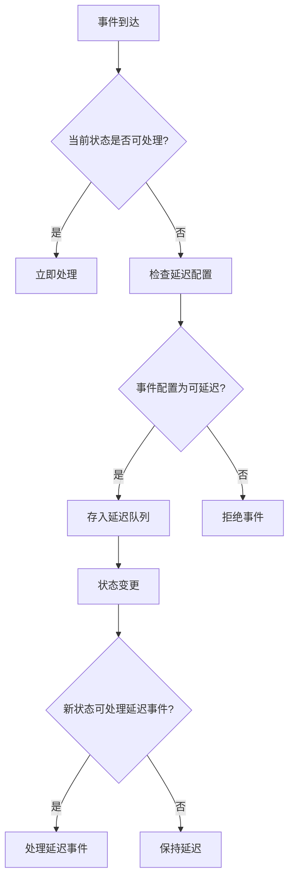

# Spring Statemachine Deferred Events 延迟事件及配置详解与最佳实践

## 1. 概述

### 1.1 什么是延迟事件

Spring Statemachine 中的延迟事件（Deferred Events）是一种特殊的事件处理机制，允许状态机在某些状态下暂时不处理特定事件，而是将这些事件推迟到进入能够处理它们的其他状态时再自动执行。

### 1.2 延迟事件的应用场景

延迟事件在以下场景中特别有用：

- **状态依赖处理**：当事件只能在特定状态下处理，但可能在不适当时机到达时
- **资源约束**：当系统资源暂时不可用，需要等待资源可用后再处理事件时
- **顺序保证**：需要确保事件按照特定顺序处理，即使它们到达的顺序不同
- **条件等待**：等待某些条件满足后再处理事件

### 1.3 延迟事件 vs 立即事件

| 特性 | 立即事件 | 延迟事件 |
|------|---------|---------|
| 处理时机 | 立即处理 | 推迟到合适状态处理 |
| 状态要求 | 必须在当前状态可处理 | 可在后续状态处理 |
| 返回值 | 立即返回接受/拒绝 | 返回接受但延迟处理 |
| 内存占用 | 无额外存储 | 需要存储事件数据 |

## 2. 核心概念与工作原理

### 2.1 延迟事件的生命周期



### 2.2 延迟队列管理

Spring Statemachine 内部维护一个延迟事件队列，用于存储所有被延迟的事件。当状态机转换到新状态时，会自动检查该队列并处理那些可以在新状态下处理的事件。

## 3. 配置延迟事件

### 3.1 基本配置方式

#### 3.1.1 使用状态配置器配置延迟事件

```java
@Configuration
@EnableStateMachine
public class StateMachineConfig extends StateMachineConfigurerAdapter<String, String> {

    @Override
    public void configure(StateMachineStateConfigurer<String, String> states) throws Exception {
        states
            .withStates()
                .initial("SI")
                .state("S1")
                .state("S2")
                .state("S3")
                // 在S1状态配置延迟事件E2
                .state("S1", null, null, Collections.singleton("E2"))
                // 在S2状态配置延迟事件E3
                .state("S2", null, null, Collections.singleton("E3"));
    }

    @Override
    public void configure(StateMachineTransitionConfigurer<String, String> transitions) throws Exception {
        transitions
            .withExternal()
                .source("SI").target("S1").event("E1")
            .and()
            .withExternal()
                .source("S1").target("S2").event("E2")
            .and()
            .withExternal()
                .source("S2").target("S3").event("E3");
    }
}
```

#### 3.1.2 使用枚举类型的状态和事件

```java
public enum States {
    SI, S1, S2, S3
}

public enum Events {
    E1, E2, E3
}

@Configuration
@EnableStateMachine
public class StateMachineConfig extends EnumStateMachineConfigurerAdapter<States, Events> {

    @Override
    public void configure(StateMachineStateConfigurer<States, Events> states) throws Exception {
        states
            .withStates()
                .initial(States.SI)
                .state(States.S1)
                .state(States.S2)
                .state(States.S3)
                // 配置延迟事件
                .state(States.S1, null, null, Collections.singleton(Events.E2))
                .state(States.S2, null, null, Collections.singleton(Events.E3));
    }

    @Override
    public void configure(StateMachineTransitionConfigurer<States, Events> transitions) throws Exception {
        transitions
            .withExternal()
                .source(States.SI).target(States.S1).event(Events.E1)
            .and()
            .withExternal()
                .source(States.S1).target(States.S2).event(Events.E2)
            .and()
            .withExternal()
                .source(States.S2).target(States.S3).event(Events.E3);
    }
}
```

### 3.2 高级配置选项

#### 3.2.1 配置多个延迟事件

```java
@Override
public void configure(StateMachineStateConfigurer<String, String> states) throws Exception {
    states
        .withStates()
            .initial("SI")
            .state("S1")
            .state("S2")
            // 配置多个延迟事件
            .state("S1", null, null, Arrays.asList("E2", "E3", "E4"));
}
```

#### 3.2.2 使用通配符配置延迟事件

Spring Statemachine 不支持直接使用通配符，但可以通过编程方式实现类似功能：

```java
@Override
public void configure(StateMachineStateConfigurer<String, String> states) throws Exception {
    Set<String> deferredEvents = new HashSet<>();
    // 添加所有以"DEFERRED_"开头的事件
    deferredEvents.add("DEFERRED_ALPHA");
    deferredEvents.add("DEFERRED_BETA");
    deferredEvents.add("DEFERRED_GAMMA");
    
    states
        .withStates()
            .initial("SI")
            .state("S1")
            .state("S2")
            .state("S1", null, null, deferredEvents);
}
```

## 4. 编程方式使用延迟事件

### 4.1 发送事件与延迟处理

```java
@Service
public class EventService {
    
    @Autowired
    private StateMachine<String, String> stateMachine;
    
    public void processEvents() {
        // 启动状态机
        stateMachine.start();
        
        // 发送事件E1 - 立即处理（转换到S1）
        stateMachine.sendEvent("E1");
        System.out.println("当前状态: " + stateMachine.getState().getId());
        
        // 发送事件E2 - 在S1状态下被延迟
        stateMachine.sendEvent("E2");
        System.out.println("事件E2已发送，但被延迟处理");
        System.out.println("当前状态: " + stateMachine.getState().getId());
        System.out.println("延迟事件: " + stateMachine.getDeferredEvents());
        
        // 发送事件E3 - 触发转换到S2，并处理延迟的E2事件
        stateMachine.sendEvent("E3");
        System.out.println("当前状态: " + stateMachine.getState().getId());
        System.out.println("延迟事件: " + stateMachine.getDeferredEvents());
    }
}
```

### 4.2 手动管理延迟事件

```java
@Service
public class ManualDeferredEventService {
    
    @Autowired
    private StateMachine<String, String> stateMachine;
    
    public void manualDeferredEventManagement() {
        stateMachine.start();
        
        // 检查是否有延迟事件
        Collection<Message<String>> deferredEvents = stateMachine.getDeferredEvents();
        System.out.println("延迟事件数量: " + deferredEvents.size());
        
        // 手动处理特定延迟事件
        for (Message<String> event : deferredEvents) {
            if ("SPECIAL_EVENT".equals(event.getPayload())) {
                // 条件处理：只在特定情况下处理
                if (shouldProcessNow(event)) {
                    stateMachine.sendEvent(event);
                }
            }
        }
        
        // 清空所有延迟事件（谨慎使用）
        // stateMachine.getStateMachineAccessor().doWithAllRegions(access -> {
        //     access.resetDeferredEvents();
        // });
    }
    
    private boolean shouldProcessNow(Message<String> event) {
        // 自定义逻辑决定是否现在处理延迟事件
        return true;
    }
}
```

## 5. 最佳实践与高级用法

### 5.1 延迟事件与守卫条件的结合使用

```java
@Configuration
@EnableStateMachine
public class AdvancedDeferredConfig extends StateMachineConfigurerAdapter<String, String> {

    @Override
    public void configure(StateMachineStateConfigurer<String, String> states) throws Exception {
        states
            .withStates()
                .initial("SI")
                .state("PROCESSING")
                .state("WAITING_FOR_RESOURCE")
                // 在等待资源状态下延迟处理资源相关事件
                .state("WAITING_FOR_RESOURCE", null, null, Arrays.asList("RESOURCE_READY", "PROCESS_DATA"));
    }

    @Override
    public void configure(StateMachineTransitionConfigurer<String, String> transitions) throws Exception {
        transitions
            .withExternal()
                .source("SI").target("PROCESSING").event("START_PROCESSING")
            .and()
            .withExternal()
                .source("PROCESSING").target("WAITING_FOR_RESOURCE").event("NEED_RESOURCE")
                .action(checkResourceAvailability())
            .and()
            .withExternal()
                .source("WAITING_FOR_RESOURCE").target("PROCESSING").event("RESOURCE_READY")
                .guard(resourceAvailableGuard())
            .and()
            .withInternal()
                .source("PROCESSING").event("PROCESS_DATA")
                .guard(dataProcessableGuard())
                .action(processDataAction());
    }
    
    @Bean
    public Action<String, String> checkResourceAvailability() {
        return context -> {
            // 检查资源可用性，如果不可用则进入等待状态
            if (!isResourceAvailable()) {
                System.out.println("资源不可用，进入等待状态");
                context.getStateMachine().sendEvent("NEED_RESOURCE");
            }
        };
    }
    
    @Bean
    public Guard<String, String> resourceAvailableGuard() {
        return context -> {
            // 只有资源真正可用时才允许转换
            return isResourceAvailable();
        };
    }
    
    @Bean
    public Guard<String, String> dataProcessableGuard() {
        return context -> {
            // 检查数据是否可处理（可能需要资源）
            return isResourceAvailable() && isDataValid(context);
        };
    }
    
    @Bean
    public Action<String, String> processDataAction() {
        return context -> {
            // 处理数据
            System.out.println("处理数据: " + context.getMessage().getPayload());
        };
    }
    
    private boolean isResourceAvailable() {
        // 实现资源检查逻辑
        return true; // 示例实现
    }
    
    private boolean isDataValid(StateContext<String, String> context) {
        // 实现数据验证逻辑
        return true; // 示例实现
    }
}
```

### 5.2 延迟事件与异常处理

```java
@Configuration
@EnableStateMachine
public class ExceptionHandlingConfig extends StateMachineConfigurerAdapter<String, String> {

    @Override
    public void configure(StateMachineStateConfigurer<String, String> states) throws Exception {
        states
            .withStates()
                .initial("READY")
                .state("PROCESSING")
                .state("ERROR")
                // 在错误状态下延迟处理正常业务事件
                .state("ERROR", null, null, Arrays.asList("PROCESS", "RETRY"))
                .state("PROCESSING", null, null, Collections.singleton("PROCESS"));
    }

    @Override
    public void configure(StateMachineTransitionConfigurer<String, String> transitions) throws Exception {
        transitions
            .withExternal()
                .source("READY").target("PROCESSING").event("PROCESS")
                .action(processingAction())
            .and()
            .withExternal()
                .source("PROCESSING").target("READY").event("COMPLETE")
            .and()
            .withExternal()
                .source("PROCESSING").target("ERROR").event("ERROR")
            .and()
            .withExternal()
                .source("ERROR").target("PROCESSING").event("RETRY")
                .guard(errorResolvedGuard())
            .and()
            .withInternal()
                .source("ERROR").event("PROCESS")
                .action(logDeferredEventAction());
    }
    
    @Bean
    public Action<String, String> processingAction() {
        return context -> {
            try {
                // 模拟处理逻辑，可能抛出异常
                processBusinessLogic();
                context.getStateMachine().sendEvent("COMPLETE");
            } catch (Exception e) {
                System.out.println("处理过程中发生错误: " + e.getMessage());
                context.getStateMachine().sendEvent("ERROR");
            }
        };
    }
    
    @Bean
    public Guard<String, String> errorResolvedGuard() {
        return context -> {
            // 检查错误是否已解决
            return isErrorResolved();
        };
    }
    
    @Bean
    public Action<String, String> logDeferredEventAction() {
        return context -> {
            System.out.println("在错误状态下收到延迟事件: " + context.getEvent());
            // 可以记录日志、通知监控系统等
        };
    }
    
    private void processBusinessLogic() throws Exception {
        // 模拟业务逻辑处理
        if (Math.random() > 0.5) {
            throw new Exception("随机业务错误");
        }
    }
    
    private boolean isErrorResolved() {
        // 检查错误是否已解决
        return true; // 示例实现
    }
}
```

### 5.3 性能优化与内存管理

```java
@Configuration
@EnableStateMachine
public class PerformanceOptimizedConfig extends StateMachineConfigurerAdapter<String, String> {

    @Override
    public void configure(StateMachineStateConfigurer<String, String> states) throws Exception {
        states
            .withStates()
                .initial("IDLE")
                .state("PROCESSING")
                .state("PAUSED")
                // 谨慎选择需要延迟的事件，避免内存泄漏
                .state("PAUSED", null, null, Arrays.asList("RESUME", "PROCESS_DATA"));
    }

    @Override
    public void configure(StateMachineConfigurationConfigurer<String, String> config) throws Exception {
        config
            .withConfiguration()
                // 配置状态机执行器，优化性能
                .taskExecutor(new SimpleAsyncTaskExecutor())
                .taskScheduler(new ConcurrentTaskScheduler())
                // 设置状态机自动启动
                .autoStartup(true);
    }

    @Override
    public void configure(StateMachineTransitionConfigurer<String, String> transitions) throws Exception {
        transitions
            .withExternal()
                .source("IDLE").target("PROCESSING").event("START")
            .and()
            .withExternal()
                .source("PROCESSING").target("PAUSED").event("PAUSE")
            .and()
            .withExternal()
                .source("PAUSED").target("PROCESSING").event("RESUME")
            .and()
            .withInternal()
                .source("PROCESSING").event("PROCESS_DATA")
                .action(processDataAction())
            .and()
            .withInternal()
                .source("PAUSED").event("PROCESS_DATA")
                .action(logDeferredAction());
    }
    
    @Bean
    public Action<String, String> processDataAction() {
        return context -> {
            // 高效处理数据
            String data = (String) context.getMessage().getHeaders().get("data");
            if (data != null) {
                System.out.println("处理数据: " + data);
            }
        };
    }
    
    @Bean
    public Action<String, String> logDeferredAction() {
        return context -> {
            // 记录延迟事件信息，但不处理大数据
            String event = context.getEvent();
            System.out.println("记录延迟事件: " + event);
            
            // 对于大数据负载，只存储引用而非完整数据
            if (context.getMessage().getHeaders().containsKey("largeDataRef")) {
                String dataRef = (String) context.getMessage().getHeaders().get("largeDataRef");
                System.out.println("延迟事件包含大数据引用: " + dataRef);
            }
        };
    }
}
```

## 6. 实战案例：订单处理系统

### 6.1 业务场景描述

假设我们有一个订单处理系统，订单有以下状态：

- **CREATED**: 订单已创建
- **VALIDATING**: 订单验证中
- **PAYMENT_PENDING**: 等待支付
- **PROCESSING**: 处理中
- **COMPLETED**: 完成
- **CANCELLED**: 已取消

在某些状态下，我们需要延迟处理某些事件，例如：

- 在支付完成前延迟处理发货请求
- 在验证过程中延迟处理取消请求

### 6.2 状态机配置实现

```java
public enum OrderStates {
    CREATED, VALIDATING, PAYMENT_PENDING, PROCESSING, COMPLETED, CANCELLED
}

public enum OrderEvents {
    VALIDATE, VALIDATION_SUCCESS, VALIDATION_FAILED,
    REQUEST_PAYMENT, PAYMENT_RECEIVED, PAYMENT_FAILED,
    PROCESS, COMPLETE, CANCEL, SHIP
}

@Configuration
@EnableStateMachine
public class OrderStateMachineConfig extends EnumStateMachineConfigurerAdapter<OrderStates, OrderEvents> {

    @Override
    public void configure(StateMachineStateConfigurer<OrderStates, OrderEvents> states) throws Exception {
        states
            .withStates()
                .initial(OrderStates.CREATED)
                .state(OrderStates.VALIDATING)
                .state(OrderStates.PAYMENT_PENDING)
                .state(OrderStates.PROCESSING)
                .state(OrderStates.COMPLETED)
                .state(OrderStates.CANCELLED)
                // 配置延迟事件
                .state(OrderStates.VALIDATING, null, null, Collections.singleton(OrderEvents.CANCEL))
                .state(OrderStates.PAYMENT_PENDING, null, null, 
                    Arrays.asList(OrderEvents.SHIP, OrderEvents.CANCEL))
                .state(OrderStates.PROCESSING, null, null, Collections.singleton(OrderEvents.CANCEL));
    }

    @Override
    public void configure(StateMachineTransitionConfigurer<OrderStates, OrderEvents> transitions) throws Exception {
        transitions
            .withExternal()
                .source(OrderStates.CREATED).target(OrderStates.VALIDATING).event(OrderEvents.VALIDATE)
            .and()
            .withExternal()
                .source(OrderStates.VALIDATING).target(OrderStates.PAYMENT_PENDING).event(OrderEvents.VALIDATION_SUCCESS)
            .and()
            .withExternal()
                .source(OrderStates.VALIDATING).target(OrderStates.CANCELLED).event(OrderEvents.VALIDATION_FAILED)
            .and()
            .withExternal()
                .source(OrderStates.PAYMENT_PENDING).target(OrderStates.PROCESSING).event(OrderEvents.PAYMENT_RECEIVED)
            .and()
            .withExternal()
                .source(OrderStates.PAYMENT_PENDING).target(OrderStates.CANCELLED).event(OrderEvents.PAYMENT_FAILED)
            .and()
            .withExternal()
                .source(OrderStates.PROCESSING).target(OrderStates.COMPLETED).event(OrderEvents.COMPLETE)
            .and()
            .withExternal()
                .source(OrderStates.PAYMENT_PENDING).target(OrderStates.PROCESSING).event(OrderEvents.PAYMENT_RECEIVED)
            .and()
            // 处理延迟事件
            .withExternal()
                .source(OrderStates.PROCESSING).target(OrderStates.CANCELLED).event(OrderEvents.CANCEL)
            .and()
            .withInternal()
                .source(OrderStates.PROCESSING).event(OrderEvents.SHIP)
                .action(shipOrderAction());
    }
    
    @Bean
    public Action<OrderStates, OrderEvents> shipOrderAction() {
        return context -> {
            System.out.println("发货处理: " + context.getMessage().getHeaders().get("orderId"));
            // 实际发货逻辑
        };
    }
}
```

### 6.3 业务逻辑实现

```java
@Service
public class OrderService {
    
    @Autowired
    private StateMachine<OrderStates, OrderEvents> stateMachine;
    
    private Map<String, Object> orderContext = new ConcurrentHashMap<>();
    
    public void createOrder(String orderId, Order orderDetails) {
        // 初始化订单上下文
        orderContext.put(orderId, orderDetails);
        
        // 启动状态机并发送初始事件
        stateMachine.start();
        stateMachine.sendEvent(MessageBuilder
            .withPayload(OrderEvents.VALIDATE)
            .setHeader("orderId", orderId)
            .build());
        
        System.out.println("订单创建并开始验证: " + orderId);
    }
    
    public void processPayment(String orderId, Payment payment) {
        // 模拟支付处理
        boolean paymentSuccess = processPaymentLogic(payment);
        
        if (paymentSuccess) {
            stateMachine.sendEvent(MessageBuilder
                .withPayload(OrderEvents.PAYMENT_RECEIVED)
                .setHeader("orderId", orderId)
                .build());
            System.out.println("支付成功: " + orderId);
        } else {
            stateMachine.sendEvent(MessageBuilder
                .withPayload(OrderEvents.PAYMENT_FAILED)
                .setHeader("orderId", orderId)
                .build());
            System.out.println("支付失败: " + orderId);
        }
    }
    
    public void requestShipment(String orderId) {
        // 发送发货请求（可能在支付完成前发送，会被延迟）
        stateMachine.sendEvent(MessageBuilder
            .withPayload(OrderEvents.SHIP)
            .setHeader("orderId", orderId)
            .build());
        
        System.out.println("发货请求已发送: " + orderId);
        printDeferredEvents(orderId);
    }
    
    public void cancelOrder(String orderId) {
        // 发送取消请求（可能在处理过程中发送，会被延迟）
        stateMachine.sendEvent(MessageBuilder
            .withPayload(OrderEvents.CANCEL)
            .setHeader("orderId", orderId)
            .build());
        
        System.out.println("取消请求已发送: " + orderId);
        printDeferredEvents(orderId);
    }
    
    private void printDeferredEvents(String orderId) {
        Collection<Message<OrderEvents>> deferredEvents = stateMachine.getDeferredEvents();
        if (!deferredEvents.isEmpty()) {
            System.out.println("订单 " + orderId + " 的延迟事件: ");
            for (Message<OrderEvents> event : deferredEvents) {
                System.out.println(" - " + event.getPayload() + 
                                 " (时间: " + event.getHeaders().getTimestamp() + ")");
            }
        }
    }
    
    private boolean processPaymentLogic(Payment payment) {
        // 模拟支付处理逻辑
        return Math.random() > 0.2; // 80% 成功率
    }
    
    @EventListener
    public void onStateChange(StateMachineEvent<OrderStates, OrderEvents> event) {
        // 监听状态变化，处理延迟事件
        if (event instanceof OnTransitionEndEvent) {
            OnTransitionEndEvent<OrderStates, OrderEvents> transitionEvent = 
                (OnTransitionEndEvent<OrderStates, OrderEvents>) event;
            
            String orderId = (String) transitionEvent.getStateMachine().getExtendedState()
                .getVariables().get("orderId");
            
            if (orderId != null) {
                System.out.println("订单 " + orderId + " 状态变化: " + 
                    transitionEvent.getTransition().getSource().getId() + " -> " +
                    transitionEvent.getTransition().getTarget().getId());
                
                // 检查并处理延迟事件
                processDeferredEvents(orderId);
            }
        }
    }
    
    private void processDeferredEvents(String orderId) {
        // 在实际应用中，这里可以添加特定的业务逻辑来处理延迟事件
        System.out.println("检查订单 " + orderId + " 的延迟事件...");
        printDeferredEvents(orderId);
    }
}
```

## 7. 监控与调试

### 7.1 监控延迟事件

```java
@Configuration
public class DeferredEventMonitorConfig {
    
    @Bean
    public StateMachineListener<OrderStates, OrderEvents> deferredEventMonitor() {
        return new StateMachineListenerAdapter<OrderStates, OrderEvents>() {
            
            @Override
            public void eventNotAccepted(Message<OrderEvents> event) {
                System.out.println("事件被拒绝: " + event.getPayload());
            }
            
            @Override
            public void stateChanged(State<OrderStates, OrderEvents> from, 
                                   State<OrderStates, OrderEvents> to) {
                if (from != null && to != null) {
                    System.out.println("状态变化: " + from.getId() + " -> " + to.getId());
                    // 检查延迟事件队列
                    checkDeferredEvents();
                }
            }
            
            private void checkDeferredEvents() {
                // 在实际应用中，可以通过 StateMachineAccessor 访问延迟事件
                // 这里只是示例
                System.out.println("延迟事件监控: 状态变化时检查延迟事件队列");
            }
        };
    }
}
```

### 7.2 日志记录与审计

```java
@Component
public class DeferredEventLogger {
    
    private static final Logger logger = LoggerFactory.getLogger(DeferredEventLogger.class);
    
    @EventListener
    public void logDeferredEvents(StateMachineEvent<OrderStates, OrderEvents> event) {
        if (event instanceof OnEventNotAcceptedEvent) {
            OnEventNotAcceptedEvent<OrderStates, OrderEvents> notAcceptedEvent = 
                (OnEventNotAcceptedEvent<OrderStates, OrderEvents>) event;
            
            logger.info("事件未被接受，可能被延迟: {}", notAcceptedEvent.getEvent());
            
            // 记录详细信息到审计日志
            auditLogDeferredEvent(notAcceptedEvent.getEvent(), 
                                notAcceptedEvent.getStateMachine().getState().getId());
        }
    }
    
    private void auditLogDeferredEvent(Message<OrderEvents> event, OrderStates currentState) {
        // 记录到审计数据库或文件
        logger.debug("延迟事件审计 - 事件: {}, 当前状态: {}, 时间: {}", 
                   event.getPayload(), currentState, new Date());
        
        // 可以添加更多审计信息，如用户ID、订单ID等
        if (event.getHeaders().containsKey("orderId")) {
            String orderId = (String) event.getHeaders().get("orderId");
            logger.debug("延迟事件审计 - 订单ID: {}", orderId);
        }
    }
}
```

### 7.3 使用 Spring Boot Actuator 监控延迟事件

Spring Boot Actuator 提供了强大的应用监控功能，可以用于监控状态机和延迟事件的状态。

#### 7.3.1 添加 Actuator 依赖

```xml
<dependency>
    <groupId>org.springframework.boot</groupId>
    <artifactId>spring-boot-starter-actuator</artifactId>
</dependency>
```

#### 7.3.2 配置状态机监控端点

```yaml
# application.yml
management:
  endpoints:
    web:
      exposure:
        include: health,info,statemachine
  endpoint:
    health:
      show-details: always
```

#### 7.3.3 自定义状态机健康检查

```java
@Component
public class StateMachineHealthIndicator implements HealthIndicator {
    
    @Autowired
    private StateMachine<OrderStates, OrderEvents> stateMachine;
    
    @Override
    public Health health() {
        // 检查延迟事件队列大小
        int deferredEventCount = stateMachine.getDeferredEvents().size();
        
        // 构建健康状态信息
        Health.Builder builder = deferredEventCount < 100 ? 
            Health.up() : Health.down();
        
        return builder
            .withDetail("current_state", stateMachine.getState().getId().toString())
            .withDetail("deferred_events_count", deferredEventCount)
            .withDetail("deferred_events", getDeferredEventDetails())
            .build();
    }
    
    private List<String> getDeferredEventDetails() {
        return stateMachine.getDeferredEvents().stream()
            .map(event -> event.getPayload() + " at " + 
                 new Date(event.getHeaders().getTimestamp()))
            .collect(Collectors.toList());
    }
}
```

### 7.4 使用 Micrometer 收集指标

```java
@Configuration
public class MetricsConfig {
    
    @Autowired
    private MeterRegistry meterRegistry;
    
    @Autowired
    private StateMachine<OrderStates, OrderEvents> stateMachine;
    
    @PostConstruct
    public void initMetrics() {
        // 注册延迟事件数量的指标
        Gauge.builder("statemachine.deferred_events.count", 
                     stateMachine, sm -> sm.getDeferredEvents().size())
            .description("Number of deferred events in the state machine")
            .register(meterRegistry);
        
        // 注册状态机状态的指标
        Gauge.builder("statemachine.current_state", 
                     stateMachine, sm -> {
                         try {
                             return Double.parseDouble(sm.getState().getId().toString().replace("STATE_", ""));
                         } catch (Exception e) {
                             return 0;
                         }
                     })
            .description("Current state of the state machine")
            .register(meterRegistry);
    }
}
```

## 8. 常见问题与解决方案

### 8.1 延迟事件队列溢出

**问题描述**: 延迟事件积累过多导致内存溢出。

**解决方案**:

```java
@Configuration
@EnableStateMachine
public class MemorySafeConfig extends StateMachineConfigurerAdapter<String, String> {
    
    private static final int MAX_DEFERRED_EVENTS = 1000;
    
    @Override
    public void configure(StateMachineConfigurationConfigurer<String, String> config) throws Exception {
        config
            .withConfiguration()
                .listener(deferredEventMonitor());
    }
    
    @Bean
    public StateMachineListener<String, String> deferredEventMonitor() {
        return new StateMachineListenerAdapter<String, String>() {
            @Override
            public void eventDeferred(Message<String> event) {
                // 检查延迟事件数量，防止内存溢出
                StateMachine<String, String> sm = getStateMachine();
                if (sm != null && sm.getDeferredEvents().size() > MAX_DEFERRED_EVENTS) {
                    handleDeferredEventOverflow(sm);
                }
            }
            
            private void handleDeferredEventOverflow(StateMachine<String, String> stateMachine) {
                // 1. 记录警告日志
                log.warn("Deferred events queue overflow detected. Size: {}", 
                        stateMachine.getDeferredEvents().size());
                
                // 2. 清理最旧的延迟事件
                List<Message<String>> events = new ArrayList<>(stateMachine.getDeferredEvents());
                if (!events.isEmpty()) {
                    Message<String> oldestEvent = events.get(0);
                    stateMachine.getStateMachineAccessor().doWithAllRegions(access -> {
                        access.resetDeferredEvents(Collections.singleton(oldestEvent));
                    });
                    log.warn("Removed oldest deferred event: {}", oldestEvent.getPayload());
                }
                
                // 3. 发送警报或采取其他措施
                sendAlertNotification();
            }
        };
    }
}
```

### 8.2 延迟事件丢失问题

**问题描述**: 在状态机重启或故障时延迟事件丢失。

**解决方案**: 实现延迟事件的持久化存储。

```java
@Component
public class PersistentDeferredEventService {
    
    @Autowired
    private StateMachine<OrderStates, OrderEvents> stateMachine;
    
    @Autowired
    private DeferredEventRepository repository;
    
    @EventListener
    public void onStateMachineStart(StateMachineStartEvent<OrderStates, OrderEvents> event) {
        // 状态机启动时恢复延迟事件
        restoreDeferredEvents();
    }
    
    @EventListener
    public void onEventDeferred(OnEventDeferredEvent<OrderStates, OrderEvents> event) {
        // 事件被延迟时保存到持久化存储
        saveDeferredEvent(event.getMessage());
    }
    
    @EventListener
    public void onEventProcessed(OnTransitionEndEvent<OrderStates, OrderEvents> event) {
        // 事件被处理时从持久化存储中移除
        removeProcessedEvents();
    }
    
    private void saveDeferredEvent(Message<OrderEvents> event) {
        DeferredEventEntity entity = new DeferredEventEntity();
        entity.setEventType(event.getPayload().toString());
        entity.setEventData(serializeEventData(event));
        entity.setCreationTime(new Date());
        entity.setMachineId(stateMachine.getId());
        
        repository.save(entity);
    }
    
    private void restoreDeferredEvents() {
        List<DeferredEventEntity> events = repository.findByMachineId(stateMachine.getId());
        for (DeferredEventEntity entity : events) {
            Message<OrderEvents> event = deserializeEventData(entity);
            stateMachine.sendEvent(event);
        }
    }
    
    private String serializeEventData(Message<OrderEvents> event) {
        // 实现事件数据的序列化逻辑
        return event.getPayload() + "|" + event.getHeaders().toString();
    }
    
    private Message<OrderEvents> deserializeEventData(DeferredEventEntity entity) {
        // 实现事件数据的反序列化逻辑
        String[] parts = entity.getEventData().split("\\|");
        OrderEvents eventType = OrderEvents.valueOf(parts[0]);
        
        return MessageBuilder.withPayload(eventType)
            .setHeader("restored", true)
            .setHeader("originalTime", entity.getCreationTime())
            .build();
    }
}
```

### 8.3 延迟事件处理顺序问题

**问题描述**: 延迟事件的处理顺序不符合业务需求。

**解决方案**: 实现优先级队列处理机制。

```java
@Configuration
@EnableStateMachine
public class PriorityAwareConfig extends StateMachineConfigurerAdapter<String, String> {
    
    @Override
    public void configure(StateMachineConfigurationConfigurer<String, String> config) throws Exception {
        config
            .withConfiguration()
                .beanFactory(null)
                .taskExecutor(createPriorityAwareExecutor());
    }
    
    private TaskExecutor createPriorityAwareExecutor() {
        return new TaskExecutor() {
            private final PriorityBlockingQueue<Runnable> priorityQueue = 
                new PriorityBlockingQueue<>(100, Comparator.comparingInt(this::getPriority));
            
            private final ExecutorService executor = new ThreadPoolExecutor(
                1, 1, 0L, TimeUnit.MILLISECONDS, priorityQueue);
            
            @Override
            public void execute(Runnable task) {
                executor.execute(task);
            }
            
            private int getPriority(Runnable runnable) {
                // 根据任务类型确定优先级
                if (runnable.toString().contains("DeferredEvent")) {
                    return 1; // 高优先级
                }
                return 10; // 低优先级
            }
        };
    }
    
    @Bean
    public StateMachineListener<String, String> priorityEventListener() {
        return new StateMachineListenerAdapter<String, String>() {
            @Override
            public void eventDeferred(Message<String> event) {
                // 根据事件内容设置优先级
                int priority = calculateEventPriority(event);
                event.getHeaders().put("priority", priority);
            }
            
            private int calculateEventPriority(Message<String> event) {
                if ("URGENT".equals(event.getHeaders().get("type"))) {
                    return 1;
                } else if ("NORMAL".equals(event.getHeaders().get("type"))) {
                    return 5;
                }
                return 10;
            }
        };
    }
}
```

## 9. 性能优化建议

### 9.1 延迟事件队列优化

```java
@Configuration
@EnableStateMachine
public class PerformanceOptimizedConfig extends StateMachineConfigurerAdapter<String, String> {
    
    @Override
    public void configure(StateMachineConfigurationConfigurer<String, String> config) throws Exception {
        config
            .withConfiguration()
                .taskExecutor(createOptimizedExecutor())
                .taskScheduler(createOptimizedScheduler());
    }
    
    private TaskExecutor createOptimizedExecutor() {
        ThreadPoolTaskExecutor executor = new ThreadPoolTaskExecutor();
        executor.setCorePoolSize(2);
        executor.setMaxPoolSize(5);
        executor.setQueueCapacity(100);
        executor.setThreadNamePrefix("sm-deferred-");
        executor.initialize();
        return executor;
    }
    
    private TaskScheduler createOptimizedScheduler() {
        ThreadPoolTaskScheduler scheduler = new ThreadPoolTaskScheduler();
        scheduler.setPoolSize(2);
        scheduler.setThreadNamePrefix("sm-scheduler-");
        scheduler.initialize();
        return scheduler;
    }
    
    @Bean
    public StateMachineListener<String, String> performanceMonitor() {
        return new StateMachineListenerAdapter<String, String>() {
            private final MeterRegistry meterRegistry = new SimpleMeterRegistry();
            private final DistributionSummary deferredEventSize = 
                DistributionSummary.builder("sm.deferred.size")
                    .register(meterRegistry);
            
            @Override
            public void eventDeferred(Message<String> event) {
                deferredEventSize.record(getStateMachine().getDeferredEvents().size());
                
                // 监控延迟事件处理时间
                Timer.Sample sample = Timer.start(meterRegistry);
                // ... 事件处理逻辑
                sample.stop(Timer.builder("sm.deferred.process.time").register(meterRegistry));
            }
        };
    }
}
```

### 9.2 内存使用优化

```java
@Component
public class MemoryOptimizationService {
    
    private static final int MAX_EVENT_HISTORY = 100;
    private final Map<String, LinkedList<Message<?>>> eventHistory = new ConcurrentHashMap<>();
    
    @EventListener
    public void onEventDeferred(OnEventDeferredEvent<?, ?> event) {
        String machineId = event.getStateMachine().getId();
        
        // 维护事件历史，防止内存泄漏
        LinkedList<Message<?>> history = eventHistory.computeIfAbsent(
            machineId, k -> new LinkedList<>());
        
        history.add(event.getMessage());
        
        // 清理过旧的历史记录
        while (history.size() > MAX_EVENT_HISTORY) {
            history.removeFirst();
        }
    }
    
    @EventListener
    public void onStateMachineStop(StateMachineStopEvent<?, ?> event) {
        // 状态机停止时清理相关资源
        String machineId = event.getStateMachine().getId();
        eventHistory.remove(machineId);
    }
    
    public List<Message<?>> getEventHistory(String machineId) {
        return Collections.unmodifiableList(
            eventHistory.getOrDefault(machineId, new LinkedList<>()));
    }
}
```

## 10. 测试策略

### 10.1 单元测试延迟事件

```java
@SpringBootTest
@DirtiesContext(classMode = DirtiesContext.ClassMode.AFTER_EACH_TEST_METHOD)
public class DeferredEventTest {
    
    @Autowired
    private StateMachine<OrderStates, OrderEvents> stateMachine;
    
    @Test
    public void testEventDeferral() {
        stateMachine.start();
        
        // 发送应在当前状态被延迟的事件
        stateMachine.sendEvent(OrderEvents.SHIP);
        
        // 验证事件被延迟
        assertEquals("事件应该被延迟", 1, stateMachine.getDeferredEvents().size());
        assertEquals("应该保持在当前状态", OrderStates.CREATED, stateMachine.getState().getId());
        
        // 转换到可以处理延迟事件的状态
        stateMachine.sendEvent(OrderEvents.VALIDATE);
        stateMachine.sendEvent(OrderEvents.VALIDATION_SUCCESS);
        stateMachine.sendEvent(OrderEvents.REQUEST_PAYMENT);
        stateMachine.sendEvent(OrderEvents.PAYMENT_RECEIVED);
        
        // 验证延迟事件已被处理
        assertEquals("延迟事件应该已被处理", 0, stateMachine.getDeferredEvents().size());
    }
    
    @Test
    public void testDeferredEventOrder() {
        stateMachine.start();
        
        // 发送多个事件，其中一些应该被延迟
        stateMachine.sendEvent(OrderEvents.SHIP);
        stateMachine.sendEvent(OrderEvents.CANCEL);
        stateMachine.sendEvent(OrderEvents.VALIDATE);
        
        // 验证延迟事件的数量和顺序
        Collection<Message<OrderEvents>> deferredEvents = stateMachine.getDeferredEvents();
        assertEquals("应该有2个延迟事件", 2, deferredEvents.size());
        
        // 验证事件顺序（需要根据具体实现调整）
        Iterator<Message<OrderEvents>> iterator = deferredEvents.iterator();
        assertEquals("第一个延迟事件应该是SHIP", OrderEvents.SHIP, iterator.next().getPayload());
        assertEquals("第二个延迟事件应该是CANCEL", OrderEvents.CANCEL, iterator.next().getPayload());
    }
}
```

### 10.2 集成测试

```java
@SpringBootTest(webEnvironment = SpringBootTest.WebEnvironment.RANDOM_PORT)
@TestInstance(TestInstance.Lifecycle.PER_CLASS)
public class DeferredEventIntegrationTest {
    
    @Autowired
    private TestRestTemplate restTemplate;
    
    @Autowired
    private StateMachine<OrderStates, OrderEvents> stateMachine;
    
    @Test
    public void testDeferredEventsInDistributedEnvironment() throws InterruptedException {
        // 模拟分布式环境下的延迟事件处理
        String orderId = "test-order-001";
        
        // 创建订单
        ResponseEntity<String> createResponse = restTemplate.postForEntity(
            "/orders", new OrderRequest(orderId), String.class);
        assertEquals(200, createResponse.getStatusCodeValue());
        
        // 发送应在当前状态被延迟的事件（发货请求）
        ResponseEntity<String> shipResponse = restTemplate.postForEntity(
            "/orders/" + orderId + "/ship", null, String.class);
        assertEquals(202, shipResponse.getStatusCodeValue()); // 请求被接受但延迟处理
        
        // 验证订单状态
        ResponseEntity<OrderStatus> statusResponse = restTemplate.getForEntity(
            "/orders/" + orderId + "/status", OrderStatus.class);
        assertEquals(OrderStates.PAYMENT_PENDING, statusResponse.getBody().getState());
        
        // 完成支付（应该触发延迟事件处理）
        ResponseEntity<String> paymentResponse = restTemplate.postForEntity(
            "/orders/" + orderId + "/payment", new PaymentRequest("100.00"), String.class);
        assertEquals(200, paymentResponse.getStatusCodeValue());
        
        // 等待异步处理完成
        Thread.sleep(1000);
        
        // 验证延迟事件已被处理
        statusResponse = restTemplate.getForEntity(
            "/orders/" + orderId + "/status", OrderStatus.class);
        assertEquals(OrderStates.PROCESSING, statusResponse.getBody().getState());
    }
}
```

### 10.3 性能测试

```java
@SpringBootTest
@ActiveProfiles("test")
public class DeferredEventPerformanceTest {
    
    @Autowired
    private StateMachine<OrderStates, OrderEvents> stateMachine;
    
    @Test
    public void testDeferredEventThroughput() {
        stateMachine.start();
        
        int eventCount = 1000;
        long startTime = System.currentTimeMillis();
        
        // 发送大量事件
        for (int i = 0; i < eventCount; i++) {
            stateMachine.sendEvent(OrderEvents.SHIP);
        }
        
        long endTime = System.currentTimeMillis();
        long duration = endTime - startTime;
        
        System.out.println("Processed " + eventCount + " events in " + duration + "ms");
        System.out.println("Throughput: " + (eventCount * 1000 / duration) + " events/second");
        
        // 性能断言
        assertTrue("吞吐量应大于1000 events/second", 
                  (eventCount * 1000 / duration) > 1000);
        assertTrue("延迟事件队列大小应合理", 
                  stateMachine.getDeferredEvents().size() <= eventCount);
    }
}
```

## 11. 总结与最佳实践

### 11.1 延迟事件使用总结

Spring Statemachine 的延迟事件功能提供了强大的状态管理能力，允许开发者在合适的时机处理事件，而不是立即响应。通过合理使用延迟事件，可以：

1. **提高系统稳定性**：避免在不合适的状态下处理事件
2. **增强业务逻辑灵活性**：支持复杂的状态转换逻辑
3. **优化资源利用**：在资源可用时再处理相关事件
4. **改善用户体验**：提供更流畅的业务流程

### 11.2 最佳实践清单

1. **合理配置延迟事件**：只为真正需要延迟的事件配置延迟处理
2. **监控延迟队列**：定期检查延迟事件数量，防止内存溢出
3. **实现持久化存储**：对重要的延迟事件实现持久化，防止系统重启时丢失
4. **考虑事件优先级**：为不同类型的延迟事件设置合理的处理优先级
5. **完善监控告警**：设置延迟事件数量的阈值告警
6. **编写全面测试**：包括单元测试、集成测试和性能测试
7. **文档化延迟逻辑**：清晰记录哪些事件在哪些状态下会被延迟
8. **优化性能**：根据实际负载调整线程池和队列配置

### 11.3 常见陷阱与避免方法

1. **内存泄漏**：定期清理不再需要的延迟事件
2. **事件丢失**：实现持久化机制和恢复逻辑
3. **处理顺序问题**：明确业务对事件顺序的要求并相应实现
4. **性能瓶颈**：监控延迟事件处理性能并适时优化
5. **状态不一致**：确保延迟事件处理后的状态符合业务预期

通过遵循这些最佳实践和避免常见陷阱，您可以充分利用 Spring Statemachine 的延迟事件功能，构建出健壮、高效的状态管理系统。
